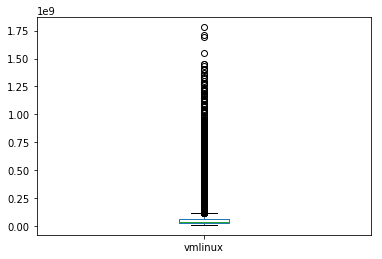
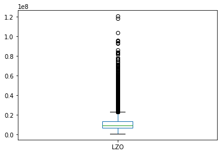
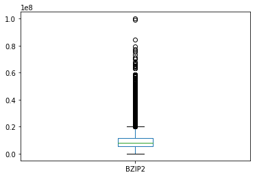

```python
import os
import pandas as pd
import numpy as np
import matplotlib.pyplot as plt

TUXML_CSV_FILENAME= "/mnt/temp_dd/igrida-fs1/macher/config_bdd30To102K.csv" # "config_bdd83K.csv" # 'config_bdd1K.csv' # # "./config_bdd.csv" # 

# sanity check CSV
with open(TUXML_CSV_FILENAME, "r") as file:
    k = file.readline()
    t = k.split(",")
    s = set(t)
    assert(len(t) == len(s)) # unique number of options/features/column names

# parsing for real with pandas 
rawtuxdata = pd.read_csv(open(TUXML_CSV_FILENAME, "r"))

basic_head = ["cid", "time", "date"] # "compile"
size_methods = ["vmlinux", "GZIP-bzImage", "GZIP-vmlinux", "GZIP", "BZIP2-bzImage", 
              "BZIP2-vmlinux", "BZIP2", "LZMA-bzImage", "LZMA-vmlinux", "LZMA", "XZ-bzImage", "XZ-vmlinux", "XZ", 
              "LZO-bzImage", "LZO-vmlinux", "LZO", "LZ4-bzImage", "LZ4-vmlinux", "LZ4"]


### basic stats about options and remove of unique values 
## could be improved 

tri_state_values = ['y', 'n', 'm']

ftuniques = []
freq_ymn_features = []
non_tristate_options = []

for col in rawtuxdata:
    ft = rawtuxdata[col]    
    # eg always "y"
    if len(ft.unique()) == 1:
        ftuniques.append(col)
    # only tri-state values (y, n, m) (possible TODO: handle numerical/string options)    
    elif all(x in tri_state_values for x in ft.unique()):     #len(ft.unique()) == 3: 
        freq = ft.value_counts(normalize=True)
        freqy = 0
        freqn = 0
        freqm = 0
        if ('y' in freq.index):
            freqy = freq['y']
        if ('n' in freq.index):
            freqn = freq['n']
        if ('m' in freq.index):
            freqm = freq['m']
        freq_ymn_features.append((col, freqy, freqm, freqn))
    else:
        if not (col in size_methods): 
            non_tristate_options.append(col)
        

### TODO: we want to keep all quantitative values!
# non_tristate_options.remove('LZO') # ('vmlinux')

# we want to keep measurements (that are not tristate ;)) 
# non_tristate_options = list(set(non_tristate_options) - set(size_methods))

#### print options with unique values
# options with only one value eg always "y"
#i = 0
#for ft in ftuniques:
#    print(ft + " (" + str(i) + ")")
#    i = i + 1

print("Original size (#configs/#options) of the dataset " + str(rawtuxdata.shape))
print ("Number of options with only one value (eg always y): " + str(pd.DataFrame(ftuniques).shape))

# maybe we can drop options with only one unique value (no interest for machine learning)
# TODO: maybe we can rely on more traditional feature reduction techniques
# TODO: need to think about *when* to apply the removal 
rawtuxdata.drop(columns=ftuniques,inplace=True) 
## non_tristate_options include basic stuff like date, time, cid but also string/numerical options
print ("Non tri-state value options (eg string or integer or hybrid values): " 
       + str(pd.DataFrame(non_tristate_options).shape) + " ") 
#      + str(pd.DataFrame(non_tristate_options)))


print ("Predictor variables: " + str(rawtuxdata.drop(columns=non_tristate_options).columns.size))
# frequency of y, m, and n values 
#plt.figure()
#pd.DataFrame(freq_ymn_features, columns=["feature", "freqy", "freqm", "freqn"]).plot(kind='hist', alpha=0.8) #plot()
#plt.show()


    


```

    /usr/lib/python3/dist-packages/IPython/core/interactiveshell.py:2718: DtypeWarning: Columns (1150,2722,6015,6026,6717,7350,7676,7726,8507,10442) have mixed types. Specify dtype option on import or set low_memory=False.
      interactivity=interactivity, compiler=compiler, result=result)


    Original size (#configs/#options) of the dataset (71759, 12798)
    Number of options with only one value (eg always y): (2885, 1)
    Non tri-state value options (eg string or integer or hybrid values): (174, 1) 
    Predictor variables: 9739


```python
'X86_64' in ftuniques, 'DEBUG_INFO' in ftuniques, 'GCOV_PROFILE_ALL' in ftuniques, 'KASAN' in ftuniques, 'UBSAN_SANITIZE_ALL' in ftuniques, 'RELOCATABLE' in ftuniques, 'XFS_DEBUG' in ftuniques, 'AIC7XXX_BUILD_FIRMWARE' in ftuniques, 'AIC79XX_BUILD_FIRMWARE' in ftuniques, 'WANXL_BUILD_FIRMWARE' in ftuniques
```


    (False, False, False, False, False, False, False, False, False, False)


```python
# tinyconfig 
rawtuxdata['SLOB'].value_counts(), rawtuxdata['CC_OPTIMIZE_FOR_SIZE'].value_counts(), rawtuxdata['OPTIMIZE_INLINING'].value_counts()
```


    (n    71414
     y      345
     Name: SLOB, dtype: int64, n    71303
     y      456
     Name: CC_OPTIMIZE_FOR_SIZE, dtype: int64, y    36059
     n    35700
     Name: OPTIMIZE_INLINING, dtype: int64)


```python
if 'RELOCATABLE' in rawtuxdata.columns:
    print(rawtuxdata.query("RELOCATABLE == 'y'")[['cid', 'RELOCATABLE']], rawtuxdata.query("RELOCATABLE == 'y'").shape)
```

              cid RELOCATABLE
    0       30000           y
    1       30001           y
    3       30003           y
    4       30004           y
    5       30005           y
    7       30007           y
    10      30010           y
    11      30011           y
    12      30012           y
    13      30013           y
    15      30015           y
    16      30016           y
    18      30018           y
    19      30019           y
    21      30021           y
    24      30024           y
    26      30026           y
    28      30028           y
    29      30029           y
    31      30031           y
    32      30032           y
    33      30033           y
    34      30034           y
    36      30036           y
    38      30038           y
    40      30040           y
    41      30041           y
    42      30042           y
    45      30045           y
    46      30046           y
    ...       ...         ...
    71702  102243           y
    71703  102244           y
    71707  102248           y
    71711  102252           y
    71715  102256           y
    71717  102258           y
    71718  102259           y
    71719  102260           y
    71721  102262           y
    71722  102263           y
    71723  102264           y
    71724  102265           y
    71726  102267           y
    71727  102268           y
    71728  102269           y
    71730  102271           y
    71731  102272           y
    71732  102273           y
    71733  102274           y
    71736  102277           y
    71737  102278           y
    71739  102280           y
    71740  102281           y
    71741  102282           y
    71742  102283           y
    71743  102284           y
    71745  102286           y
    71750  102291           y
    71755  102296           y
    71758  102299           y
    
    [32496 rows x 2 columns] (32496, 9913)


```python
print("Data exploration")
```

    Data exploration


```python
# BUGS EXPLORATION
def bug_exploration():
    rawtuxdata.query("AIC7XXX_BUILD_FIRMWARE == 'y'")[['cid', 'vmlinux']]
    rawtuxdata.query("AIC79XX_BUILD_FIRMWARE == 'y'")[['cid', 'vmlinux']]
    rawtuxdata.query("WANXL_BUILD_FIRMWARE == 'y'")[['cid', 'vmlinux']]
    rawtuxdata.query("GENERIC_ALLOCATOR == 'n' & DRM_VBOXVIDEO == 'y'")[['cid', 'vmlinux']]
    rawtuxdata.query("GENERIC_ALLOCATOR == 'y' & DRM_VBOXVIDEO == 'y'")[['cid', 'vmlinux']]
    rawtuxdata.query("GENERIC_ALLOCATOR == 'n' & DRM_VBOXVIDEO == 'm'")[['cid', 'vmlinux']]
    return rawtuxdata.query("DRM_VBOXVIDEO == 'y'")[['cid', 'vmlinux']]

#bug_exploration()


```


```python
#rawtuxdata[rawtuxdata['X86_64'] == 'n']
#rawtuxdata.query("X86_64 == 'n'")
```


```python
#rawtuxdata[(rawtuxdata['DEBUG_INFO'] == 'n') & (rawtuxdata['GCOV_PROFILE_ALL'] == 'n') & (rawtuxdata['KASAN'] == 'n') & (rawtuxdata['MODULES'] == 'y')]
# rawtuxdata.query("(DEBUG_INFO == 'n') & (GCOV_PROFILE_ALL == 'n') & (KASAN == 'n') & (MODULES == 'y')")
#rawtuxdata.query("(DEBUG_INFO == 'n') & (GCOV_PROFILE_ALL == 'n') & (KASAN == 'n')").shape, rawtuxdata.shape

```


```python
#rawtuxdata[rawtuxdata['vmlinux'] == 1168072][['cid', 'CC_OPTIMIZE_FOR_SIZE', 'DEBUG_INFO_DWARF4', 'KASAN', 'UBSAN_ALIGNMENT', 'X86_NEED_RELOCS', 'RANDOMIZE_BASE', 'GCOV_PROFILE_ALL', 'UBSAN_SANITIZE_ALL', 'DEBUG_INFO', 'MODULES', 'DEBUG_INFO_REDUCED', 'DEBUG_INFO_SPLIT']]
tiny_data = rawtuxdata.query("vmlinux == 1168072") #tiny config for X86_32
#if (len(tiny_data) > 0):
#    print(tiny_data[['cid', 'CC_OPTIMIZE_FOR_SIZE', 'DEBUG_INFO_DWARF4', 'KASAN', 'UBSAN_ALIGNMENT', 'X86_NEED_RELOCS', 'RANDOMIZE_BASE', 'GCOV_PROFILE_ALL', 'UBSAN_SANITIZE_ALL', 'DEBUG_INFO', 'MODULES', 'DEBUG_INFO_REDUCED', 'DEBUG_INFO_SPLIT']])
```


```python
#rawtuxdata[rawtuxdata['vmlinux'] == -1]
rawtuxdata.query("vmlinux == -1")
```


<div>
<style scoped>
    .dataframe tbody tr th:only-of-type {
        vertical-align: middle;
    }

    .dataframe tbody tr th {
        vertical-align: top;
    }

    .dataframe thead th {
        text-align: right;
    }
</style>
<table border="1" class="dataframe">
  <thead>
    <tr style="text-align: right;">
      <th></th>
      <th>cid</th>
      <th>date</th>
      <th>time</th>
      <th>vmlinux</th>
      <th>GZIP-bzImage</th>
      <th>GZIP-vmlinux</th>
      <th>GZIP</th>
      <th>BZIP2-bzImage</th>
      <th>BZIP2-vmlinux</th>
      <th>BZIP2</th>
      <th>...</th>
      <th>SND_SOC_INTEL_SKL_NAU88L25_SSM4567_MACH</th>
      <th>APDS9960</th>
      <th>ARCH_SUPPORTS_INT128</th>
      <th>SLABINFO</th>
      <th>MICROCODE_AMD</th>
      <th>ISDN_DRV_HISAX</th>
      <th>CHARGER_BQ24190</th>
      <th>SND_SOC_NAU8825</th>
      <th>BH1750</th>
      <th>NETWORK_FILESYSTEMS</th>
    </tr>
  </thead>
  <tbody>
    <tr>
      <th>699</th>
      <td>30699</td>
      <td>2018-06-11 11:45:45</td>
      <td>580.167</td>
      <td>-1</td>
      <td>-1.0</td>
      <td>-1</td>
      <td>-1</td>
      <td>-1.0</td>
      <td>-1</td>
      <td>-1</td>
      <td>...</td>
      <td>n</td>
      <td>m</td>
      <td>y</td>
      <td>y</td>
      <td>n</td>
      <td>n</td>
      <td>m</td>
      <td>n</td>
      <td>n</td>
      <td>n</td>
    </tr>
    <tr>
      <th>700</th>
      <td>30700</td>
      <td>2018-06-11 12:04:27</td>
      <td>814.281</td>
      <td>-1</td>
      <td>-1.0</td>
      <td>-1</td>
      <td>-1</td>
      <td>-1.0</td>
      <td>-1</td>
      <td>-1</td>
      <td>...</td>
      <td>n</td>
      <td>n</td>
      <td>y</td>
      <td>y</td>
      <td>y</td>
      <td>n</td>
      <td>m</td>
      <td>m</td>
      <td>m</td>
      <td>y</td>
    </tr>
    <tr>
      <th>704</th>
      <td>30704</td>
      <td>2018-06-11 16:28:46</td>
      <td>318.957</td>
      <td>-1</td>
      <td>-1.0</td>
      <td>-1</td>
      <td>-1</td>
      <td>-1.0</td>
      <td>-1</td>
      <td>-1</td>
      <td>...</td>
      <td>n</td>
      <td>n</td>
      <td>y</td>
      <td>y</td>
      <td>y</td>
      <td>n</td>
      <td>n</td>
      <td>n</td>
      <td>n</td>
      <td>n</td>
    </tr>
    <tr>
      <th>717</th>
      <td>30717</td>
      <td>2018-06-11 16:31:52</td>
      <td>485.380</td>
      <td>-1</td>
      <td>-1.0</td>
      <td>-1</td>
      <td>-1</td>
      <td>-1.0</td>
      <td>-1</td>
      <td>-1</td>
      <td>...</td>
      <td>m</td>
      <td>m</td>
      <td>y</td>
      <td>y</td>
      <td>y</td>
      <td>n</td>
      <td>m</td>
      <td>m</td>
      <td>n</td>
      <td>y</td>
    </tr>
    <tr>
      <th>718</th>
      <td>30718</td>
      <td>2018-06-11 16:31:58</td>
      <td>228.473</td>
      <td>-1</td>
      <td>-1.0</td>
      <td>-1</td>
      <td>-1</td>
      <td>-1.0</td>
      <td>-1</td>
      <td>-1</td>
      <td>...</td>
      <td>n</td>
      <td>n</td>
      <td>y</td>
      <td>y</td>
      <td>n</td>
      <td>n</td>
      <td>n</td>
      <td>n</td>
      <td>n</td>
      <td>n</td>
    </tr>
    <tr>
      <th>722</th>
      <td>30722</td>
      <td>2018-06-11 16:32:37</td>
      <td>536.941</td>
      <td>-1</td>
      <td>-1.0</td>
      <td>-1</td>
      <td>-1</td>
      <td>-1.0</td>
      <td>-1</td>
      <td>-1</td>
      <td>...</td>
      <td>m</td>
      <td>n</td>
      <td>y</td>
      <td>n</td>
      <td>y</td>
      <td>n</td>
      <td>y</td>
      <td>m</td>
      <td>n</td>
      <td>y</td>
    </tr>
    <tr>
      <th>726</th>
      <td>30726</td>
      <td>2018-06-11 16:34:29</td>
      <td>282.212</td>
      <td>-1</td>
      <td>-1.0</td>
      <td>-1</td>
      <td>-1</td>
      <td>-1.0</td>
      <td>-1</td>
      <td>-1</td>
      <td>...</td>
      <td>n</td>
      <td>n</td>
      <td>y</td>
      <td>y</td>
      <td>n</td>
      <td>n</td>
      <td>n</td>
      <td>n</td>
      <td>n</td>
      <td>n</td>
    </tr>
    <tr>
      <th>730</th>
      <td>30730</td>
      <td>2018-06-11 16:36:31</td>
      <td>282.096</td>
      <td>-1</td>
      <td>-1.0</td>
      <td>-1</td>
      <td>-1</td>
      <td>-1.0</td>
      <td>-1</td>
      <td>-1</td>
      <td>...</td>
      <td>n</td>
      <td>n</td>
      <td>y</td>
      <td>n</td>
      <td>y</td>
      <td>n</td>
      <td>n</td>
      <td>n</td>
      <td>y</td>
      <td>n</td>
    </tr>
    <tr>
      <th>731</th>
      <td>30731</td>
      <td>2018-06-11 16:36:42</td>
      <td>315.862</td>
      <td>-1</td>
      <td>-1.0</td>
      <td>-1</td>
      <td>-1</td>
      <td>-1.0</td>
      <td>-1</td>
      <td>-1</td>
      <td>...</td>
      <td>n</td>
      <td>y</td>
      <td>y</td>
      <td>y</td>
      <td>n</td>
      <td>n</td>
      <td>y</td>
      <td>n</td>
      <td>n</td>
      <td>y</td>
    </tr>
    <tr>
      <th>737</th>
      <td>30737</td>
      <td>2018-06-11 16:39:28</td>
      <td>267.500</td>
      <td>-1</td>
      <td>-1.0</td>
      <td>-1</td>
      <td>-1</td>
      <td>-1.0</td>
      <td>-1</td>
      <td>-1</td>
      <td>...</td>
      <td>n</td>
      <td>n</td>
      <td>y</td>
      <td>y</td>
      <td>n</td>
      <td>n</td>
      <td>y</td>
      <td>n</td>
      <td>n</td>
      <td>n</td>
    </tr>
    <tr>
      <th>806</th>
      <td>30806</td>
      <td>2018-06-11 17:04:45</td>
      <td>266.910</td>
      <td>-1</td>
      <td>-1.0</td>
      <td>-1</td>
      <td>-1</td>
      <td>-1.0</td>
      <td>-1</td>
      <td>-1</td>
      <td>...</td>
      <td>n</td>
      <td>n</td>
      <td>y</td>
      <td>y</td>
      <td>n</td>
      <td>n</td>
      <td>y</td>
      <td>n</td>
      <td>n</td>
      <td>n</td>
    </tr>
    <tr>
      <th>811</th>
      <td>30811</td>
      <td>2018-06-11 17:05:47</td>
      <td>539.088</td>
      <td>-1</td>
      <td>-1.0</td>
      <td>-1</td>
      <td>-1</td>
      <td>-1.0</td>
      <td>-1</td>
      <td>-1</td>
      <td>...</td>
      <td>n</td>
      <td>m</td>
      <td>y</td>
      <td>y</td>
      <td>n</td>
      <td>n</td>
      <td>n</td>
      <td>m</td>
      <td>m</td>
      <td>n</td>
    </tr>
    <tr>
      <th>821</th>
      <td>30821</td>
      <td>2018-06-11 17:09:39</td>
      <td>333.213</td>
      <td>-1</td>
      <td>-1.0</td>
      <td>-1</td>
      <td>-1</td>
      <td>-1.0</td>
      <td>-1</td>
      <td>-1</td>
      <td>...</td>
      <td>n</td>
      <td>y</td>
      <td>y</td>
      <td>n</td>
      <td>n</td>
      <td>n</td>
      <td>n</td>
      <td>n</td>
      <td>n</td>
      <td>n</td>
    </tr>
    <tr>
      <th>837</th>
      <td>30837</td>
      <td>2018-06-11 17:13:43</td>
      <td>212.546</td>
      <td>-1</td>
      <td>-1.0</td>
      <td>-1</td>
      <td>-1</td>
      <td>-1.0</td>
      <td>-1</td>
      <td>-1</td>
      <td>...</td>
      <td>n</td>
      <td>n</td>
      <td>y</td>
      <td>n</td>
      <td>n</td>
      <td>n</td>
      <td>n</td>
      <td>n</td>
      <td>n</td>
      <td>y</td>
    </tr>
    <tr>
      <th>848</th>
      <td>30849</td>
      <td>2018-06-11 17:18:59</td>
      <td>290.525</td>
      <td>-1</td>
      <td>-1.0</td>
      <td>-1</td>
      <td>-1</td>
      <td>-1.0</td>
      <td>-1</td>
      <td>-1</td>
      <td>...</td>
      <td>n</td>
      <td>n</td>
      <td>y</td>
      <td>y</td>
      <td>y</td>
      <td>n</td>
      <td>n</td>
      <td>n</td>
      <td>m</td>
      <td>n</td>
    </tr>
    <tr>
      <th>878</th>
      <td>30879</td>
      <td>2018-06-11 17:27:34</td>
      <td>360.800</td>
      <td>-1</td>
      <td>-1.0</td>
      <td>-1</td>
      <td>-1</td>
      <td>-1.0</td>
      <td>-1</td>
      <td>-1</td>
      <td>...</td>
      <td>n</td>
      <td>m</td>
      <td>y</td>
      <td>y</td>
      <td>n</td>
      <td>m</td>
      <td>n</td>
      <td>n</td>
      <td>m</td>
      <td>n</td>
    </tr>
    <tr>
      <th>885</th>
      <td>30886</td>
      <td>2018-06-11 17:29:26</td>
      <td>450.263</td>
      <td>-1</td>
      <td>-1.0</td>
      <td>-1</td>
      <td>-1</td>
      <td>-1.0</td>
      <td>-1</td>
      <td>-1</td>
      <td>...</td>
      <td>n</td>
      <td>y</td>
      <td>y</td>
      <td>y</td>
      <td>n</td>
      <td>n</td>
      <td>y</td>
      <td>n</td>
      <td>n</td>
      <td>y</td>
    </tr>
    <tr>
      <th>890</th>
      <td>30891</td>
      <td>2018-06-11 17:32:45</td>
      <td>308.130</td>
      <td>-1</td>
      <td>-1.0</td>
      <td>-1</td>
      <td>-1</td>
      <td>-1.0</td>
      <td>-1</td>
      <td>-1</td>
      <td>...</td>
      <td>n</td>
      <td>y</td>
      <td>y</td>
      <td>y</td>
      <td>n</td>
      <td>n</td>
      <td>n</td>
      <td>n</td>
      <td>y</td>
      <td>n</td>
    </tr>
    <tr>
      <th>900</th>
      <td>30901</td>
      <td>2018-06-11 17:34:44</td>
      <td>342.380</td>
      <td>-1</td>
      <td>-1.0</td>
      <td>-1</td>
      <td>-1</td>
      <td>-1.0</td>
      <td>-1</td>
      <td>-1</td>
      <td>...</td>
      <td>n</td>
      <td>n</td>
      <td>y</td>
      <td>y</td>
      <td>n</td>
      <td>n</td>
      <td>y</td>
      <td>n</td>
      <td>m</td>
      <td>n</td>
    </tr>
    <tr>
      <th>903</th>
      <td>30904</td>
      <td>2018-06-11 17:35:35</td>
      <td>307.636</td>
      <td>-1</td>
      <td>-1.0</td>
      <td>-1</td>
      <td>-1</td>
      <td>-1.0</td>
      <td>-1</td>
      <td>-1</td>
      <td>...</td>
      <td>n</td>
      <td>n</td>
      <td>y</td>
      <td>n</td>
      <td>n</td>
      <td>n</td>
      <td>y</td>
      <td>n</td>
      <td>n</td>
      <td>y</td>
    </tr>
    <tr>
      <th>916</th>
      <td>30917</td>
      <td>2018-06-11 17:40:19</td>
      <td>380.940</td>
      <td>-1</td>
      <td>-1.0</td>
      <td>-1</td>
      <td>-1</td>
      <td>-1.0</td>
      <td>-1</td>
      <td>-1</td>
      <td>...</td>
      <td>n</td>
      <td>y</td>
      <td>y</td>
      <td>n</td>
      <td>n</td>
      <td>y</td>
      <td>y</td>
      <td>n</td>
      <td>y</td>
      <td>y</td>
    </tr>
    <tr>
      <th>926</th>
      <td>30927</td>
      <td>2018-06-11 17:44:05</td>
      <td>272.803</td>
      <td>-1</td>
      <td>-1.0</td>
      <td>-1</td>
      <td>-1</td>
      <td>-1.0</td>
      <td>-1</td>
      <td>-1</td>
      <td>...</td>
      <td>n</td>
      <td>y</td>
      <td>y</td>
      <td>n</td>
      <td>n</td>
      <td>n</td>
      <td>n</td>
      <td>n</td>
      <td>y</td>
      <td>n</td>
    </tr>
    <tr>
      <th>957</th>
      <td>30959</td>
      <td>2018-06-11 17:53:34</td>
      <td>396.818</td>
      <td>-1</td>
      <td>-1.0</td>
      <td>-1</td>
      <td>-1</td>
      <td>-1.0</td>
      <td>-1</td>
      <td>-1</td>
      <td>...</td>
      <td>n</td>
      <td>n</td>
      <td>y</td>
      <td>y</td>
      <td>n</td>
      <td>n</td>
      <td>y</td>
      <td>n</td>
      <td>n</td>
      <td>n</td>
    </tr>
    <tr>
      <th>959</th>
      <td>30961</td>
      <td>2018-06-11 17:54:24</td>
      <td>364.646</td>
      <td>-1</td>
      <td>-1.0</td>
      <td>-1</td>
      <td>-1</td>
      <td>-1.0</td>
      <td>-1</td>
      <td>-1</td>
      <td>...</td>
      <td>n</td>
      <td>y</td>
      <td>y</td>
      <td>y</td>
      <td>n</td>
      <td>n</td>
      <td>n</td>
      <td>n</td>
      <td>y</td>
      <td>n</td>
    </tr>
    <tr>
      <th>960</th>
      <td>30962</td>
      <td>2018-06-11 17:54:34</td>
      <td>464.907</td>
      <td>-1</td>
      <td>-1.0</td>
      <td>-1</td>
      <td>-1</td>
      <td>-1.0</td>
      <td>-1</td>
      <td>-1</td>
      <td>...</td>
      <td>n</td>
      <td>n</td>
      <td>y</td>
      <td>y</td>
      <td>n</td>
      <td>y</td>
      <td>y</td>
      <td>y</td>
      <td>n</td>
      <td>y</td>
    </tr>
    <tr>
      <th>962</th>
      <td>30964</td>
      <td>2018-06-11 17:55:04</td>
      <td>371.157</td>
      <td>-1</td>
      <td>-1.0</td>
      <td>-1</td>
      <td>-1</td>
      <td>-1.0</td>
      <td>-1</td>
      <td>-1</td>
      <td>...</td>
      <td>n</td>
      <td>y</td>
      <td>y</td>
      <td>n</td>
      <td>n</td>
      <td>n</td>
      <td>n</td>
      <td>n</td>
      <td>n</td>
      <td>n</td>
    </tr>
    <tr>
      <th>969</th>
      <td>30971</td>
      <td>2018-06-11 17:57:48</td>
      <td>256.803</td>
      <td>-1</td>
      <td>-1.0</td>
      <td>-1</td>
      <td>-1</td>
      <td>-1.0</td>
      <td>-1</td>
      <td>-1</td>
      <td>...</td>
      <td>n</td>
      <td>n</td>
      <td>y</td>
      <td>y</td>
      <td>y</td>
      <td>n</td>
      <td>y</td>
      <td>n</td>
      <td>n</td>
      <td>n</td>
    </tr>
    <tr>
      <th>987</th>
      <td>30989</td>
      <td>2018-06-11 18:03:56</td>
      <td>620.644</td>
      <td>-1</td>
      <td>-1.0</td>
      <td>-1</td>
      <td>-1</td>
      <td>-1.0</td>
      <td>-1</td>
      <td>-1</td>
      <td>...</td>
      <td>n</td>
      <td>n</td>
      <td>y</td>
      <td>n</td>
      <td>n</td>
      <td>n</td>
      <td>y</td>
      <td>n</td>
      <td>n</td>
      <td>y</td>
    </tr>
    <tr>
      <th>1010</th>
      <td>31012</td>
      <td>2018-06-11 18:11:59</td>
      <td>303.874</td>
      <td>-1</td>
      <td>-1.0</td>
      <td>-1</td>
      <td>-1</td>
      <td>-1.0</td>
      <td>-1</td>
      <td>-1</td>
      <td>...</td>
      <td>n</td>
      <td>n</td>
      <td>y</td>
      <td>y</td>
      <td>n</td>
      <td>n</td>
      <td>y</td>
      <td>n</td>
      <td>n</td>
      <td>n</td>
    </tr>
    <tr>
      <th>1023</th>
      <td>31025</td>
      <td>2018-06-11 18:16:27</td>
      <td>359.358</td>
      <td>-1</td>
      <td>-1.0</td>
      <td>-1</td>
      <td>-1</td>
      <td>-1.0</td>
      <td>-1</td>
      <td>-1</td>
      <td>...</td>
      <td>n</td>
      <td>m</td>
      <td>y</td>
      <td>y</td>
      <td>n</td>
      <td>n</td>
      <td>n</td>
      <td>n</td>
      <td>m</td>
      <td>n</td>
    </tr>
    <tr>
      <th>...</th>
      <td>...</td>
      <td>...</td>
      <td>...</td>
      <td>...</td>
      <td>...</td>
      <td>...</td>
      <td>...</td>
      <td>...</td>
      <td>...</td>
      <td>...</td>
      <td>...</td>
      <td>...</td>
      <td>...</td>
      <td>...</td>
      <td>...</td>
      <td>...</td>
      <td>...</td>
      <td>...</td>
      <td>...</td>
      <td>...</td>
      <td>...</td>
    </tr>
    <tr>
      <th>66417</th>
      <td>96958</td>
      <td>2018-08-02 12:26:25</td>
      <td>731.364</td>
      <td>-1</td>
      <td>-1.0</td>
      <td>-1</td>
      <td>-1</td>
      <td>-1.0</td>
      <td>-1</td>
      <td>-1</td>
      <td>...</td>
      <td>n</td>
      <td>y</td>
      <td>y</td>
      <td>y</td>
      <td>y</td>
      <td>n</td>
      <td>n</td>
      <td>y</td>
      <td>y</td>
      <td>n</td>
    </tr>
    <tr>
      <th>66620</th>
      <td>97161</td>
      <td>2018-08-02 13:35:53</td>
      <td>583.129</td>
      <td>-1</td>
      <td>-1.0</td>
      <td>-1</td>
      <td>-1</td>
      <td>-1.0</td>
      <td>-1</td>
      <td>-1</td>
      <td>...</td>
      <td>y</td>
      <td>m</td>
      <td>y</td>
      <td>y</td>
      <td>n</td>
      <td>n</td>
      <td>n</td>
      <td>y</td>
      <td>m</td>
      <td>n</td>
    </tr>
    <tr>
      <th>66693</th>
      <td>97234</td>
      <td>2018-08-02 13:59:39</td>
      <td>675.453</td>
      <td>-1</td>
      <td>-1.0</td>
      <td>-1</td>
      <td>-1</td>
      <td>-1.0</td>
      <td>-1</td>
      <td>-1</td>
      <td>...</td>
      <td>n</td>
      <td>n</td>
      <td>y</td>
      <td>y</td>
      <td>n</td>
      <td>n</td>
      <td>n</td>
      <td>n</td>
      <td>y</td>
      <td>n</td>
    </tr>
    <tr>
      <th>66789</th>
      <td>97330</td>
      <td>2018-08-02 14:31:07</td>
      <td>605.514</td>
      <td>-1</td>
      <td>-1.0</td>
      <td>-1</td>
      <td>-1</td>
      <td>-1.0</td>
      <td>-1</td>
      <td>-1</td>
      <td>...</td>
      <td>n</td>
      <td>n</td>
      <td>y</td>
      <td>y</td>
      <td>y</td>
      <td>n</td>
      <td>m</td>
      <td>n</td>
      <td>m</td>
      <td>y</td>
    </tr>
    <tr>
      <th>67335</th>
      <td>97876</td>
      <td>2018-08-02 17:48:55</td>
      <td>690.402</td>
      <td>-1</td>
      <td>-1.0</td>
      <td>-1</td>
      <td>-1</td>
      <td>-1.0</td>
      <td>-1</td>
      <td>-1</td>
      <td>...</td>
      <td>n</td>
      <td>y</td>
      <td>y</td>
      <td>n</td>
      <td>y</td>
      <td>n</td>
      <td>y</td>
      <td>n</td>
      <td>y</td>
      <td>n</td>
    </tr>
    <tr>
      <th>67606</th>
      <td>98147</td>
      <td>2018-08-02 19:23:31</td>
      <td>324.985</td>
      <td>-1</td>
      <td>-1.0</td>
      <td>-1</td>
      <td>-1</td>
      <td>-1.0</td>
      <td>-1</td>
      <td>-1</td>
      <td>...</td>
      <td>n</td>
      <td>n</td>
      <td>y</td>
      <td>y</td>
      <td>n</td>
      <td>n</td>
      <td>n</td>
      <td>n</td>
      <td>n</td>
      <td>n</td>
    </tr>
    <tr>
      <th>67620</th>
      <td>98161</td>
      <td>2018-08-02 19:29:19</td>
      <td>631.261</td>
      <td>-1</td>
      <td>-1.0</td>
      <td>-1</td>
      <td>-1</td>
      <td>-1.0</td>
      <td>-1</td>
      <td>-1</td>
      <td>...</td>
      <td>n</td>
      <td>y</td>
      <td>y</td>
      <td>n</td>
      <td>n</td>
      <td>n</td>
      <td>n</td>
      <td>n</td>
      <td>n</td>
      <td>n</td>
    </tr>
    <tr>
      <th>67674</th>
      <td>98215</td>
      <td>2018-08-02 19:46:38</td>
      <td>393.018</td>
      <td>-1</td>
      <td>-1.0</td>
      <td>-1</td>
      <td>-1</td>
      <td>-1.0</td>
      <td>-1</td>
      <td>-1</td>
      <td>...</td>
      <td>n</td>
      <td>n</td>
      <td>y</td>
      <td>y</td>
      <td>y</td>
      <td>n</td>
      <td>y</td>
      <td>m</td>
      <td>n</td>
      <td>n</td>
    </tr>
    <tr>
      <th>67773</th>
      <td>98314</td>
      <td>2018-08-02 20:21:43</td>
      <td>2107.220</td>
      <td>-1</td>
      <td>-1.0</td>
      <td>-1</td>
      <td>-1</td>
      <td>-1.0</td>
      <td>-1</td>
      <td>-1</td>
      <td>...</td>
      <td>n</td>
      <td>n</td>
      <td>y</td>
      <td>n</td>
      <td>n</td>
      <td>n</td>
      <td>y</td>
      <td>n</td>
      <td>n</td>
      <td>n</td>
    </tr>
    <tr>
      <th>67969</th>
      <td>98510</td>
      <td>2018-08-02 21:34:00</td>
      <td>339.695</td>
      <td>-1</td>
      <td>-1.0</td>
      <td>-1</td>
      <td>-1</td>
      <td>-1.0</td>
      <td>-1</td>
      <td>-1</td>
      <td>...</td>
      <td>n</td>
      <td>y</td>
      <td>y</td>
      <td>y</td>
      <td>n</td>
      <td>n</td>
      <td>n</td>
      <td>n</td>
      <td>y</td>
      <td>n</td>
    </tr>
    <tr>
      <th>67970</th>
      <td>98511</td>
      <td>2018-08-02 21:34:24</td>
      <td>5885.850</td>
      <td>-1</td>
      <td>-1.0</td>
      <td>-1</td>
      <td>-1</td>
      <td>-1.0</td>
      <td>-1</td>
      <td>-1</td>
      <td>...</td>
      <td>n</td>
      <td>n</td>
      <td>y</td>
      <td>n</td>
      <td>n</td>
      <td>n</td>
      <td>y</td>
      <td>n</td>
      <td>y</td>
      <td>n</td>
    </tr>
    <tr>
      <th>68064</th>
      <td>98605</td>
      <td>2018-08-03 09:09:04</td>
      <td>145.354</td>
      <td>-1</td>
      <td>-1.0</td>
      <td>-1</td>
      <td>-1</td>
      <td>-1.0</td>
      <td>-1</td>
      <td>-1</td>
      <td>...</td>
      <td>n</td>
      <td>n</td>
      <td>y</td>
      <td>n</td>
      <td>n</td>
      <td>n</td>
      <td>y</td>
      <td>n</td>
      <td>n</td>
      <td>n</td>
    </tr>
    <tr>
      <th>68361</th>
      <td>98902</td>
      <td>2018-08-03 10:48:28</td>
      <td>377.468</td>
      <td>-1</td>
      <td>-1.0</td>
      <td>-1</td>
      <td>-1</td>
      <td>-1.0</td>
      <td>-1</td>
      <td>-1</td>
      <td>...</td>
      <td>n</td>
      <td>y</td>
      <td>y</td>
      <td>n</td>
      <td>y</td>
      <td>n</td>
      <td>n</td>
      <td>n</td>
      <td>y</td>
      <td>n</td>
    </tr>
    <tr>
      <th>68379</th>
      <td>98920</td>
      <td>2018-08-03 10:52:50</td>
      <td>2223.570</td>
      <td>-1</td>
      <td>-1.0</td>
      <td>-1</td>
      <td>-1</td>
      <td>-1.0</td>
      <td>-1</td>
      <td>-1</td>
      <td>...</td>
      <td>n</td>
      <td>y</td>
      <td>y</td>
      <td>y</td>
      <td>n</td>
      <td>n</td>
      <td>y</td>
      <td>n</td>
      <td>y</td>
      <td>n</td>
    </tr>
    <tr>
      <th>68662</th>
      <td>99203</td>
      <td>2018-08-03 12:21:17</td>
      <td>591.575</td>
      <td>-1</td>
      <td>-1.0</td>
      <td>-1</td>
      <td>-1</td>
      <td>-1.0</td>
      <td>-1</td>
      <td>-1</td>
      <td>...</td>
      <td>n</td>
      <td>y</td>
      <td>y</td>
      <td>n</td>
      <td>n</td>
      <td>n</td>
      <td>y</td>
      <td>n</td>
      <td>y</td>
      <td>n</td>
    </tr>
    <tr>
      <th>68746</th>
      <td>99287</td>
      <td>2018-08-03 12:46:12</td>
      <td>2056.440</td>
      <td>-1</td>
      <td>-1.0</td>
      <td>-1</td>
      <td>-1</td>
      <td>-1.0</td>
      <td>-1</td>
      <td>-1</td>
      <td>...</td>
      <td>n</td>
      <td>n</td>
      <td>y</td>
      <td>n</td>
      <td>y</td>
      <td>n</td>
      <td>n</td>
      <td>n</td>
      <td>n</td>
      <td>n</td>
    </tr>
    <tr>
      <th>69368</th>
      <td>99909</td>
      <td>2018-08-03 20:03:47</td>
      <td>2567.660</td>
      <td>-1</td>
      <td>-1.0</td>
      <td>-1</td>
      <td>-1</td>
      <td>-1.0</td>
      <td>-1</td>
      <td>-1</td>
      <td>...</td>
      <td>n</td>
      <td>y</td>
      <td>y</td>
      <td>y</td>
      <td>n</td>
      <td>n</td>
      <td>n</td>
      <td>n</td>
      <td>n</td>
      <td>n</td>
    </tr>
    <tr>
      <th>69408</th>
      <td>99949</td>
      <td>2018-08-03 20:18:16</td>
      <td>426.444</td>
      <td>-1</td>
      <td>-1.0</td>
      <td>-1</td>
      <td>-1</td>
      <td>-1.0</td>
      <td>-1</td>
      <td>-1</td>
      <td>...</td>
      <td>n</td>
      <td>y</td>
      <td>y</td>
      <td>n</td>
      <td>n</td>
      <td>n</td>
      <td>y</td>
      <td>n</td>
      <td>y</td>
      <td>n</td>
    </tr>
    <tr>
      <th>69826</th>
      <td>100367</td>
      <td>2018-08-03 22:29:50</td>
      <td>437.879</td>
      <td>-1</td>
      <td>-1.0</td>
      <td>-1</td>
      <td>-1</td>
      <td>-1.0</td>
      <td>-1</td>
      <td>-1</td>
      <td>...</td>
      <td>n</td>
      <td>n</td>
      <td>y</td>
      <td>n</td>
      <td>n</td>
      <td>n</td>
      <td>n</td>
      <td>n</td>
      <td>n</td>
      <td>n</td>
    </tr>
    <tr>
      <th>69849</th>
      <td>100390</td>
      <td>2018-08-03 22:35:48</td>
      <td>446.047</td>
      <td>-1</td>
      <td>-1.0</td>
      <td>-1</td>
      <td>-1</td>
      <td>-1.0</td>
      <td>-1</td>
      <td>-1</td>
      <td>...</td>
      <td>n</td>
      <td>m</td>
      <td>y</td>
      <td>y</td>
      <td>n</td>
      <td>n</td>
      <td>n</td>
      <td>n</td>
      <td>m</td>
      <td>n</td>
    </tr>
    <tr>
      <th>69869</th>
      <td>100410</td>
      <td>2018-08-03 22:43:28</td>
      <td>459.967</td>
      <td>-1</td>
      <td>-1.0</td>
      <td>-1</td>
      <td>-1</td>
      <td>-1.0</td>
      <td>-1</td>
      <td>-1</td>
      <td>...</td>
      <td>n</td>
      <td>n</td>
      <td>y</td>
      <td>n</td>
      <td>n</td>
      <td>n</td>
      <td>n</td>
      <td>n</td>
      <td>n</td>
      <td>n</td>
    </tr>
    <tr>
      <th>69918</th>
      <td>100459</td>
      <td>2018-08-03 22:56:42</td>
      <td>853.376</td>
      <td>-1</td>
      <td>-1.0</td>
      <td>-1</td>
      <td>-1</td>
      <td>-1.0</td>
      <td>-1</td>
      <td>-1</td>
      <td>...</td>
      <td>n</td>
      <td>y</td>
      <td>y</td>
      <td>n</td>
      <td>n</td>
      <td>n</td>
      <td>y</td>
      <td>n</td>
      <td>y</td>
      <td>y</td>
    </tr>
    <tr>
      <th>70109</th>
      <td>100650</td>
      <td>2018-08-03 23:57:54</td>
      <td>599.857</td>
      <td>-1</td>
      <td>-1.0</td>
      <td>-1</td>
      <td>-1</td>
      <td>-1.0</td>
      <td>-1</td>
      <td>-1</td>
      <td>...</td>
      <td>n</td>
      <td>y</td>
      <td>y</td>
      <td>n</td>
      <td>n</td>
      <td>n</td>
      <td>y</td>
      <td>n</td>
      <td>y</td>
      <td>n</td>
    </tr>
    <tr>
      <th>70193</th>
      <td>100734</td>
      <td>2018-08-04 00:25:10</td>
      <td>566.492</td>
      <td>-1</td>
      <td>-1.0</td>
      <td>-1</td>
      <td>-1</td>
      <td>-1.0</td>
      <td>-1</td>
      <td>-1</td>
      <td>...</td>
      <td>n</td>
      <td>n</td>
      <td>y</td>
      <td>n</td>
      <td>n</td>
      <td>n</td>
      <td>m</td>
      <td>n</td>
      <td>n</td>
      <td>n</td>
    </tr>
    <tr>
      <th>70621</th>
      <td>101162</td>
      <td>2018-08-04 02:43:33</td>
      <td>470.455</td>
      <td>-1</td>
      <td>-1.0</td>
      <td>-1</td>
      <td>-1</td>
      <td>-1.0</td>
      <td>-1</td>
      <td>-1</td>
      <td>...</td>
      <td>n</td>
      <td>n</td>
      <td>y</td>
      <td>n</td>
      <td>y</td>
      <td>n</td>
      <td>n</td>
      <td>n</td>
      <td>n</td>
      <td>n</td>
    </tr>
    <tr>
      <th>71001</th>
      <td>101542</td>
      <td>2018-08-04 04:59:08</td>
      <td>466.027</td>
      <td>-1</td>
      <td>-1.0</td>
      <td>-1</td>
      <td>-1</td>
      <td>-1.0</td>
      <td>-1</td>
      <td>-1</td>
      <td>...</td>
      <td>n</td>
      <td>n</td>
      <td>y</td>
      <td>n</td>
      <td>n</td>
      <td>n</td>
      <td>y</td>
      <td>n</td>
      <td>n</td>
      <td>n</td>
    </tr>
    <tr>
      <th>71020</th>
      <td>101561</td>
      <td>2018-08-04 05:06:23</td>
      <td>3488.900</td>
      <td>-1</td>
      <td>-1.0</td>
      <td>-1</td>
      <td>-1</td>
      <td>-1.0</td>
      <td>-1</td>
      <td>-1</td>
      <td>...</td>
      <td>n</td>
      <td>m</td>
      <td>y</td>
      <td>n</td>
      <td>n</td>
      <td>n</td>
      <td>y</td>
      <td>n</td>
      <td>y</td>
      <td>n</td>
    </tr>
    <tr>
      <th>71121</th>
      <td>101662</td>
      <td>2018-08-04 05:46:07</td>
      <td>926.644</td>
      <td>-1</td>
      <td>-1.0</td>
      <td>-1</td>
      <td>-1</td>
      <td>-1.0</td>
      <td>-1</td>
      <td>-1</td>
      <td>...</td>
      <td>n</td>
      <td>n</td>
      <td>y</td>
      <td>y</td>
      <td>n</td>
      <td>n</td>
      <td>n</td>
      <td>n</td>
      <td>y</td>
      <td>n</td>
    </tr>
    <tr>
      <th>71157</th>
      <td>101698</td>
      <td>2018-08-04 05:59:30</td>
      <td>757.945</td>
      <td>-1</td>
      <td>-1.0</td>
      <td>-1</td>
      <td>-1</td>
      <td>-1.0</td>
      <td>-1</td>
      <td>-1</td>
      <td>...</td>
      <td>m</td>
      <td>m</td>
      <td>y</td>
      <td>y</td>
      <td>n</td>
      <td>n</td>
      <td>n</td>
      <td>m</td>
      <td>m</td>
      <td>n</td>
    </tr>
    <tr>
      <th>71274</th>
      <td>101815</td>
      <td>2018-08-04 06:43:59</td>
      <td>376.748</td>
      <td>-1</td>
      <td>-1.0</td>
      <td>-1</td>
      <td>-1</td>
      <td>-1.0</td>
      <td>-1</td>
      <td>-1</td>
      <td>...</td>
      <td>n</td>
      <td>n</td>
      <td>y</td>
      <td>y</td>
      <td>n</td>
      <td>n</td>
      <td>n</td>
      <td>n</td>
      <td>n</td>
      <td>n</td>
    </tr>
  </tbody>
</table>
<p>3546 rows × 9913 columns</p>
</div>


```python
#rawtuxdata[rawtuxdata['vmlinux'] == 1168072]['MODULES']
rawtuxdata.query("vmlinux == 1168072")['MODULES'] #tiny config for X86_32
```


    26211    n
    26212    n
    26213    n
    40226    n
    40230    n
    40239    n
    40240    n
    56176    n
    66292    n
    Name: MODULES, dtype: object


```python
# playing a bit with the data 
rawtuxdata.dtypes
# 'DEBUG_INFOO' in list(pd.DataFrame(non_tristate_options)[0]) # 
# tuxdata['DEBUG_INFO'].unique()
#tuxdata['OUTPUT_FORMAT'].dtypes
#tuxdata['DEFAULT_HOSTNAME'].unique()

#rawtuxdata[:5]
rawtuxdata[:20]['vmlinux']
#tuxdata[:5]['CONFIG_DEBUG_INFO']
#tuxdata['ARCH_HAS_SG_CHAIN'].unique()
#tuxdata['ARCH_HAS_SG_CHAIN'].astype('category')
```


    0      50222120
    1      16660024
    2      43080856
    3      27261672
    4      58769440
    5      24234952
    6      28801640
    7     109670360
    8     153521616
    9      30553608
    10     21910984
    11     47290224
    12    694670992
    13     46398560
    14     36613928
    15     64815912
    16     55728592
    17     70468056
    18     66096464
    19     22521704
    Name: vmlinux, dtype: int64


```python
rawtuxdata.shape, rawtuxdata.query("vmlinux != -1").shape
```


    ((71759, 9913), (68213, 9913))


```python
print("some configurations may have X86_32 (coz we have tested/tried some options and there are in the database)")
# we only keep X86_64 configurations
#rawtuxdata = rawtuxdata[rawtuxdata['X86_64'] == 'y'] ### TODO: I've impression it's not the most effective way (wrt memory) to filter 
if 'X86_64' in rawtuxdata.columns:
    print(rawtuxdata['X86_64'].describe())
    rawtuxdata.query("X86_64 == 'y'", inplace=True)
rawtuxdata.info(memory_usage='deep')
```

    some configurations may have X86_32 (coz we have tested/tried some options and there are in the database)
    count     71759
    unique        2
    top           y
    freq      71723
    Name: X86_64, dtype: object
    <class 'pandas.core.frame.DataFrame'>
    Int64Index: 71723 entries, 0 to 71758
    Columns: 9913 entries, cid to NETWORK_FILESYSTEMS
    dtypes: float64(7), int64(148), object(9758)
    memory usage: 43.1 GB


```python
from sklearn.preprocessing import *
from sklearn.metrics import mean_squared_error, r2_score, mean_absolute_error
from sklearn.model_selection import train_test_split
from sklearn.ensemble import ExtraTreesRegressor, RandomForestRegressor, GradientBoostingClassifier
from sklearn.feature_selection import SelectFromModel
from sklearn.linear_model import LassoCV
from sklearn.pipeline import Pipeline
from sklearn import linear_model
from sklearn import svm
from sklearn.metrics import accuracy_score, f1_score, precision_score, recall_score
from sklearn import tree
import graphviz 


LEARN_COMPILATION_SUCCESS = False # costly in time and space 
compilation_status_column_name = 'compile_success'

def encode_data_compilation(rawtuxdata):
    lae = LabelEncoder()
    # we save quantitative values we want (here vmlinux, TODO: generalize)
    # the key idea is that the labelling encoder should not be applied to this kind of values (only to predictor variables!)
    # vml = rawtuxdata['LZO'] # rawtuxdata['vmlinux'] 
    o_sizes = rawtuxdata[size_methods]

    # we remove non tri state options, but TODO there are perhaps some interesting options (numerical or string) here
    #tuxdata = rawtuxdata.drop(columns=non_tristate_options).drop(columns=['vmlinux']).apply(le.fit_transform)
    tuxdata_for_compilation = rawtuxdata.drop(columns=non_tristate_options).drop(columns=size_methods).apply(lae.fit_transform)

    #tuxdata['vmlinux'] = vml 
    tuxdata_for_compilation[size_methods] = o_sizes
    # we can ue vmlinux since it has been restored thanks to previous line
    tuxdata_for_compilation[compilation_status_column_name] = tuxdata_for_compilation['vmlinux'] != -1
    return tuxdata_for_compilation

def learn_compilation_success(tuxdata_for_compilation):
    TESTING_SIZE=0.3 
    X_train, X_test, y_train, y_test = train_test_split(tuxdata_for_compilation.drop(columns=size_methods).drop(columns=compilation_status_column_name), tuxdata_for_compilation[compilation_status_column_name], test_size=TESTING_SIZE, random_state=0)  
    clf = tree.DecisionTreeClassifier() #GradientBoostingClassifier(n_estimators=100) #RandomForestRegressor(n_estimators=100) #   #GradientBoostingRegressor(n_estimators=100)  
    clf.fit(X_train, y_train)
    y_pred = clf.predict(X_test)
    importances = clf.feature_importances_
    indices = np.argsort(importances)[::-1]    

    TOP_FT_IMPORTANCE=20
    print("Feature ranking: " + "top (" + str(TOP_FT_IMPORTANCE) + ")")
    for f in range(TOP_FT_IMPORTANCE): # len(indices)
        print("%d. feature %s %d (%f)" % (f + 1, tuxdata_for_compilation.columns[indices[f]], indices[f], importances[indices[f]]))
   
    
    dot_data = tree.export_graphviz(clf, out_file=None, 
                         feature_names=tuxdata_for_compilation.drop(columns=size_methods).drop(columns=compilation_status_column_name).columns,  
                         filled=True, rounded=True,
                         special_characters=True)  
    graph = graphviz.Source(dot_data)  
    graph.render("TUXML compilation sucess")
    
    acc = accuracy_score (y_test, y_pred)
    prec = precision_score (y_test, y_pred)
    reca = recall_score (y_test, y_pred)
    f1 = f1_score (y_test, y_pred)
    print("Accuracy score: %.2f" % (acc))
    print("Precision score: %.2f" % (prec))
    print("Recall score: %.2f" % (reca))
    print("F1 score: %.2f" % (f1))

if (LEARN_COMPILATION_SUCCESS):
    tuxdata_for_compilation = encode_data_compilation(rawtuxdata)
    tuxdata_for_compilation [compilation_status_column_name].describe()
    learn_compilation_success(tuxdata_for_compilation)
    del tuxdata_for_compilation
```


```python
#rawtuxdata.query("vmlinux == -1")[['cid', 'AIC7XXX_BUILD_FIRMWARE', 'AIC79XX_BUILD_FIRMWARE', 'IPVTAP', 'WANXL_BUILD_FIRMWARE', 'TCIC']]

```


```python
# aka MAPE
def mean_relative_error(y_true, y_pred): 
    return np.mean(np.abs((y_true - y_pred) / y_true)) * 100

```


```python
# remove entries with same configurations
print(str(len(rawtuxdata)) + " before the removal of some entries (those with same configurations)")
# tuxdata.drop_duplicates(subset=tuxdata.columns.difference(['vmlinux']), inplace=True)
rawtuxdata.drop_duplicates(subset=rawtuxdata.columns.difference(size_methods).difference(basic_head), inplace=True)
print(str(len(rawtuxdata)) + " after the removal of some entries (those with same configurations)")

#n_failures = len(tuxdata[~np.isnan(tuxdata['vmlinux'])])
#n_failures = len(rawtuxdata.query("vmlinux != -1")) #len(tuxdata[np.isnan(tuxdata['vmlinux'])])
#print(str(n_failures) + " non-failures out of " + str(len(rawtuxdata)))

#tuxdata = tuxdata[~np.isnan(tuxdata['vmlinux'])]
#rawtuxdata = rawtuxdata[rawtuxdata['vmlinux'] != -1] #tuxdata[~np.isnan(tuxdata['vmlinux'])]
rawtuxdata.query("(vmlinux != -1) & (vmlinux != 0)", inplace=True)
print(str(len(rawtuxdata)) + " after the removal of configurations that do NOT compile")

```

    71723 before the removal of some entries (those with same configurations)
    71664 after the removal of some entries (those with same configurations)
    68143 after the removal of configurations that do NOT compile


```python
rawtuxdata.query("vmlinux == 1168072") # tinyconfig with X86_32
```


<div>
<style scoped>
    .dataframe tbody tr th:only-of-type {
        vertical-align: middle;
    }

    .dataframe tbody tr th {
        vertical-align: top;
    }

    .dataframe thead th {
        text-align: right;
    }
</style>
<table border="1" class="dataframe">
  <thead>
    <tr style="text-align: right;">
      <th></th>
      <th>cid</th>
      <th>date</th>
      <th>time</th>
      <th>vmlinux</th>
      <th>GZIP-bzImage</th>
      <th>GZIP-vmlinux</th>
      <th>GZIP</th>
      <th>BZIP2-bzImage</th>
      <th>BZIP2-vmlinux</th>
      <th>BZIP2</th>
      <th>...</th>
      <th>SND_SOC_INTEL_SKL_NAU88L25_SSM4567_MACH</th>
      <th>APDS9960</th>
      <th>ARCH_SUPPORTS_INT128</th>
      <th>SLABINFO</th>
      <th>MICROCODE_AMD</th>
      <th>ISDN_DRV_HISAX</th>
      <th>CHARGER_BQ24190</th>
      <th>SND_SOC_NAU8825</th>
      <th>BH1750</th>
      <th>NETWORK_FILESYSTEMS</th>
    </tr>
  </thead>
  <tbody>
  </tbody>
</table>
<p>0 rows × 9913 columns</p>
</div>


```python
rawtuxdata.query("vmlinux == 7317008") # tiny config for X86_64
```


<div>
<style scoped>
    .dataframe tbody tr th:only-of-type {
        vertical-align: middle;
    }

    .dataframe tbody tr th {
        vertical-align: top;
    }

    .dataframe thead th {
        text-align: right;
    }
</style>
<table border="1" class="dataframe">
  <thead>
    <tr style="text-align: right;">
      <th></th>
      <th>cid</th>
      <th>date</th>
      <th>time</th>
      <th>vmlinux</th>
      <th>GZIP-bzImage</th>
      <th>GZIP-vmlinux</th>
      <th>GZIP</th>
      <th>BZIP2-bzImage</th>
      <th>BZIP2-vmlinux</th>
      <th>BZIP2</th>
      <th>...</th>
      <th>SND_SOC_INTEL_SKL_NAU88L25_SSM4567_MACH</th>
      <th>APDS9960</th>
      <th>ARCH_SUPPORTS_INT128</th>
      <th>SLABINFO</th>
      <th>MICROCODE_AMD</th>
      <th>ISDN_DRV_HISAX</th>
      <th>CHARGER_BQ24190</th>
      <th>SND_SOC_NAU8825</th>
      <th>BH1750</th>
      <th>NETWORK_FILESYSTEMS</th>
    </tr>
  </thead>
  <tbody>
    <tr>
      <th>43921</th>
      <td>74458</td>
      <td>2018-07-05 16:07:21</td>
      <td>28.7108</td>
      <td>7317008</td>
      <td>646608.0</td>
      <td>2733176</td>
      <td>501222</td>
      <td>4722128.0</td>
      <td>6808144</td>
      <td>458568</td>
      <td>...</td>
      <td>n</td>
      <td>n</td>
      <td>y</td>
      <td>n</td>
      <td>n</td>
      <td>n</td>
      <td>n</td>
      <td>n</td>
      <td>n</td>
      <td>n</td>
    </tr>
  </tbody>
</table>
<p>1 rows × 9913 columns</p>
</div>


```python


```


```python
plt.figure()
pd.DataFrame(rawtuxdata['vmlinux']).plot.box()
plt.show(block=False)

plt.figure()
pd.DataFrame(rawtuxdata['LZO']).plot.box()
plt.show(block=False)

plt.figure()
pd.DataFrame(rawtuxdata['BZIP2']).plot.box()
plt.show(block=False)


rawtuxdata['vmlinux'].describe()

```


    <Figure size 432x288 with 0 Axes>





    <Figure size 432x288 with 0 Axes>





    <Figure size 432x288 with 0 Axes>





    count    6.814300e+04
    mean     5.794907e+07
    std      8.063862e+07
    min      7.317008e+06
    25%      2.486830e+07
    50%      3.568170e+07
    75%      5.689512e+07
    max      1.780630e+09
    Name: vmlinux, dtype: float64


```python
rawtuxdata['vmlinux'].sort_values()[:100]
```


    43921     7317008
    66107    10524528
    51728    10572520
    764      10707344
    24931    10786744
    19592    10790352
    45183    10856456
    51131    10857304
    57495    10865408
    66547    10866864
    13113    10870272
    60257    10889536
    61496    10892608
    15945    10908568
    69447    10913072
    1868     10916624
    52418    10918504
    48934    10955056
    61726    10962488
    4626     10963928
    53079    10981392
    68450    10981856
    49516    10992912
    28364    10994728
    71253    11012800
    38471    11035016
    57736    11035128
    30708    11044640
    68043    11046816
    1377     11062640
               ...   
    22904    11278048
    68611    11281720
    64651    11281928
    37069    11288296
    23967    11288832
    63482    11291352
    58412    11295064
    57026    11299728
    35014    11316840
    59360    11317488
    56057    11317608
    57679    11319536
    25931    11327040
    34571    11330376
    22902    11334296
    7174     11337672
    1111     11343824
    39591    11355552
    48651    11356480
    19606    11359696
    27776    11367336
    37537    11371928
    64052    11379328
    8656     11381184
    35573    11381304
    3062     11381320
    63251    11394072
    59276    11395976
    58994    11398144
    38899    11398632
    Name: vmlinux, Length: 100, dtype: int64


```python
import scipy.stats
import seaborn as sns


def color_negative_positive(val, pcolor="green", ncolor="red"):
    """
    Takes a scalar and returns a string with
    the css property `'color: red'` for negative
    strings, black otherwise.
    """
    color = pcolor if val > 0 else ncolor 
    if val == 0:
        color = 'black' 
    return 'color: %s' % color

compress_methods = ["GZIP", "BZIP2", "LZMA", "XZ", "LZO", "LZ4"]
def compareCompress(size_measure_of_interest): #"" # "-vmlinux" #"-bzImage" # prefix
    rCompressDiff = pd.DataFrame(index=list(map(lambda c: c + "o", compress_methods)) , columns=compress_methods) 
    for compress_method in compress_methods:
        for compress_method2 in compress_methods:
            rCompressDiff.loc[compress_method + "o"][compress_method2] = (np.mean(rawtuxdata[compress_method + size_measure_of_interest] / rawtuxdata[compress_method2 + size_measure_of_interest]) * 100) - 100
    return rCompressDiff

#cmy = sns.light_palette("red", as_cmap=True)
compareCompress("").style.set_caption('Difference (average in percentage) per compression methods').applymap(color_negative_positive)
```


<style  type="text/css" >
    #T_c9fe2d18_98ec_11e8_aacd_525400123456row0_col0 {
            color:  black;
        }    #T_c9fe2d18_98ec_11e8_aacd_525400123456row0_col1 {
            color:  green;
        }    #T_c9fe2d18_98ec_11e8_aacd_525400123456row0_col2 {
            color:  green;
        }    #T_c9fe2d18_98ec_11e8_aacd_525400123456row0_col3 {
            color:  green;
        }    #T_c9fe2d18_98ec_11e8_aacd_525400123456row0_col4 {
            color:  red;
        }    #T_c9fe2d18_98ec_11e8_aacd_525400123456row0_col5 {
            color:  red;
        }    #T_c9fe2d18_98ec_11e8_aacd_525400123456row1_col0 {
            color:  red;
        }    #T_c9fe2d18_98ec_11e8_aacd_525400123456row1_col1 {
            color:  black;
        }    #T_c9fe2d18_98ec_11e8_aacd_525400123456row1_col2 {
            color:  green;
        }    #T_c9fe2d18_98ec_11e8_aacd_525400123456row1_col3 {
            color:  green;
        }    #T_c9fe2d18_98ec_11e8_aacd_525400123456row1_col4 {
            color:  red;
        }    #T_c9fe2d18_98ec_11e8_aacd_525400123456row1_col5 {
            color:  red;
        }    #T_c9fe2d18_98ec_11e8_aacd_525400123456row2_col0 {
            color:  red;
        }    #T_c9fe2d18_98ec_11e8_aacd_525400123456row2_col1 {
            color:  red;
        }    #T_c9fe2d18_98ec_11e8_aacd_525400123456row2_col2 {
            color:  black;
        }    #T_c9fe2d18_98ec_11e8_aacd_525400123456row2_col3 {
            color:  green;
        }    #T_c9fe2d18_98ec_11e8_aacd_525400123456row2_col4 {
            color:  red;
        }    #T_c9fe2d18_98ec_11e8_aacd_525400123456row2_col5 {
            color:  red;
        }    #T_c9fe2d18_98ec_11e8_aacd_525400123456row3_col0 {
            color:  red;
        }    #T_c9fe2d18_98ec_11e8_aacd_525400123456row3_col1 {
            color:  red;
        }    #T_c9fe2d18_98ec_11e8_aacd_525400123456row3_col2 {
            color:  red;
        }    #T_c9fe2d18_98ec_11e8_aacd_525400123456row3_col3 {
            color:  black;
        }    #T_c9fe2d18_98ec_11e8_aacd_525400123456row3_col4 {
            color:  red;
        }    #T_c9fe2d18_98ec_11e8_aacd_525400123456row3_col5 {
            color:  red;
        }    #T_c9fe2d18_98ec_11e8_aacd_525400123456row4_col0 {
            color:  red;
        }    #T_c9fe2d18_98ec_11e8_aacd_525400123456row4_col1 {
            color:  red;
        }    #T_c9fe2d18_98ec_11e8_aacd_525400123456row4_col2 {
            color:  red;
        }    #T_c9fe2d18_98ec_11e8_aacd_525400123456row4_col3 {
            color:  green;
        }    #T_c9fe2d18_98ec_11e8_aacd_525400123456row4_col4 {
            color:  black;
        }    #T_c9fe2d18_98ec_11e8_aacd_525400123456row4_col5 {
            color:  red;
        }    #T_c9fe2d18_98ec_11e8_aacd_525400123456row5_col0 {
            color:  red;
        }    #T_c9fe2d18_98ec_11e8_aacd_525400123456row5_col1 {
            color:  red;
        }    #T_c9fe2d18_98ec_11e8_aacd_525400123456row5_col2 {
            color:  red;
        }    #T_c9fe2d18_98ec_11e8_aacd_525400123456row5_col3 {
            color:  green;
        }    #T_c9fe2d18_98ec_11e8_aacd_525400123456row5_col4 {
            color:  green;
        }    #T_c9fe2d18_98ec_11e8_aacd_525400123456row5_col5 {
            color:  black;
        }</style>  
<table id="T_c9fe2d18_98ec_11e8_aacd_525400123456" ><caption>Difference (average in percentage) per compression methods</caption> 
<thead>    <tr> 
        <th class="blank level0" ></th> 
        <th class="col_heading level0 col0" >GZIP</th> 
        <th class="col_heading level0 col1" >BZIP2</th> 
        <th class="col_heading level0 col2" >LZMA</th> 
        <th class="col_heading level0 col3" >XZ</th> 
        <th class="col_heading level0 col4" >LZO</th> 
        <th class="col_heading level0 col5" >LZ4</th> 
    </tr></thead> 
<tbody>    <tr> 
        <th id="T_c9fe2d18_98ec_11e8_aacd_525400123456level0_row0" class="row_heading level0 row0" >GZIPo</th> 
        <td id="T_c9fe2d18_98ec_11e8_aacd_525400123456row0_col0" class="data row0 col0" >0</td> 
        <td id="T_c9fe2d18_98ec_11e8_aacd_525400123456row0_col1" class="data row0 col1" >2.99065</td> 
        <td id="T_c9fe2d18_98ec_11e8_aacd_525400123456row0_col2" class="data row0 col2" >24.3558</td> 
        <td id="T_c9fe2d18_98ec_11e8_aacd_525400123456row0_col3" class="data row0 col3" >37.673</td> 
        <td id="T_c9fe2d18_98ec_11e8_aacd_525400123456row0_col4" class="data row0 col4" >-9.95355</td> 
        <td id="T_c9fe2d18_98ec_11e8_aacd_525400123456row0_col5" class="data row0 col5" >-16138.2</td> 
    </tr>    <tr> 
        <th id="T_c9fe2d18_98ec_11e8_aacd_525400123456level0_row1" class="row_heading level0 row1" >BZIP2o</th> 
        <td id="T_c9fe2d18_98ec_11e8_aacd_525400123456row1_col0" class="data row1 col0" >-2.84042</td> 
        <td id="T_c9fe2d18_98ec_11e8_aacd_525400123456row1_col1" class="data row1 col1" >0</td> 
        <td id="T_c9fe2d18_98ec_11e8_aacd_525400123456row1_col2" class="data row1 col2" >20.8279</td> 
        <td id="T_c9fe2d18_98ec_11e8_aacd_525400123456row1_col3" class="data row1 col3" >33.7428</td> 
        <td id="T_c9fe2d18_98ec_11e8_aacd_525400123456row1_col4" class="data row1 col4" >-12.5454</td> 
        <td id="T_c9fe2d18_98ec_11e8_aacd_525400123456row1_col5" class="data row1 col5" >-15519.6</td> 
    </tr>    <tr> 
        <th id="T_c9fe2d18_98ec_11e8_aacd_525400123456level0_row2" class="row_heading level0 row2" >LZMAo</th> 
        <td id="T_c9fe2d18_98ec_11e8_aacd_525400123456row2_col0" class="data row2 col0" >-19.5241</td> 
        <td id="T_c9fe2d18_98ec_11e8_aacd_525400123456row2_col1" class="data row2 col1" >-17.1165</td> 
        <td id="T_c9fe2d18_98ec_11e8_aacd_525400123456row2_col2" class="data row2 col2" >0</td> 
        <td id="T_c9fe2d18_98ec_11e8_aacd_525400123456row2_col3" class="data row2 col3" >10.7088</td> 
        <td id="T_c9fe2d18_98ec_11e8_aacd_525400123456row2_col4" class="data row2 col4" >-27.5043</td> 
        <td id="T_c9fe2d18_98ec_11e8_aacd_525400123456row2_col5" class="data row2 col5" >-12697.8</td> 
    </tr>    <tr> 
        <th id="T_c9fe2d18_98ec_11e8_aacd_525400123456level0_row3" class="row_heading level0 row3" >XZo</th> 
        <td id="T_c9fe2d18_98ec_11e8_aacd_525400123456row3_col0" class="data row3 col0" >-12312.5</td> 
        <td id="T_c9fe2d18_98ec_11e8_aacd_525400123456row3_col1" class="data row3 col1" >-12310.3</td> 
        <td id="T_c9fe2d18_98ec_11e8_aacd_525400123456row3_col2" class="data row3 col2" >-12294.8</td> 
        <td id="T_c9fe2d18_98ec_11e8_aacd_525400123456row3_col3" class="data row3 col3" >0</td> 
        <td id="T_c9fe2d18_98ec_11e8_aacd_525400123456row3_col4" class="data row3 col4" >-34.2858</td> 
        <td id="T_c9fe2d18_98ec_11e8_aacd_525400123456row3_col5" class="data row3 col5" >-11773.8</td> 
    </tr>    <tr> 
        <th id="T_c9fe2d18_98ec_11e8_aacd_525400123456level0_row4" class="row_heading level0 row4" >LZOo</th> 
        <td id="T_c9fe2d18_98ec_11e8_aacd_525400123456row4_col0" class="data row4 col0" >-23456.9</td> 
        <td id="T_c9fe2d18_98ec_11e8_aacd_525400123456row4_col1" class="data row4 col1" >-23453.6</td> 
        <td id="T_c9fe2d18_98ec_11e8_aacd_525400123456row4_col2" class="data row4 col2" >-23429.7</td> 
        <td id="T_c9fe2d18_98ec_11e8_aacd_525400123456row4_col3" class="data row4 col3" >53.0406</td> 
        <td id="T_c9fe2d18_98ec_11e8_aacd_525400123456row4_col4" class="data row4 col4" >0</td> 
        <td id="T_c9fe2d18_98ec_11e8_aacd_525400123456row4_col5" class="data row4 col5" >-17926.6</td> 
    </tr>    <tr> 
        <th id="T_c9fe2d18_98ec_11e8_aacd_525400123456level0_row5" class="row_heading level0 row5" >LZ4o</th> 
        <td id="T_c9fe2d18_98ec_11e8_aacd_525400123456row5_col0" class="data row5 col0" >-25607.4</td> 
        <td id="T_c9fe2d18_98ec_11e8_aacd_525400123456row5_col1" class="data row5 col1" >-25603.9</td> 
        <td id="T_c9fe2d18_98ec_11e8_aacd_525400123456row5_col2" class="data row5 col2" >-25578.3</td> 
        <td id="T_c9fe2d18_98ec_11e8_aacd_525400123456row5_col3" class="data row5 col3" >64.0533</td> 
        <td id="T_c9fe2d18_98ec_11e8_aacd_525400123456row5_col4" class="data row5 col4" >7.13394</td> 
        <td id="T_c9fe2d18_98ec_11e8_aacd_525400123456row5_col5" class="data row5 col5" >0</td> 
    </tr></tbody> 
</table> 


```python
compareCompress("-bzImage").style.set_caption('Difference (average in percentage) per compression methods, bzImage').applymap(color_negative_positive)

```


<style  type="text/css" >
    #T_c9fe2d19_98ec_11e8_aacd_525400123456row0_col0 {
            color:  black;
        }    #T_c9fe2d19_98ec_11e8_aacd_525400123456row0_col1 {
            color:  red;
        }    #T_c9fe2d19_98ec_11e8_aacd_525400123456row0_col2 {
            color:  green;
        }    #T_c9fe2d19_98ec_11e8_aacd_525400123456row0_col3 {
            color:  green;
        }    #T_c9fe2d19_98ec_11e8_aacd_525400123456row0_col4 {
            color:  red;
        }    #T_c9fe2d19_98ec_11e8_aacd_525400123456row0_col5 {
            color:  red;
        }    #T_c9fe2d19_98ec_11e8_aacd_525400123456row1_col0 {
            color:  green;
        }    #T_c9fe2d19_98ec_11e8_aacd_525400123456row1_col1 {
            color:  black;
        }    #T_c9fe2d19_98ec_11e8_aacd_525400123456row1_col2 {
            color:  green;
        }    #T_c9fe2d19_98ec_11e8_aacd_525400123456row1_col3 {
            color:  green;
        }    #T_c9fe2d19_98ec_11e8_aacd_525400123456row1_col4 {
            color:  green;
        }    #T_c9fe2d19_98ec_11e8_aacd_525400123456row1_col5 {
            color:  green;
        }    #T_c9fe2d19_98ec_11e8_aacd_525400123456row2_col0 {
            color:  red;
        }    #T_c9fe2d19_98ec_11e8_aacd_525400123456row2_col1 {
            color:  red;
        }    #T_c9fe2d19_98ec_11e8_aacd_525400123456row2_col2 {
            color:  black;
        }    #T_c9fe2d19_98ec_11e8_aacd_525400123456row2_col3 {
            color:  green;
        }    #T_c9fe2d19_98ec_11e8_aacd_525400123456row2_col4 {
            color:  red;
        }    #T_c9fe2d19_98ec_11e8_aacd_525400123456row2_col5 {
            color:  red;
        }    #T_c9fe2d19_98ec_11e8_aacd_525400123456row3_col0 {
            color:  red;
        }    #T_c9fe2d19_98ec_11e8_aacd_525400123456row3_col1 {
            color:  red;
        }    #T_c9fe2d19_98ec_11e8_aacd_525400123456row3_col2 {
            color:  red;
        }    #T_c9fe2d19_98ec_11e8_aacd_525400123456row3_col3 {
            color:  black;
        }    #T_c9fe2d19_98ec_11e8_aacd_525400123456row3_col4 {
            color:  red;
        }    #T_c9fe2d19_98ec_11e8_aacd_525400123456row3_col5 {
            color:  red;
        }    #T_c9fe2d19_98ec_11e8_aacd_525400123456row4_col0 {
            color:  green;
        }    #T_c9fe2d19_98ec_11e8_aacd_525400123456row4_col1 {
            color:  red;
        }    #T_c9fe2d19_98ec_11e8_aacd_525400123456row4_col2 {
            color:  green;
        }    #T_c9fe2d19_98ec_11e8_aacd_525400123456row4_col3 {
            color:  green;
        }    #T_c9fe2d19_98ec_11e8_aacd_525400123456row4_col4 {
            color:  black;
        }    #T_c9fe2d19_98ec_11e8_aacd_525400123456row4_col5 {
            color:  red;
        }    #T_c9fe2d19_98ec_11e8_aacd_525400123456row5_col0 {
            color:  green;
        }    #T_c9fe2d19_98ec_11e8_aacd_525400123456row5_col1 {
            color:  red;
        }    #T_c9fe2d19_98ec_11e8_aacd_525400123456row5_col2 {
            color:  green;
        }    #T_c9fe2d19_98ec_11e8_aacd_525400123456row5_col3 {
            color:  green;
        }    #T_c9fe2d19_98ec_11e8_aacd_525400123456row5_col4 {
            color:  green;
        }    #T_c9fe2d19_98ec_11e8_aacd_525400123456row5_col5 {
            color:  black;
        }</style>  
<table id="T_c9fe2d19_98ec_11e8_aacd_525400123456" ><caption>Difference (average in percentage) per compression methods, bzImage</caption> 
<thead>    <tr> 
        <th class="blank level0" ></th> 
        <th class="col_heading level0 col0" >GZIP</th> 
        <th class="col_heading level0 col1" >BZIP2</th> 
        <th class="col_heading level0 col2" >LZMA</th> 
        <th class="col_heading level0 col3" >XZ</th> 
        <th class="col_heading level0 col4" >LZO</th> 
        <th class="col_heading level0 col5" >LZ4</th> 
    </tr></thead> 
<tbody>    <tr> 
        <th id="T_c9fe2d19_98ec_11e8_aacd_525400123456level0_row0" class="row_heading level0 row0" >GZIPo</th> 
        <td id="T_c9fe2d19_98ec_11e8_aacd_525400123456row0_col0" class="data row0 col0" >0</td> 
        <td id="T_c9fe2d19_98ec_11e8_aacd_525400123456row0_col1" class="data row0 col1" >-32.4473</td> 
        <td id="T_c9fe2d19_98ec_11e8_aacd_525400123456row0_col2" class="data row0 col2" >23.948</td> 
        <td id="T_c9fe2d19_98ec_11e8_aacd_525400123456row0_col3" class="data row0 col3" >36.6526</td> 
        <td id="T_c9fe2d19_98ec_11e8_aacd_525400123456row0_col4" class="data row0 col4" >-9.62016</td> 
        <td id="T_c9fe2d19_98ec_11e8_aacd_525400123456row0_col5" class="data row0 col5" >-15.6254</td> 
    </tr>    <tr> 
        <th id="T_c9fe2d19_98ec_11e8_aacd_525400123456level0_row1" class="row_heading level0 row1" >BZIP2o</th> 
        <td id="T_c9fe2d19_98ec_11e8_aacd_525400123456row1_col0" class="data row1 col0" >52.4589</td> 
        <td id="T_c9fe2d19_98ec_11e8_aacd_525400123456row1_col1" class="data row1 col1" >0</td> 
        <td id="T_c9fe2d19_98ec_11e8_aacd_525400123456row1_col2" class="data row1 col2" >88.4331</td> 
        <td id="T_c9fe2d19_98ec_11e8_aacd_525400123456row1_col3" class="data row1 col3" >107.305</td> 
        <td id="T_c9fe2d19_98ec_11e8_aacd_525400123456row1_col4" class="data row1 col4" >37.889</td> 
        <td id="T_c9fe2d19_98ec_11e8_aacd_525400123456row1_col5" class="data row1 col5" >28.7734</td> 
    </tr>    <tr> 
        <th id="T_c9fe2d19_98ec_11e8_aacd_525400123456level0_row2" class="row_heading level0 row2" >LZMAo</th> 
        <td id="T_c9fe2d19_98ec_11e8_aacd_525400123456row2_col0" class="data row2 col0" >-19.2583</td> 
        <td id="T_c9fe2d19_98ec_11e8_aacd_525400123456row2_col1" class="data row2 col1" >-45.6101</td> 
        <td id="T_c9fe2d19_98ec_11e8_aacd_525400123456row2_col2" class="data row2 col2" >0</td> 
        <td id="T_c9fe2d19_98ec_11e8_aacd_525400123456row2_col3" class="data row2 col3" >10.2463</td> 
        <td id="T_c9fe2d19_98ec_11e8_aacd_525400123456row2_col4" class="data row2 col4" >-26.9945</td> 
        <td id="T_c9fe2d19_98ec_11e8_aacd_525400123456row2_col5" class="data row2 col5" >-31.8315</td> 
    </tr>    <tr> 
        <th id="T_c9fe2d19_98ec_11e8_aacd_525400123456level0_row3" class="row_heading level0 row3" >XZo</th> 
        <td id="T_c9fe2d19_98ec_11e8_aacd_525400123456row3_col0" class="data row3 col0" >-26.5075</td> 
        <td id="T_c9fe2d19_98ec_11e8_aacd_525400123456row3_col1" class="data row3 col1" >-50.5818</td> 
        <td id="T_c9fe2d19_98ec_11e8_aacd_525400123456row3_col2" class="data row3 col2" >-8.98305</td> 
        <td id="T_c9fe2d19_98ec_11e8_aacd_525400123456row3_col3" class="data row3 col3" >0</td> 
        <td id="T_c9fe2d19_98ec_11e8_aacd_525400123456row3_col4" class="data row3 col4" >-33.5528</td> 
        <td id="T_c9fe2d19_98ec_11e8_aacd_525400123456row3_col5" class="data row3 col5" >-37.953</td> 
    </tr>    <tr> 
        <th id="T_c9fe2d19_98ec_11e8_aacd_525400123456level0_row4" class="row_heading level0 row4" >LZOo</th> 
        <td id="T_c9fe2d19_98ec_11e8_aacd_525400123456row4_col0" class="data row4 col0" >10.7076</td> 
        <td id="T_c9fe2d19_98ec_11e8_aacd_525400123456row4_col1" class="data row4 col1" >-25.1579</td> 
        <td id="T_c9fe2d19_98ec_11e8_aacd_525400123456row4_col2" class="data row4 col2" >37.2871</td> 
        <td id="T_c9fe2d19_98ec_11e8_aacd_525400123456row4_col3" class="data row4 col3" >51.3494</td> 
        <td id="T_c9fe2d19_98ec_11e8_aacd_525400123456row4_col4" class="data row4 col4" >0</td> 
        <td id="T_c9fe2d19_98ec_11e8_aacd_525400123456row4_col5" class="data row4 col5" >-6.66767</td> 
    </tr>    <tr> 
        <th id="T_c9fe2d19_98ec_11e8_aacd_525400123456level0_row5" class="row_heading level0 row5" >LZ4o</th> 
        <td id="T_c9fe2d19_98ec_11e8_aacd_525400123456row5_col0" class="data row5 col0" >18.6658</td> 
        <td id="T_c9fe2d19_98ec_11e8_aacd_525400123456row5_col1" class="data row5 col1" >-19.7438</td> 
        <td id="T_c9fe2d19_98ec_11e8_aacd_525400123456row5_col2" class="data row5 col2" >47.1928</td> 
        <td id="T_c9fe2d19_98ec_11e8_aacd_525400123456row5_col3" class="data row5 col3" >62.2751</td> 
        <td id="T_c9fe2d19_98ec_11e8_aacd_525400123456row5_col4" class="data row5 col4" >7.15911</td> 
        <td id="T_c9fe2d19_98ec_11e8_aacd_525400123456row5_col5" class="data row5 col5" >0</td> 
    </tr></tbody> 
</table> 


```python
compareCompress("-vmlinux").style.set_caption('Difference (average in percentage) per compression methods, vmlinux').applymap(color_negative_positive)

```


<style  type="text/css" >
    #T_c9fe2d1a_98ec_11e8_aacd_525400123456row0_col0 {
            color:  black;
        }    #T_c9fe2d1a_98ec_11e8_aacd_525400123456row0_col1 {
            color:  red;
        }    #T_c9fe2d1a_98ec_11e8_aacd_525400123456row0_col2 {
            color:  green;
        }    #T_c9fe2d1a_98ec_11e8_aacd_525400123456row0_col3 {
            color:  green;
        }    #T_c9fe2d1a_98ec_11e8_aacd_525400123456row0_col4 {
            color:  red;
        }    #T_c9fe2d1a_98ec_11e8_aacd_525400123456row0_col5 {
            color:  red;
        }    #T_c9fe2d1a_98ec_11e8_aacd_525400123456row1_col0 {
            color:  green;
        }    #T_c9fe2d1a_98ec_11e8_aacd_525400123456row1_col1 {
            color:  black;
        }    #T_c9fe2d1a_98ec_11e8_aacd_525400123456row1_col2 {
            color:  green;
        }    #T_c9fe2d1a_98ec_11e8_aacd_525400123456row1_col3 {
            color:  green;
        }    #T_c9fe2d1a_98ec_11e8_aacd_525400123456row1_col4 {
            color:  green;
        }    #T_c9fe2d1a_98ec_11e8_aacd_525400123456row1_col5 {
            color:  green;
        }    #T_c9fe2d1a_98ec_11e8_aacd_525400123456row2_col0 {
            color:  red;
        }    #T_c9fe2d1a_98ec_11e8_aacd_525400123456row2_col1 {
            color:  red;
        }    #T_c9fe2d1a_98ec_11e8_aacd_525400123456row2_col2 {
            color:  black;
        }    #T_c9fe2d1a_98ec_11e8_aacd_525400123456row2_col3 {
            color:  green;
        }    #T_c9fe2d1a_98ec_11e8_aacd_525400123456row2_col4 {
            color:  red;
        }    #T_c9fe2d1a_98ec_11e8_aacd_525400123456row2_col5 {
            color:  red;
        }    #T_c9fe2d1a_98ec_11e8_aacd_525400123456row3_col0 {
            color:  red;
        }    #T_c9fe2d1a_98ec_11e8_aacd_525400123456row3_col1 {
            color:  red;
        }    #T_c9fe2d1a_98ec_11e8_aacd_525400123456row3_col2 {
            color:  red;
        }    #T_c9fe2d1a_98ec_11e8_aacd_525400123456row3_col3 {
            color:  black;
        }    #T_c9fe2d1a_98ec_11e8_aacd_525400123456row3_col4 {
            color:  red;
        }    #T_c9fe2d1a_98ec_11e8_aacd_525400123456row3_col5 {
            color:  red;
        }    #T_c9fe2d1a_98ec_11e8_aacd_525400123456row4_col0 {
            color:  green;
        }    #T_c9fe2d1a_98ec_11e8_aacd_525400123456row4_col1 {
            color:  red;
        }    #T_c9fe2d1a_98ec_11e8_aacd_525400123456row4_col2 {
            color:  green;
        }    #T_c9fe2d1a_98ec_11e8_aacd_525400123456row4_col3 {
            color:  green;
        }    #T_c9fe2d1a_98ec_11e8_aacd_525400123456row4_col4 {
            color:  black;
        }    #T_c9fe2d1a_98ec_11e8_aacd_525400123456row4_col5 {
            color:  red;
        }    #T_c9fe2d1a_98ec_11e8_aacd_525400123456row5_col0 {
            color:  green;
        }    #T_c9fe2d1a_98ec_11e8_aacd_525400123456row5_col1 {
            color:  red;
        }    #T_c9fe2d1a_98ec_11e8_aacd_525400123456row5_col2 {
            color:  green;
        }    #T_c9fe2d1a_98ec_11e8_aacd_525400123456row5_col3 {
            color:  green;
        }    #T_c9fe2d1a_98ec_11e8_aacd_525400123456row5_col4 {
            color:  green;
        }    #T_c9fe2d1a_98ec_11e8_aacd_525400123456row5_col5 {
            color:  black;
        }</style>  
<table id="T_c9fe2d1a_98ec_11e8_aacd_525400123456" ><caption>Difference (average in percentage) per compression methods, vmlinux</caption> 
<thead>    <tr> 
        <th class="blank level0" ></th> 
        <th class="col_heading level0 col0" >GZIP</th> 
        <th class="col_heading level0 col1" >BZIP2</th> 
        <th class="col_heading level0 col2" >LZMA</th> 
        <th class="col_heading level0 col3" >XZ</th> 
        <th class="col_heading level0 col4" >LZO</th> 
        <th class="col_heading level0 col5" >LZ4</th> 
    </tr></thead> 
<tbody>    <tr> 
        <th id="T_c9fe2d1a_98ec_11e8_aacd_525400123456level0_row0" class="row_heading level0 row0" >GZIPo</th> 
        <td id="T_c9fe2d1a_98ec_11e8_aacd_525400123456row0_col0" class="data row0 col0" >0</td> 
        <td id="T_c9fe2d1a_98ec_11e8_aacd_525400123456row0_col1" class="data row0 col1" >-27.2046</td> 
        <td id="T_c9fe2d1a_98ec_11e8_aacd_525400123456row0_col2" class="data row0 col2" >18.2423</td> 
        <td id="T_c9fe2d1a_98ec_11e8_aacd_525400123456row0_col3" class="data row0 col3" >27.2457</td> 
        <td id="T_c9fe2d1a_98ec_11e8_aacd_525400123456row0_col4" class="data row0 col4" >-7.78487</td> 
        <td id="T_c9fe2d1a_98ec_11e8_aacd_525400123456row0_col5" class="data row0 col5" >-12.7986</td> 
    </tr>    <tr> 
        <th id="T_c9fe2d1a_98ec_11e8_aacd_525400123456level0_row1" class="row_heading level0 row1" >BZIP2o</th> 
        <td id="T_c9fe2d1a_98ec_11e8_aacd_525400123456row1_col0" class="data row1 col0" >39.2304</td> 
        <td id="T_c9fe2d1a_98ec_11e8_aacd_525400123456row1_col1" class="data row1 col1" >0</td> 
        <td id="T_c9fe2d1a_98ec_11e8_aacd_525400123456row1_col2" class="data row1 col2" >64.047</td> 
        <td id="T_c9fe2d1a_98ec_11e8_aacd_525400123456row1_col3" class="data row1 col3" >76.2243</td> 
        <td id="T_c9fe2d1a_98ec_11e8_aacd_525400123456row1_col4" class="data row1 col4" >28.5518</td> 
        <td id="T_c9fe2d1a_98ec_11e8_aacd_525400123456row1_col5" class="data row1 col5" >21.6555</td> 
    </tr>    <tr> 
        <th id="T_c9fe2d1a_98ec_11e8_aacd_525400123456level0_row2" class="row_heading level0 row2" >LZMAo</th> 
        <td id="T_c9fe2d1a_98ec_11e8_aacd_525400123456row2_col0" class="data row2 col0" >-15.3171</td> 
        <td id="T_c9fe2d1a_98ec_11e8_aacd_525400123456row2_col1" class="data row2 col1" >-38.5717</td> 
        <td id="T_c9fe2d1a_98ec_11e8_aacd_525400123456row2_col2" class="data row2 col2" >0</td> 
        <td id="T_c9fe2d1a_98ec_11e8_aacd_525400123456row2_col3" class="data row2 col3" >7.57608</td> 
        <td id="T_c9fe2d1a_98ec_11e8_aacd_525400123456row2_col4" class="data row2 col4" >-21.861</td> 
        <td id="T_c9fe2d1a_98ec_11e8_aacd_525400123456row2_col5" class="data row2 col5" >-26.0842</td> 
    </tr>    <tr> 
        <th id="T_c9fe2d1a_98ec_11e8_aacd_525400123456level0_row3" class="row_heading level0 row3" >XZo</th> 
        <td id="T_c9fe2d1a_98ec_11e8_aacd_525400123456row3_col0" class="data row3 col0" >-21.0895</td> 
        <td id="T_c9fe2d1a_98ec_11e8_aacd_525400123456row3_col1" class="data row3 col1" >-42.856</td> 
        <td id="T_c9fe2d1a_98ec_11e8_aacd_525400123456row3_col2" class="data row3 col2" >-6.85042</td> 
        <td id="T_c9fe2d1a_98ec_11e8_aacd_525400123456row3_col3" class="data row3 col3" >0</td> 
        <td id="T_c9fe2d1a_98ec_11e8_aacd_525400123456row3_col4" class="data row3 col4" >-27.179</td> 
        <td id="T_c9fe2d1a_98ec_11e8_aacd_525400123456row3_col5" class="data row3 col5" >-31.107</td> 
    </tr>    <tr> 
        <th id="T_c9fe2d1a_98ec_11e8_aacd_525400123456level0_row4" class="row_heading level0 row4" >LZOo</th> 
        <td id="T_c9fe2d1a_98ec_11e8_aacd_525400123456row4_col0" class="data row4 col0" >8.50288</td> 
        <td id="T_c9fe2d1a_98ec_11e8_aacd_525400123456row4_col1" class="data row4 col1" >-20.9144</td> 
        <td id="T_c9fe2d1a_98ec_11e8_aacd_525400123456row4_col2" class="data row4 col2" >28.3856</td> 
        <td id="T_c9fe2d1a_98ec_11e8_aacd_525400123456row4_col3" class="data row4 col3" >38.1763</td> 
        <td id="T_c9fe2d1a_98ec_11e8_aacd_525400123456row4_col4" class="data row4 col4" >0</td> 
        <td id="T_c9fe2d1a_98ec_11e8_aacd_525400123456row4_col5" class="data row4 col5" >-5.4628</td> 
    </tr>    <tr> 
        <th id="T_c9fe2d1a_98ec_11e8_aacd_525400123456level0_row5" class="row_heading level0 row5" >LZ4o</th> 
        <td id="T_c9fe2d1a_98ec_11e8_aacd_525400123456row5_col0" class="data row5 col0" >14.8257</td> 
        <td id="T_c9fe2d1a_98ec_11e8_aacd_525400123456row5_col1" class="data row5 col1" >-16.2389</td> 
        <td id="T_c9fe2d1a_98ec_11e8_aacd_525400123456row5_col2" class="data row5 col2" >35.9217</td> 
        <td id="T_c9fe2d1a_98ec_11e8_aacd_525400123456row5_col3" class="data row5 col3" >46.303</td> 
        <td id="T_c9fe2d1a_98ec_11e8_aacd_525400123456row5_col4" class="data row5 col4" >5.7957</td> 
        <td id="T_c9fe2d1a_98ec_11e8_aacd_525400123456row5_col5" class="data row5 col5" >0</td> 
    </tr></tbody> 
</table> 


```python
cm = sns.light_palette("green", as_cmap=True)
pd.DataFrame.corr(rawtuxdata[size_methods]).style.set_caption('Correlations between size measures').background_gradient(cmap=cm)

```


<style  type="text/css" >
    #T_c9fe2d1b_98ec_11e8_aacd_525400123456row0_col0 {
            background-color:  #008000;
        }    #T_c9fe2d1b_98ec_11e8_aacd_525400123456row0_col1 {
            background-color:  #e5ffe5;
        }    #T_c9fe2d1b_98ec_11e8_aacd_525400123456row0_col2 {
            background-color:  #e5ffe5;
        }    #T_c9fe2d1b_98ec_11e8_aacd_525400123456row0_col3 {
            background-color:  #e5ffe5;
        }    #T_c9fe2d1b_98ec_11e8_aacd_525400123456row0_col4 {
            background-color:  #e5ffe5;
        }    #T_c9fe2d1b_98ec_11e8_aacd_525400123456row0_col5 {
            background-color:  #e5ffe5;
        }    #T_c9fe2d1b_98ec_11e8_aacd_525400123456row0_col6 {
            background-color:  #e5ffe5;
        }    #T_c9fe2d1b_98ec_11e8_aacd_525400123456row0_col7 {
            background-color:  #e5ffe5;
        }    #T_c9fe2d1b_98ec_11e8_aacd_525400123456row0_col8 {
            background-color:  #e5ffe5;
        }    #T_c9fe2d1b_98ec_11e8_aacd_525400123456row0_col9 {
            background-color:  #e5ffe5;
        }    #T_c9fe2d1b_98ec_11e8_aacd_525400123456row0_col10 {
            background-color:  #e5ffe5;
        }    #T_c9fe2d1b_98ec_11e8_aacd_525400123456row0_col11 {
            background-color:  #e5ffe5;
        }    #T_c9fe2d1b_98ec_11e8_aacd_525400123456row0_col12 {
            background-color:  #e5ffe5;
        }    #T_c9fe2d1b_98ec_11e8_aacd_525400123456row0_col13 {
            background-color:  #e5ffe5;
        }    #T_c9fe2d1b_98ec_11e8_aacd_525400123456row0_col14 {
            background-color:  #e5ffe5;
        }    #T_c9fe2d1b_98ec_11e8_aacd_525400123456row0_col15 {
            background-color:  #e5ffe5;
        }    #T_c9fe2d1b_98ec_11e8_aacd_525400123456row0_col16 {
            background-color:  #e5ffe5;
        }    #T_c9fe2d1b_98ec_11e8_aacd_525400123456row0_col17 {
            background-color:  #e5ffe5;
        }    #T_c9fe2d1b_98ec_11e8_aacd_525400123456row0_col18 {
            background-color:  #e5ffe5;
        }    #T_c9fe2d1b_98ec_11e8_aacd_525400123456row1_col0 {
            background-color:  #dffcdf;
        }    #T_c9fe2d1b_98ec_11e8_aacd_525400123456row1_col1 {
            background-color:  #008000;
        }    #T_c9fe2d1b_98ec_11e8_aacd_525400123456row1_col2 {
            background-color:  #008000;
        }    #T_c9fe2d1b_98ec_11e8_aacd_525400123456row1_col3 {
            background-color:  #008000;
        }    #T_c9fe2d1b_98ec_11e8_aacd_525400123456row1_col4 {
            background-color:  #018001;
        }    #T_c9fe2d1b_98ec_11e8_aacd_525400123456row1_col5 {
            background-color:  #018001;
        }    #T_c9fe2d1b_98ec_11e8_aacd_525400123456row1_col6 {
            background-color:  #018001;
        }    #T_c9fe2d1b_98ec_11e8_aacd_525400123456row1_col7 {
            background-color:  #018001;
        }    #T_c9fe2d1b_98ec_11e8_aacd_525400123456row1_col8 {
            background-color:  #018001;
        }    #T_c9fe2d1b_98ec_11e8_aacd_525400123456row1_col9 {
            background-color:  #018001;
        }    #T_c9fe2d1b_98ec_11e8_aacd_525400123456row1_col10 {
            background-color:  #038103;
        }    #T_c9fe2d1b_98ec_11e8_aacd_525400123456row1_col11 {
            background-color:  #038103;
        }    #T_c9fe2d1b_98ec_11e8_aacd_525400123456row1_col12 {
            background-color:  #038103;
        }    #T_c9fe2d1b_98ec_11e8_aacd_525400123456row1_col13 {
            background-color:  #018001;
        }    #T_c9fe2d1b_98ec_11e8_aacd_525400123456row1_col14 {
            background-color:  #018001;
        }    #T_c9fe2d1b_98ec_11e8_aacd_525400123456row1_col15 {
            background-color:  #018001;
        }    #T_c9fe2d1b_98ec_11e8_aacd_525400123456row1_col16 {
            background-color:  #038103;
        }    #T_c9fe2d1b_98ec_11e8_aacd_525400123456row1_col17 {
            background-color:  #038103;
        }    #T_c9fe2d1b_98ec_11e8_aacd_525400123456row1_col18 {
            background-color:  #038103;
        }    #T_c9fe2d1b_98ec_11e8_aacd_525400123456row2_col0 {
            background-color:  #dffcdf;
        }    #T_c9fe2d1b_98ec_11e8_aacd_525400123456row2_col1 {
            background-color:  #008000;
        }    #T_c9fe2d1b_98ec_11e8_aacd_525400123456row2_col2 {
            background-color:  #008000;
        }    #T_c9fe2d1b_98ec_11e8_aacd_525400123456row2_col3 {
            background-color:  #008000;
        }    #T_c9fe2d1b_98ec_11e8_aacd_525400123456row2_col4 {
            background-color:  #018001;
        }    #T_c9fe2d1b_98ec_11e8_aacd_525400123456row2_col5 {
            background-color:  #018001;
        }    #T_c9fe2d1b_98ec_11e8_aacd_525400123456row2_col6 {
            background-color:  #018001;
        }    #T_c9fe2d1b_98ec_11e8_aacd_525400123456row2_col7 {
            background-color:  #018001;
        }    #T_c9fe2d1b_98ec_11e8_aacd_525400123456row2_col8 {
            background-color:  #018001;
        }    #T_c9fe2d1b_98ec_11e8_aacd_525400123456row2_col9 {
            background-color:  #018001;
        }    #T_c9fe2d1b_98ec_11e8_aacd_525400123456row2_col10 {
            background-color:  #038103;
        }    #T_c9fe2d1b_98ec_11e8_aacd_525400123456row2_col11 {
            background-color:  #038103;
        }    #T_c9fe2d1b_98ec_11e8_aacd_525400123456row2_col12 {
            background-color:  #038103;
        }    #T_c9fe2d1b_98ec_11e8_aacd_525400123456row2_col13 {
            background-color:  #018001;
        }    #T_c9fe2d1b_98ec_11e8_aacd_525400123456row2_col14 {
            background-color:  #018001;
        }    #T_c9fe2d1b_98ec_11e8_aacd_525400123456row2_col15 {
            background-color:  #018001;
        }    #T_c9fe2d1b_98ec_11e8_aacd_525400123456row2_col16 {
            background-color:  #038103;
        }    #T_c9fe2d1b_98ec_11e8_aacd_525400123456row2_col17 {
            background-color:  #038103;
        }    #T_c9fe2d1b_98ec_11e8_aacd_525400123456row2_col18 {
            background-color:  #038103;
        }    #T_c9fe2d1b_98ec_11e8_aacd_525400123456row3_col0 {
            background-color:  #dffcdf;
        }    #T_c9fe2d1b_98ec_11e8_aacd_525400123456row3_col1 {
            background-color:  #008000;
        }    #T_c9fe2d1b_98ec_11e8_aacd_525400123456row3_col2 {
            background-color:  #008000;
        }    #T_c9fe2d1b_98ec_11e8_aacd_525400123456row3_col3 {
            background-color:  #008000;
        }    #T_c9fe2d1b_98ec_11e8_aacd_525400123456row3_col4 {
            background-color:  #018001;
        }    #T_c9fe2d1b_98ec_11e8_aacd_525400123456row3_col5 {
            background-color:  #018001;
        }    #T_c9fe2d1b_98ec_11e8_aacd_525400123456row3_col6 {
            background-color:  #018001;
        }    #T_c9fe2d1b_98ec_11e8_aacd_525400123456row3_col7 {
            background-color:  #018001;
        }    #T_c9fe2d1b_98ec_11e8_aacd_525400123456row3_col8 {
            background-color:  #018001;
        }    #T_c9fe2d1b_98ec_11e8_aacd_525400123456row3_col9 {
            background-color:  #018001;
        }    #T_c9fe2d1b_98ec_11e8_aacd_525400123456row3_col10 {
            background-color:  #038103;
        }    #T_c9fe2d1b_98ec_11e8_aacd_525400123456row3_col11 {
            background-color:  #038103;
        }    #T_c9fe2d1b_98ec_11e8_aacd_525400123456row3_col12 {
            background-color:  #038103;
        }    #T_c9fe2d1b_98ec_11e8_aacd_525400123456row3_col13 {
            background-color:  #018001;
        }    #T_c9fe2d1b_98ec_11e8_aacd_525400123456row3_col14 {
            background-color:  #018001;
        }    #T_c9fe2d1b_98ec_11e8_aacd_525400123456row3_col15 {
            background-color:  #018001;
        }    #T_c9fe2d1b_98ec_11e8_aacd_525400123456row3_col16 {
            background-color:  #038103;
        }    #T_c9fe2d1b_98ec_11e8_aacd_525400123456row3_col17 {
            background-color:  #038103;
        }    #T_c9fe2d1b_98ec_11e8_aacd_525400123456row3_col18 {
            background-color:  #038103;
        }    #T_c9fe2d1b_98ec_11e8_aacd_525400123456row4_col0 {
            background-color:  #d9f8d9;
        }    #T_c9fe2d1b_98ec_11e8_aacd_525400123456row4_col1 {
            background-color:  #018001;
        }    #T_c9fe2d1b_98ec_11e8_aacd_525400123456row4_col2 {
            background-color:  #018001;
        }    #T_c9fe2d1b_98ec_11e8_aacd_525400123456row4_col3 {
            background-color:  #018001;
        }    #T_c9fe2d1b_98ec_11e8_aacd_525400123456row4_col4 {
            background-color:  #008000;
        }    #T_c9fe2d1b_98ec_11e8_aacd_525400123456row4_col5 {
            background-color:  #008000;
        }    #T_c9fe2d1b_98ec_11e8_aacd_525400123456row4_col6 {
            background-color:  #008000;
        }    #T_c9fe2d1b_98ec_11e8_aacd_525400123456row4_col7 {
            background-color:  #028102;
        }    #T_c9fe2d1b_98ec_11e8_aacd_525400123456row4_col8 {
            background-color:  #028102;
        }    #T_c9fe2d1b_98ec_11e8_aacd_525400123456row4_col9 {
            background-color:  #038103;
        }    #T_c9fe2d1b_98ec_11e8_aacd_525400123456row4_col10 {
            background-color:  #048204;
        }    #T_c9fe2d1b_98ec_11e8_aacd_525400123456row4_col11 {
            background-color:  #048204;
        }    #T_c9fe2d1b_98ec_11e8_aacd_525400123456row4_col12 {
            background-color:  #048204;
        }    #T_c9fe2d1b_98ec_11e8_aacd_525400123456row4_col13 {
            background-color:  #008000;
        }    #T_c9fe2d1b_98ec_11e8_aacd_525400123456row4_col14 {
            background-color:  #008000;
        }    #T_c9fe2d1b_98ec_11e8_aacd_525400123456row4_col15 {
            background-color:  #008000;
        }    #T_c9fe2d1b_98ec_11e8_aacd_525400123456row4_col16 {
            background-color:  #018001;
        }    #T_c9fe2d1b_98ec_11e8_aacd_525400123456row4_col17 {
            background-color:  #018001;
        }    #T_c9fe2d1b_98ec_11e8_aacd_525400123456row4_col18 {
            background-color:  #018001;
        }    #T_c9fe2d1b_98ec_11e8_aacd_525400123456row5_col0 {
            background-color:  #d9f8d9;
        }    #T_c9fe2d1b_98ec_11e8_aacd_525400123456row5_col1 {
            background-color:  #018001;
        }    #T_c9fe2d1b_98ec_11e8_aacd_525400123456row5_col2 {
            background-color:  #018001;
        }    #T_c9fe2d1b_98ec_11e8_aacd_525400123456row5_col3 {
            background-color:  #018001;
        }    #T_c9fe2d1b_98ec_11e8_aacd_525400123456row5_col4 {
            background-color:  #008000;
        }    #T_c9fe2d1b_98ec_11e8_aacd_525400123456row5_col5 {
            background-color:  #008000;
        }    #T_c9fe2d1b_98ec_11e8_aacd_525400123456row5_col6 {
            background-color:  #008000;
        }    #T_c9fe2d1b_98ec_11e8_aacd_525400123456row5_col7 {
            background-color:  #038103;
        }    #T_c9fe2d1b_98ec_11e8_aacd_525400123456row5_col8 {
            background-color:  #038103;
        }    #T_c9fe2d1b_98ec_11e8_aacd_525400123456row5_col9 {
            background-color:  #038103;
        }    #T_c9fe2d1b_98ec_11e8_aacd_525400123456row5_col10 {
            background-color:  #048204;
        }    #T_c9fe2d1b_98ec_11e8_aacd_525400123456row5_col11 {
            background-color:  #048204;
        }    #T_c9fe2d1b_98ec_11e8_aacd_525400123456row5_col12 {
            background-color:  #048204;
        }    #T_c9fe2d1b_98ec_11e8_aacd_525400123456row5_col13 {
            background-color:  #018001;
        }    #T_c9fe2d1b_98ec_11e8_aacd_525400123456row5_col14 {
            background-color:  #018001;
        }    #T_c9fe2d1b_98ec_11e8_aacd_525400123456row5_col15 {
            background-color:  #018001;
        }    #T_c9fe2d1b_98ec_11e8_aacd_525400123456row5_col16 {
            background-color:  #018001;
        }    #T_c9fe2d1b_98ec_11e8_aacd_525400123456row5_col17 {
            background-color:  #018001;
        }    #T_c9fe2d1b_98ec_11e8_aacd_525400123456row5_col18 {
            background-color:  #018001;
        }    #T_c9fe2d1b_98ec_11e8_aacd_525400123456row6_col0 {
            background-color:  #d9f8d9;
        }    #T_c9fe2d1b_98ec_11e8_aacd_525400123456row6_col1 {
            background-color:  #018001;
        }    #T_c9fe2d1b_98ec_11e8_aacd_525400123456row6_col2 {
            background-color:  #018001;
        }    #T_c9fe2d1b_98ec_11e8_aacd_525400123456row6_col3 {
            background-color:  #018001;
        }    #T_c9fe2d1b_98ec_11e8_aacd_525400123456row6_col4 {
            background-color:  #008000;
        }    #T_c9fe2d1b_98ec_11e8_aacd_525400123456row6_col5 {
            background-color:  #008000;
        }    #T_c9fe2d1b_98ec_11e8_aacd_525400123456row6_col6 {
            background-color:  #008000;
        }    #T_c9fe2d1b_98ec_11e8_aacd_525400123456row6_col7 {
            background-color:  #028102;
        }    #T_c9fe2d1b_98ec_11e8_aacd_525400123456row6_col8 {
            background-color:  #028102;
        }    #T_c9fe2d1b_98ec_11e8_aacd_525400123456row6_col9 {
            background-color:  #028102;
        }    #T_c9fe2d1b_98ec_11e8_aacd_525400123456row6_col10 {
            background-color:  #048204;
        }    #T_c9fe2d1b_98ec_11e8_aacd_525400123456row6_col11 {
            background-color:  #048204;
        }    #T_c9fe2d1b_98ec_11e8_aacd_525400123456row6_col12 {
            background-color:  #048204;
        }    #T_c9fe2d1b_98ec_11e8_aacd_525400123456row6_col13 {
            background-color:  #008000;
        }    #T_c9fe2d1b_98ec_11e8_aacd_525400123456row6_col14 {
            background-color:  #008000;
        }    #T_c9fe2d1b_98ec_11e8_aacd_525400123456row6_col15 {
            background-color:  #008000;
        }    #T_c9fe2d1b_98ec_11e8_aacd_525400123456row6_col16 {
            background-color:  #018001;
        }    #T_c9fe2d1b_98ec_11e8_aacd_525400123456row6_col17 {
            background-color:  #018001;
        }    #T_c9fe2d1b_98ec_11e8_aacd_525400123456row6_col18 {
            background-color:  #018001;
        }    #T_c9fe2d1b_98ec_11e8_aacd_525400123456row7_col0 {
            background-color:  #e5ffe5;
        }    #T_c9fe2d1b_98ec_11e8_aacd_525400123456row7_col1 {
            background-color:  #018001;
        }    #T_c9fe2d1b_98ec_11e8_aacd_525400123456row7_col2 {
            background-color:  #018001;
        }    #T_c9fe2d1b_98ec_11e8_aacd_525400123456row7_col3 {
            background-color:  #018001;
        }    #T_c9fe2d1b_98ec_11e8_aacd_525400123456row7_col4 {
            background-color:  #038103;
        }    #T_c9fe2d1b_98ec_11e8_aacd_525400123456row7_col5 {
            background-color:  #038103;
        }    #T_c9fe2d1b_98ec_11e8_aacd_525400123456row7_col6 {
            background-color:  #038103;
        }    #T_c9fe2d1b_98ec_11e8_aacd_525400123456row7_col7 {
            background-color:  #008000;
        }    #T_c9fe2d1b_98ec_11e8_aacd_525400123456row7_col8 {
            background-color:  #008000;
        }    #T_c9fe2d1b_98ec_11e8_aacd_525400123456row7_col9 {
            background-color:  #008000;
        }    #T_c9fe2d1b_98ec_11e8_aacd_525400123456row7_col10 {
            background-color:  #038103;
        }    #T_c9fe2d1b_98ec_11e8_aacd_525400123456row7_col11 {
            background-color:  #038103;
        }    #T_c9fe2d1b_98ec_11e8_aacd_525400123456row7_col12 {
            background-color:  #038103;
        }    #T_c9fe2d1b_98ec_11e8_aacd_525400123456row7_col13 {
            background-color:  #048204;
        }    #T_c9fe2d1b_98ec_11e8_aacd_525400123456row7_col14 {
            background-color:  #048204;
        }    #T_c9fe2d1b_98ec_11e8_aacd_525400123456row7_col15 {
            background-color:  #048204;
        }    #T_c9fe2d1b_98ec_11e8_aacd_525400123456row7_col16 {
            background-color:  #068306;
        }    #T_c9fe2d1b_98ec_11e8_aacd_525400123456row7_col17 {
            background-color:  #068306;
        }    #T_c9fe2d1b_98ec_11e8_aacd_525400123456row7_col18 {
            background-color:  #068306;
        }    #T_c9fe2d1b_98ec_11e8_aacd_525400123456row8_col0 {
            background-color:  #e5ffe5;
        }    #T_c9fe2d1b_98ec_11e8_aacd_525400123456row8_col1 {
            background-color:  #018001;
        }    #T_c9fe2d1b_98ec_11e8_aacd_525400123456row8_col2 {
            background-color:  #018001;
        }    #T_c9fe2d1b_98ec_11e8_aacd_525400123456row8_col3 {
            background-color:  #018001;
        }    #T_c9fe2d1b_98ec_11e8_aacd_525400123456row8_col4 {
            background-color:  #038103;
        }    #T_c9fe2d1b_98ec_11e8_aacd_525400123456row8_col5 {
            background-color:  #038103;
        }    #T_c9fe2d1b_98ec_11e8_aacd_525400123456row8_col6 {
            background-color:  #038103;
        }    #T_c9fe2d1b_98ec_11e8_aacd_525400123456row8_col7 {
            background-color:  #008000;
        }    #T_c9fe2d1b_98ec_11e8_aacd_525400123456row8_col8 {
            background-color:  #008000;
        }    #T_c9fe2d1b_98ec_11e8_aacd_525400123456row8_col9 {
            background-color:  #008000;
        }    #T_c9fe2d1b_98ec_11e8_aacd_525400123456row8_col10 {
            background-color:  #038103;
        }    #T_c9fe2d1b_98ec_11e8_aacd_525400123456row8_col11 {
            background-color:  #038103;
        }    #T_c9fe2d1b_98ec_11e8_aacd_525400123456row8_col12 {
            background-color:  #038103;
        }    #T_c9fe2d1b_98ec_11e8_aacd_525400123456row8_col13 {
            background-color:  #048204;
        }    #T_c9fe2d1b_98ec_11e8_aacd_525400123456row8_col14 {
            background-color:  #048204;
        }    #T_c9fe2d1b_98ec_11e8_aacd_525400123456row8_col15 {
            background-color:  #048204;
        }    #T_c9fe2d1b_98ec_11e8_aacd_525400123456row8_col16 {
            background-color:  #068306;
        }    #T_c9fe2d1b_98ec_11e8_aacd_525400123456row8_col17 {
            background-color:  #068306;
        }    #T_c9fe2d1b_98ec_11e8_aacd_525400123456row8_col18 {
            background-color:  #068306;
        }    #T_c9fe2d1b_98ec_11e8_aacd_525400123456row9_col0 {
            background-color:  #e5ffe5;
        }    #T_c9fe2d1b_98ec_11e8_aacd_525400123456row9_col1 {
            background-color:  #018001;
        }    #T_c9fe2d1b_98ec_11e8_aacd_525400123456row9_col2 {
            background-color:  #018001;
        }    #T_c9fe2d1b_98ec_11e8_aacd_525400123456row9_col3 {
            background-color:  #018001;
        }    #T_c9fe2d1b_98ec_11e8_aacd_525400123456row9_col4 {
            background-color:  #038103;
        }    #T_c9fe2d1b_98ec_11e8_aacd_525400123456row9_col5 {
            background-color:  #038103;
        }    #T_c9fe2d1b_98ec_11e8_aacd_525400123456row9_col6 {
            background-color:  #038103;
        }    #T_c9fe2d1b_98ec_11e8_aacd_525400123456row9_col7 {
            background-color:  #008000;
        }    #T_c9fe2d1b_98ec_11e8_aacd_525400123456row9_col8 {
            background-color:  #008000;
        }    #T_c9fe2d1b_98ec_11e8_aacd_525400123456row9_col9 {
            background-color:  #008000;
        }    #T_c9fe2d1b_98ec_11e8_aacd_525400123456row9_col10 {
            background-color:  #038103;
        }    #T_c9fe2d1b_98ec_11e8_aacd_525400123456row9_col11 {
            background-color:  #038103;
        }    #T_c9fe2d1b_98ec_11e8_aacd_525400123456row9_col12 {
            background-color:  #038103;
        }    #T_c9fe2d1b_98ec_11e8_aacd_525400123456row9_col13 {
            background-color:  #048204;
        }    #T_c9fe2d1b_98ec_11e8_aacd_525400123456row9_col14 {
            background-color:  #048204;
        }    #T_c9fe2d1b_98ec_11e8_aacd_525400123456row9_col15 {
            background-color:  #048204;
        }    #T_c9fe2d1b_98ec_11e8_aacd_525400123456row9_col16 {
            background-color:  #068306;
        }    #T_c9fe2d1b_98ec_11e8_aacd_525400123456row9_col17 {
            background-color:  #068306;
        }    #T_c9fe2d1b_98ec_11e8_aacd_525400123456row9_col18 {
            background-color:  #068306;
        }    #T_c9fe2d1b_98ec_11e8_aacd_525400123456row10_col0 {
            background-color:  #e4fee4;
        }    #T_c9fe2d1b_98ec_11e8_aacd_525400123456row10_col1 {
            background-color:  #038103;
        }    #T_c9fe2d1b_98ec_11e8_aacd_525400123456row10_col2 {
            background-color:  #038103;
        }    #T_c9fe2d1b_98ec_11e8_aacd_525400123456row10_col3 {
            background-color:  #038103;
        }    #T_c9fe2d1b_98ec_11e8_aacd_525400123456row10_col4 {
            background-color:  #048204;
        }    #T_c9fe2d1b_98ec_11e8_aacd_525400123456row10_col5 {
            background-color:  #058205;
        }    #T_c9fe2d1b_98ec_11e8_aacd_525400123456row10_col6 {
            background-color:  #048204;
        }    #T_c9fe2d1b_98ec_11e8_aacd_525400123456row10_col7 {
            background-color:  #038103;
        }    #T_c9fe2d1b_98ec_11e8_aacd_525400123456row10_col8 {
            background-color:  #038103;
        }    #T_c9fe2d1b_98ec_11e8_aacd_525400123456row10_col9 {
            background-color:  #038103;
        }    #T_c9fe2d1b_98ec_11e8_aacd_525400123456row10_col10 {
            background-color:  #008000;
        }    #T_c9fe2d1b_98ec_11e8_aacd_525400123456row10_col11 {
            background-color:  #008000;
        }    #T_c9fe2d1b_98ec_11e8_aacd_525400123456row10_col12 {
            background-color:  #008000;
        }    #T_c9fe2d1b_98ec_11e8_aacd_525400123456row10_col13 {
            background-color:  #058305;
        }    #T_c9fe2d1b_98ec_11e8_aacd_525400123456row10_col14 {
            background-color:  #058305;
        }    #T_c9fe2d1b_98ec_11e8_aacd_525400123456row10_col15 {
            background-color:  #058305;
        }    #T_c9fe2d1b_98ec_11e8_aacd_525400123456row10_col16 {
            background-color:  #078407;
        }    #T_c9fe2d1b_98ec_11e8_aacd_525400123456row10_col17 {
            background-color:  #078407;
        }    #T_c9fe2d1b_98ec_11e8_aacd_525400123456row10_col18 {
            background-color:  #078407;
        }    #T_c9fe2d1b_98ec_11e8_aacd_525400123456row11_col0 {
            background-color:  #e4fee4;
        }    #T_c9fe2d1b_98ec_11e8_aacd_525400123456row11_col1 {
            background-color:  #038103;
        }    #T_c9fe2d1b_98ec_11e8_aacd_525400123456row11_col2 {
            background-color:  #038103;
        }    #T_c9fe2d1b_98ec_11e8_aacd_525400123456row11_col3 {
            background-color:  #038103;
        }    #T_c9fe2d1b_98ec_11e8_aacd_525400123456row11_col4 {
            background-color:  #048204;
        }    #T_c9fe2d1b_98ec_11e8_aacd_525400123456row11_col5 {
            background-color:  #058205;
        }    #T_c9fe2d1b_98ec_11e8_aacd_525400123456row11_col6 {
            background-color:  #048204;
        }    #T_c9fe2d1b_98ec_11e8_aacd_525400123456row11_col7 {
            background-color:  #038103;
        }    #T_c9fe2d1b_98ec_11e8_aacd_525400123456row11_col8 {
            background-color:  #038103;
        }    #T_c9fe2d1b_98ec_11e8_aacd_525400123456row11_col9 {
            background-color:  #038103;
        }    #T_c9fe2d1b_98ec_11e8_aacd_525400123456row11_col10 {
            background-color:  #008000;
        }    #T_c9fe2d1b_98ec_11e8_aacd_525400123456row11_col11 {
            background-color:  #008000;
        }    #T_c9fe2d1b_98ec_11e8_aacd_525400123456row11_col12 {
            background-color:  #008000;
        }    #T_c9fe2d1b_98ec_11e8_aacd_525400123456row11_col13 {
            background-color:  #058305;
        }    #T_c9fe2d1b_98ec_11e8_aacd_525400123456row11_col14 {
            background-color:  #058305;
        }    #T_c9fe2d1b_98ec_11e8_aacd_525400123456row11_col15 {
            background-color:  #058305;
        }    #T_c9fe2d1b_98ec_11e8_aacd_525400123456row11_col16 {
            background-color:  #078407;
        }    #T_c9fe2d1b_98ec_11e8_aacd_525400123456row11_col17 {
            background-color:  #078407;
        }    #T_c9fe2d1b_98ec_11e8_aacd_525400123456row11_col18 {
            background-color:  #078407;
        }    #T_c9fe2d1b_98ec_11e8_aacd_525400123456row12_col0 {
            background-color:  #e5ffe5;
        }    #T_c9fe2d1b_98ec_11e8_aacd_525400123456row12_col1 {
            background-color:  #038103;
        }    #T_c9fe2d1b_98ec_11e8_aacd_525400123456row12_col2 {
            background-color:  #038103;
        }    #T_c9fe2d1b_98ec_11e8_aacd_525400123456row12_col3 {
            background-color:  #038103;
        }    #T_c9fe2d1b_98ec_11e8_aacd_525400123456row12_col4 {
            background-color:  #058205;
        }    #T_c9fe2d1b_98ec_11e8_aacd_525400123456row12_col5 {
            background-color:  #058205;
        }    #T_c9fe2d1b_98ec_11e8_aacd_525400123456row12_col6 {
            background-color:  #048204;
        }    #T_c9fe2d1b_98ec_11e8_aacd_525400123456row12_col7 {
            background-color:  #038103;
        }    #T_c9fe2d1b_98ec_11e8_aacd_525400123456row12_col8 {
            background-color:  #038103;
        }    #T_c9fe2d1b_98ec_11e8_aacd_525400123456row12_col9 {
            background-color:  #038103;
        }    #T_c9fe2d1b_98ec_11e8_aacd_525400123456row12_col10 {
            background-color:  #008000;
        }    #T_c9fe2d1b_98ec_11e8_aacd_525400123456row12_col11 {
            background-color:  #008000;
        }    #T_c9fe2d1b_98ec_11e8_aacd_525400123456row12_col12 {
            background-color:  #008000;
        }    #T_c9fe2d1b_98ec_11e8_aacd_525400123456row12_col13 {
            background-color:  #058305;
        }    #T_c9fe2d1b_98ec_11e8_aacd_525400123456row12_col14 {
            background-color:  #058305;
        }    #T_c9fe2d1b_98ec_11e8_aacd_525400123456row12_col15 {
            background-color:  #058305;
        }    #T_c9fe2d1b_98ec_11e8_aacd_525400123456row12_col16 {
            background-color:  #078407;
        }    #T_c9fe2d1b_98ec_11e8_aacd_525400123456row12_col17 {
            background-color:  #078407;
        }    #T_c9fe2d1b_98ec_11e8_aacd_525400123456row12_col18 {
            background-color:  #078407;
        }    #T_c9fe2d1b_98ec_11e8_aacd_525400123456row13_col0 {
            background-color:  #d7f7d7;
        }    #T_c9fe2d1b_98ec_11e8_aacd_525400123456row13_col1 {
            background-color:  #018001;
        }    #T_c9fe2d1b_98ec_11e8_aacd_525400123456row13_col2 {
            background-color:  #018001;
        }    #T_c9fe2d1b_98ec_11e8_aacd_525400123456row13_col3 {
            background-color:  #018001;
        }    #T_c9fe2d1b_98ec_11e8_aacd_525400123456row13_col4 {
            background-color:  #008000;
        }    #T_c9fe2d1b_98ec_11e8_aacd_525400123456row13_col5 {
            background-color:  #018001;
        }    #T_c9fe2d1b_98ec_11e8_aacd_525400123456row13_col6 {
            background-color:  #008000;
        }    #T_c9fe2d1b_98ec_11e8_aacd_525400123456row13_col7 {
            background-color:  #048204;
        }    #T_c9fe2d1b_98ec_11e8_aacd_525400123456row13_col8 {
            background-color:  #048204;
        }    #T_c9fe2d1b_98ec_11e8_aacd_525400123456row13_col9 {
            background-color:  #048204;
        }    #T_c9fe2d1b_98ec_11e8_aacd_525400123456row13_col10 {
            background-color:  #058205;
        }    #T_c9fe2d1b_98ec_11e8_aacd_525400123456row13_col11 {
            background-color:  #058205;
        }    #T_c9fe2d1b_98ec_11e8_aacd_525400123456row13_col12 {
            background-color:  #058305;
        }    #T_c9fe2d1b_98ec_11e8_aacd_525400123456row13_col13 {
            background-color:  #008000;
        }    #T_c9fe2d1b_98ec_11e8_aacd_525400123456row13_col14 {
            background-color:  #008000;
        }    #T_c9fe2d1b_98ec_11e8_aacd_525400123456row13_col15 {
            background-color:  #008000;
        }    #T_c9fe2d1b_98ec_11e8_aacd_525400123456row13_col16 {
            background-color:  #008000;
        }    #T_c9fe2d1b_98ec_11e8_aacd_525400123456row13_col17 {
            background-color:  #008000;
        }    #T_c9fe2d1b_98ec_11e8_aacd_525400123456row13_col18 {
            background-color:  #008000;
        }    #T_c9fe2d1b_98ec_11e8_aacd_525400123456row14_col0 {
            background-color:  #d7f7d7;
        }    #T_c9fe2d1b_98ec_11e8_aacd_525400123456row14_col1 {
            background-color:  #018001;
        }    #T_c9fe2d1b_98ec_11e8_aacd_525400123456row14_col2 {
            background-color:  #018001;
        }    #T_c9fe2d1b_98ec_11e8_aacd_525400123456row14_col3 {
            background-color:  #018001;
        }    #T_c9fe2d1b_98ec_11e8_aacd_525400123456row14_col4 {
            background-color:  #008000;
        }    #T_c9fe2d1b_98ec_11e8_aacd_525400123456row14_col5 {
            background-color:  #018001;
        }    #T_c9fe2d1b_98ec_11e8_aacd_525400123456row14_col6 {
            background-color:  #008000;
        }    #T_c9fe2d1b_98ec_11e8_aacd_525400123456row14_col7 {
            background-color:  #048204;
        }    #T_c9fe2d1b_98ec_11e8_aacd_525400123456row14_col8 {
            background-color:  #048204;
        }    #T_c9fe2d1b_98ec_11e8_aacd_525400123456row14_col9 {
            background-color:  #048204;
        }    #T_c9fe2d1b_98ec_11e8_aacd_525400123456row14_col10 {
            background-color:  #058205;
        }    #T_c9fe2d1b_98ec_11e8_aacd_525400123456row14_col11 {
            background-color:  #058205;
        }    #T_c9fe2d1b_98ec_11e8_aacd_525400123456row14_col12 {
            background-color:  #058305;
        }    #T_c9fe2d1b_98ec_11e8_aacd_525400123456row14_col13 {
            background-color:  #008000;
        }    #T_c9fe2d1b_98ec_11e8_aacd_525400123456row14_col14 {
            background-color:  #008000;
        }    #T_c9fe2d1b_98ec_11e8_aacd_525400123456row14_col15 {
            background-color:  #008000;
        }    #T_c9fe2d1b_98ec_11e8_aacd_525400123456row14_col16 {
            background-color:  #008000;
        }    #T_c9fe2d1b_98ec_11e8_aacd_525400123456row14_col17 {
            background-color:  #008000;
        }    #T_c9fe2d1b_98ec_11e8_aacd_525400123456row14_col18 {
            background-color:  #008000;
        }    #T_c9fe2d1b_98ec_11e8_aacd_525400123456row15_col0 {
            background-color:  #d7f7d7;
        }    #T_c9fe2d1b_98ec_11e8_aacd_525400123456row15_col1 {
            background-color:  #018001;
        }    #T_c9fe2d1b_98ec_11e8_aacd_525400123456row15_col2 {
            background-color:  #018001;
        }    #T_c9fe2d1b_98ec_11e8_aacd_525400123456row15_col3 {
            background-color:  #018001;
        }    #T_c9fe2d1b_98ec_11e8_aacd_525400123456row15_col4 {
            background-color:  #008000;
        }    #T_c9fe2d1b_98ec_11e8_aacd_525400123456row15_col5 {
            background-color:  #018001;
        }    #T_c9fe2d1b_98ec_11e8_aacd_525400123456row15_col6 {
            background-color:  #008000;
        }    #T_c9fe2d1b_98ec_11e8_aacd_525400123456row15_col7 {
            background-color:  #048204;
        }    #T_c9fe2d1b_98ec_11e8_aacd_525400123456row15_col8 {
            background-color:  #048204;
        }    #T_c9fe2d1b_98ec_11e8_aacd_525400123456row15_col9 {
            background-color:  #048204;
        }    #T_c9fe2d1b_98ec_11e8_aacd_525400123456row15_col10 {
            background-color:  #058205;
        }    #T_c9fe2d1b_98ec_11e8_aacd_525400123456row15_col11 {
            background-color:  #058205;
        }    #T_c9fe2d1b_98ec_11e8_aacd_525400123456row15_col12 {
            background-color:  #058305;
        }    #T_c9fe2d1b_98ec_11e8_aacd_525400123456row15_col13 {
            background-color:  #008000;
        }    #T_c9fe2d1b_98ec_11e8_aacd_525400123456row15_col14 {
            background-color:  #008000;
        }    #T_c9fe2d1b_98ec_11e8_aacd_525400123456row15_col15 {
            background-color:  #008000;
        }    #T_c9fe2d1b_98ec_11e8_aacd_525400123456row15_col16 {
            background-color:  #008000;
        }    #T_c9fe2d1b_98ec_11e8_aacd_525400123456row15_col17 {
            background-color:  #008000;
        }    #T_c9fe2d1b_98ec_11e8_aacd_525400123456row15_col18 {
            background-color:  #008000;
        }    #T_c9fe2d1b_98ec_11e8_aacd_525400123456row16_col0 {
            background-color:  #d4f6d4;
        }    #T_c9fe2d1b_98ec_11e8_aacd_525400123456row16_col1 {
            background-color:  #028102;
        }    #T_c9fe2d1b_98ec_11e8_aacd_525400123456row16_col2 {
            background-color:  #028102;
        }    #T_c9fe2d1b_98ec_11e8_aacd_525400123456row16_col3 {
            background-color:  #038103;
        }    #T_c9fe2d1b_98ec_11e8_aacd_525400123456row16_col4 {
            background-color:  #018001;
        }    #T_c9fe2d1b_98ec_11e8_aacd_525400123456row16_col5 {
            background-color:  #018001;
        }    #T_c9fe2d1b_98ec_11e8_aacd_525400123456row16_col6 {
            background-color:  #018001;
        }    #T_c9fe2d1b_98ec_11e8_aacd_525400123456row16_col7 {
            background-color:  #058305;
        }    #T_c9fe2d1b_98ec_11e8_aacd_525400123456row16_col8 {
            background-color:  #058305;
        }    #T_c9fe2d1b_98ec_11e8_aacd_525400123456row16_col9 {
            background-color:  #058305;
        }    #T_c9fe2d1b_98ec_11e8_aacd_525400123456row16_col10 {
            background-color:  #078407;
        }    #T_c9fe2d1b_98ec_11e8_aacd_525400123456row16_col11 {
            background-color:  #078407;
        }    #T_c9fe2d1b_98ec_11e8_aacd_525400123456row16_col12 {
            background-color:  #078407;
        }    #T_c9fe2d1b_98ec_11e8_aacd_525400123456row16_col13 {
            background-color:  #008000;
        }    #T_c9fe2d1b_98ec_11e8_aacd_525400123456row16_col14 {
            background-color:  #008000;
        }    #T_c9fe2d1b_98ec_11e8_aacd_525400123456row16_col15 {
            background-color:  #008000;
        }    #T_c9fe2d1b_98ec_11e8_aacd_525400123456row16_col16 {
            background-color:  #008000;
        }    #T_c9fe2d1b_98ec_11e8_aacd_525400123456row16_col17 {
            background-color:  #008000;
        }    #T_c9fe2d1b_98ec_11e8_aacd_525400123456row16_col18 {
            background-color:  #008000;
        }    #T_c9fe2d1b_98ec_11e8_aacd_525400123456row17_col0 {
            background-color:  #d4f6d4;
        }    #T_c9fe2d1b_98ec_11e8_aacd_525400123456row17_col1 {
            background-color:  #028102;
        }    #T_c9fe2d1b_98ec_11e8_aacd_525400123456row17_col2 {
            background-color:  #028102;
        }    #T_c9fe2d1b_98ec_11e8_aacd_525400123456row17_col3 {
            background-color:  #038103;
        }    #T_c9fe2d1b_98ec_11e8_aacd_525400123456row17_col4 {
            background-color:  #018001;
        }    #T_c9fe2d1b_98ec_11e8_aacd_525400123456row17_col5 {
            background-color:  #018001;
        }    #T_c9fe2d1b_98ec_11e8_aacd_525400123456row17_col6 {
            background-color:  #018001;
        }    #T_c9fe2d1b_98ec_11e8_aacd_525400123456row17_col7 {
            background-color:  #058305;
        }    #T_c9fe2d1b_98ec_11e8_aacd_525400123456row17_col8 {
            background-color:  #058305;
        }    #T_c9fe2d1b_98ec_11e8_aacd_525400123456row17_col9 {
            background-color:  #058305;
        }    #T_c9fe2d1b_98ec_11e8_aacd_525400123456row17_col10 {
            background-color:  #078407;
        }    #T_c9fe2d1b_98ec_11e8_aacd_525400123456row17_col11 {
            background-color:  #078407;
        }    #T_c9fe2d1b_98ec_11e8_aacd_525400123456row17_col12 {
            background-color:  #078407;
        }    #T_c9fe2d1b_98ec_11e8_aacd_525400123456row17_col13 {
            background-color:  #008000;
        }    #T_c9fe2d1b_98ec_11e8_aacd_525400123456row17_col14 {
            background-color:  #008000;
        }    #T_c9fe2d1b_98ec_11e8_aacd_525400123456row17_col15 {
            background-color:  #008000;
        }    #T_c9fe2d1b_98ec_11e8_aacd_525400123456row17_col16 {
            background-color:  #008000;
        }    #T_c9fe2d1b_98ec_11e8_aacd_525400123456row17_col17 {
            background-color:  #008000;
        }    #T_c9fe2d1b_98ec_11e8_aacd_525400123456row17_col18 {
            background-color:  #008000;
        }    #T_c9fe2d1b_98ec_11e8_aacd_525400123456row18_col0 {
            background-color:  #d4f6d4;
        }    #T_c9fe2d1b_98ec_11e8_aacd_525400123456row18_col1 {
            background-color:  #028102;
        }    #T_c9fe2d1b_98ec_11e8_aacd_525400123456row18_col2 {
            background-color:  #028102;
        }    #T_c9fe2d1b_98ec_11e8_aacd_525400123456row18_col3 {
            background-color:  #038103;
        }    #T_c9fe2d1b_98ec_11e8_aacd_525400123456row18_col4 {
            background-color:  #018001;
        }    #T_c9fe2d1b_98ec_11e8_aacd_525400123456row18_col5 {
            background-color:  #018001;
        }    #T_c9fe2d1b_98ec_11e8_aacd_525400123456row18_col6 {
            background-color:  #018001;
        }    #T_c9fe2d1b_98ec_11e8_aacd_525400123456row18_col7 {
            background-color:  #058305;
        }    #T_c9fe2d1b_98ec_11e8_aacd_525400123456row18_col8 {
            background-color:  #058305;
        }    #T_c9fe2d1b_98ec_11e8_aacd_525400123456row18_col9 {
            background-color:  #058305;
        }    #T_c9fe2d1b_98ec_11e8_aacd_525400123456row18_col10 {
            background-color:  #068306;
        }    #T_c9fe2d1b_98ec_11e8_aacd_525400123456row18_col11 {
            background-color:  #068306;
        }    #T_c9fe2d1b_98ec_11e8_aacd_525400123456row18_col12 {
            background-color:  #078407;
        }    #T_c9fe2d1b_98ec_11e8_aacd_525400123456row18_col13 {
            background-color:  #008000;
        }    #T_c9fe2d1b_98ec_11e8_aacd_525400123456row18_col14 {
            background-color:  #008000;
        }    #T_c9fe2d1b_98ec_11e8_aacd_525400123456row18_col15 {
            background-color:  #008000;
        }    #T_c9fe2d1b_98ec_11e8_aacd_525400123456row18_col16 {
            background-color:  #008000;
        }    #T_c9fe2d1b_98ec_11e8_aacd_525400123456row18_col17 {
            background-color:  #008000;
        }    #T_c9fe2d1b_98ec_11e8_aacd_525400123456row18_col18 {
            background-color:  #008000;
        }</style>  
<table id="T_c9fe2d1b_98ec_11e8_aacd_525400123456" ><caption>Correlations between size measures</caption> 
<thead>    <tr> 
        <th class="blank level0" ></th> 
        <th class="col_heading level0 col0" >vmlinux</th> 
        <th class="col_heading level0 col1" >GZIP-bzImage</th> 
        <th class="col_heading level0 col2" >GZIP-vmlinux</th> 
        <th class="col_heading level0 col3" >GZIP</th> 
        <th class="col_heading level0 col4" >BZIP2-bzImage</th> 
        <th class="col_heading level0 col5" >BZIP2-vmlinux</th> 
        <th class="col_heading level0 col6" >BZIP2</th> 
        <th class="col_heading level0 col7" >LZMA-bzImage</th> 
        <th class="col_heading level0 col8" >LZMA-vmlinux</th> 
        <th class="col_heading level0 col9" >LZMA</th> 
        <th class="col_heading level0 col10" >XZ-bzImage</th> 
        <th class="col_heading level0 col11" >XZ-vmlinux</th> 
        <th class="col_heading level0 col12" >XZ</th> 
        <th class="col_heading level0 col13" >LZO-bzImage</th> 
        <th class="col_heading level0 col14" >LZO-vmlinux</th> 
        <th class="col_heading level0 col15" >LZO</th> 
        <th class="col_heading level0 col16" >LZ4-bzImage</th> 
        <th class="col_heading level0 col17" >LZ4-vmlinux</th> 
        <th class="col_heading level0 col18" >LZ4</th> 
    </tr></thead> 
<tbody>    <tr> 
        <th id="T_c9fe2d1b_98ec_11e8_aacd_525400123456level0_row0" class="row_heading level0 row0" >vmlinux</th> 
        <td id="T_c9fe2d1b_98ec_11e8_aacd_525400123456row0_col0" class="data row0 col0" >1</td> 
        <td id="T_c9fe2d1b_98ec_11e8_aacd_525400123456row0_col1" class="data row0 col1" >0.503926</td> 
        <td id="T_c9fe2d1b_98ec_11e8_aacd_525400123456row0_col2" class="data row0 col2" >0.503952</td> 
        <td id="T_c9fe2d1b_98ec_11e8_aacd_525400123456row0_col3" class="data row0 col3" >0.502578</td> 
        <td id="T_c9fe2d1b_98ec_11e8_aacd_525400123456row0_col4" class="data row0 col4" >0.51784</td> 
        <td id="T_c9fe2d1b_98ec_11e8_aacd_525400123456row0_col5" class="data row0 col5" >0.517748</td> 
        <td id="T_c9fe2d1b_98ec_11e8_aacd_525400123456row0_col6" class="data row0 col6" >0.516641</td> 
        <td id="T_c9fe2d1b_98ec_11e8_aacd_525400123456row0_col7" class="data row0 col7" >0.489787</td> 
        <td id="T_c9fe2d1b_98ec_11e8_aacd_525400123456row0_col8" class="data row0 col8" >0.489823</td> 
        <td id="T_c9fe2d1b_98ec_11e8_aacd_525400123456row0_col9" class="data row0 col9" >0.487955</td> 
        <td id="T_c9fe2d1b_98ec_11e8_aacd_525400123456row0_col10" class="data row0 col10" >0.492688</td> 
        <td id="T_c9fe2d1b_98ec_11e8_aacd_525400123456row0_col11" class="data row0 col11" >0.492727</td> 
        <td id="T_c9fe2d1b_98ec_11e8_aacd_525400123456row0_col12" class="data row0 col12" >0.491319</td> 
        <td id="T_c9fe2d1b_98ec_11e8_aacd_525400123456row0_col13" class="data row0 col13" >0.520619</td> 
        <td id="T_c9fe2d1b_98ec_11e8_aacd_525400123456row0_col14" class="data row0 col14" >0.520798</td> 
        <td id="T_c9fe2d1b_98ec_11e8_aacd_525400123456row0_col15" class="data row0 col15" >0.520054</td> 
        <td id="T_c9fe2d1b_98ec_11e8_aacd_525400123456row0_col16" class="data row0 col16" >0.52743</td> 
        <td id="T_c9fe2d1b_98ec_11e8_aacd_525400123456row0_col17" class="data row0 col17" >0.527621</td> 
        <td id="T_c9fe2d1b_98ec_11e8_aacd_525400123456row0_col18" class="data row0 col18" >0.526968</td> 
    </tr>    <tr> 
        <th id="T_c9fe2d1b_98ec_11e8_aacd_525400123456level0_row1" class="row_heading level0 row1" >GZIP-bzImage</th> 
        <td id="T_c9fe2d1b_98ec_11e8_aacd_525400123456row1_col0" class="data row1 col0" >0.503926</td> 
        <td id="T_c9fe2d1b_98ec_11e8_aacd_525400123456row1_col1" class="data row1 col1" >1</td> 
        <td id="T_c9fe2d1b_98ec_11e8_aacd_525400123456row1_col2" class="data row1 col2" >1</td> 
        <td id="T_c9fe2d1b_98ec_11e8_aacd_525400123456row1_col3" class="data row1 col3" >0.999922</td> 
        <td id="T_c9fe2d1b_98ec_11e8_aacd_525400123456row1_col4" class="data row1 col4" >0.997412</td> 
        <td id="T_c9fe2d1b_98ec_11e8_aacd_525400123456row1_col5" class="data row1 col5" >0.996938</td> 
        <td id="T_c9fe2d1b_98ec_11e8_aacd_525400123456row1_col6" class="data row1 col6" >0.99751</td> 
        <td id="T_c9fe2d1b_98ec_11e8_aacd_525400123456row1_col7" class="data row1 col7" >0.997686</td> 
        <td id="T_c9fe2d1b_98ec_11e8_aacd_525400123456row1_col8" class="data row1 col8" >0.997688</td> 
        <td id="T_c9fe2d1b_98ec_11e8_aacd_525400123456row1_col9" class="data row1 col9" >0.997543</td> 
        <td id="T_c9fe2d1b_98ec_11e8_aacd_525400123456row1_col10" class="data row1 col10" >0.993498</td> 
        <td id="T_c9fe2d1b_98ec_11e8_aacd_525400123456row1_col11" class="data row1 col11" >0.9935</td> 
        <td id="T_c9fe2d1b_98ec_11e8_aacd_525400123456row1_col12" class="data row1 col12" >0.993404</td> 
        <td id="T_c9fe2d1b_98ec_11e8_aacd_525400123456row1_col13" class="data row1 col13" >0.997231</td> 
        <td id="T_c9fe2d1b_98ec_11e8_aacd_525400123456row1_col14" class="data row1 col14" >0.997247</td> 
        <td id="T_c9fe2d1b_98ec_11e8_aacd_525400123456row1_col15" class="data row1 col15" >0.997373</td> 
        <td id="T_c9fe2d1b_98ec_11e8_aacd_525400123456row1_col16" class="data row1 col16" >0.994217</td> 
        <td id="T_c9fe2d1b_98ec_11e8_aacd_525400123456row1_col17" class="data row1 col17" >0.994234</td> 
        <td id="T_c9fe2d1b_98ec_11e8_aacd_525400123456row1_col18" class="data row1 col18" >0.994376</td> 
    </tr>    <tr> 
        <th id="T_c9fe2d1b_98ec_11e8_aacd_525400123456level0_row2" class="row_heading level0 row2" >GZIP-vmlinux</th> 
        <td id="T_c9fe2d1b_98ec_11e8_aacd_525400123456row2_col0" class="data row2 col0" >0.503952</td> 
        <td id="T_c9fe2d1b_98ec_11e8_aacd_525400123456row2_col1" class="data row2 col1" >1</td> 
        <td id="T_c9fe2d1b_98ec_11e8_aacd_525400123456row2_col2" class="data row2 col2" >1</td> 
        <td id="T_c9fe2d1b_98ec_11e8_aacd_525400123456row2_col3" class="data row2 col3" >0.999921</td> 
        <td id="T_c9fe2d1b_98ec_11e8_aacd_525400123456row2_col4" class="data row2 col4" >0.997417</td> 
        <td id="T_c9fe2d1b_98ec_11e8_aacd_525400123456row2_col5" class="data row2 col5" >0.996943</td> 
        <td id="T_c9fe2d1b_98ec_11e8_aacd_525400123456row2_col6" class="data row2 col6" >0.997514</td> 
        <td id="T_c9fe2d1b_98ec_11e8_aacd_525400123456row2_col7" class="data row2 col7" >0.997685</td> 
        <td id="T_c9fe2d1b_98ec_11e8_aacd_525400123456row2_col8" class="data row2 col8" >0.997687</td> 
        <td id="T_c9fe2d1b_98ec_11e8_aacd_525400123456row2_col9" class="data row2 col9" >0.997541</td> 
        <td id="T_c9fe2d1b_98ec_11e8_aacd_525400123456row2_col10" class="data row2 col10" >0.993497</td> 
        <td id="T_c9fe2d1b_98ec_11e8_aacd_525400123456row2_col11" class="data row2 col11" >0.993499</td> 
        <td id="T_c9fe2d1b_98ec_11e8_aacd_525400123456row2_col12" class="data row2 col12" >0.993402</td> 
        <td id="T_c9fe2d1b_98ec_11e8_aacd_525400123456row2_col13" class="data row2 col13" >0.997236</td> 
        <td id="T_c9fe2d1b_98ec_11e8_aacd_525400123456row2_col14" class="data row2 col14" >0.997251</td> 
        <td id="T_c9fe2d1b_98ec_11e8_aacd_525400123456row2_col15" class="data row2 col15" >0.997376</td> 
        <td id="T_c9fe2d1b_98ec_11e8_aacd_525400123456row2_col16" class="data row2 col16" >0.994224</td> 
        <td id="T_c9fe2d1b_98ec_11e8_aacd_525400123456row2_col17" class="data row2 col17" >0.99424</td> 
        <td id="T_c9fe2d1b_98ec_11e8_aacd_525400123456row2_col18" class="data row2 col18" >0.994382</td> 
    </tr>    <tr> 
        <th id="T_c9fe2d1b_98ec_11e8_aacd_525400123456level0_row3" class="row_heading level0 row3" >GZIP</th> 
        <td id="T_c9fe2d1b_98ec_11e8_aacd_525400123456row3_col0" class="data row3 col0" >0.502578</td> 
        <td id="T_c9fe2d1b_98ec_11e8_aacd_525400123456row3_col1" class="data row3 col1" >0.999922</td> 
        <td id="T_c9fe2d1b_98ec_11e8_aacd_525400123456row3_col2" class="data row3 col2" >0.999921</td> 
        <td id="T_c9fe2d1b_98ec_11e8_aacd_525400123456row3_col3" class="data row3 col3" >1</td> 
        <td id="T_c9fe2d1b_98ec_11e8_aacd_525400123456row3_col4" class="data row3 col4" >0.997191</td> 
        <td id="T_c9fe2d1b_98ec_11e8_aacd_525400123456row3_col5" class="data row3 col5" >0.996716</td> 
        <td id="T_c9fe2d1b_98ec_11e8_aacd_525400123456row3_col6" class="data row3 col6" >0.997417</td> 
        <td id="T_c9fe2d1b_98ec_11e8_aacd_525400123456row3_col7" class="data row3 col7" >0.997609</td> 
        <td id="T_c9fe2d1b_98ec_11e8_aacd_525400123456row3_col8" class="data row3 col8" >0.99761</td> 
        <td id="T_c9fe2d1b_98ec_11e8_aacd_525400123456row3_col9" class="data row3 col9" >0.997674</td> 
        <td id="T_c9fe2d1b_98ec_11e8_aacd_525400123456row3_col10" class="data row3 col10" >0.993508</td> 
        <td id="T_c9fe2d1b_98ec_11e8_aacd_525400123456row3_col11" class="data row3 col11" >0.993509</td> 
        <td id="T_c9fe2d1b_98ec_11e8_aacd_525400123456row3_col12" class="data row3 col12" >0.993443</td> 
        <td id="T_c9fe2d1b_98ec_11e8_aacd_525400123456row3_col13" class="data row3 col13" >0.997077</td> 
        <td id="T_c9fe2d1b_98ec_11e8_aacd_525400123456row3_col14" class="data row3 col14" >0.997041</td> 
        <td id="T_c9fe2d1b_98ec_11e8_aacd_525400123456row3_col15" class="data row3 col15" >0.997185</td> 
        <td id="T_c9fe2d1b_98ec_11e8_aacd_525400123456row3_col16" class="data row3 col16" >0.994001</td> 
        <td id="T_c9fe2d1b_98ec_11e8_aacd_525400123456row3_col17" class="data row3 col17" >0.993961</td> 
        <td id="T_c9fe2d1b_98ec_11e8_aacd_525400123456row3_col18" class="data row3 col18" >0.994119</td> 
    </tr>    <tr> 
        <th id="T_c9fe2d1b_98ec_11e8_aacd_525400123456level0_row4" class="row_heading level0 row4" >BZIP2-bzImage</th> 
        <td id="T_c9fe2d1b_98ec_11e8_aacd_525400123456row4_col0" class="data row4 col0" >0.51784</td> 
        <td id="T_c9fe2d1b_98ec_11e8_aacd_525400123456row4_col1" class="data row4 col1" >0.997412</td> 
        <td id="T_c9fe2d1b_98ec_11e8_aacd_525400123456row4_col2" class="data row4 col2" >0.997417</td> 
        <td id="T_c9fe2d1b_98ec_11e8_aacd_525400123456row4_col3" class="data row4 col3" >0.997191</td> 
        <td id="T_c9fe2d1b_98ec_11e8_aacd_525400123456row4_col4" class="data row4 col4" >1</td> 
        <td id="T_c9fe2d1b_98ec_11e8_aacd_525400123456row4_col5" class="data row4 col5" >0.999532</td> 
        <td id="T_c9fe2d1b_98ec_11e8_aacd_525400123456row4_col6" class="data row4 col6" >0.999947</td> 
        <td id="T_c9fe2d1b_98ec_11e8_aacd_525400123456row4_col7" class="data row4 col7" >0.994158</td> 
        <td id="T_c9fe2d1b_98ec_11e8_aacd_525400123456row4_col8" class="data row4 col8" >0.994167</td> 
        <td id="T_c9fe2d1b_98ec_11e8_aacd_525400123456row4_col9" class="data row4 col9" >0.993824</td> 
        <td id="T_c9fe2d1b_98ec_11e8_aacd_525400123456row4_col10" class="data row4 col10" >0.990919</td> 
        <td id="T_c9fe2d1b_98ec_11e8_aacd_525400123456row4_col11" class="data row4 col11" >0.990928</td> 
        <td id="T_c9fe2d1b_98ec_11e8_aacd_525400123456row4_col12" class="data row4 col12" >0.990579</td> 
        <td id="T_c9fe2d1b_98ec_11e8_aacd_525400123456row4_col13" class="data row4 col13" >0.998459</td> 
        <td id="T_c9fe2d1b_98ec_11e8_aacd_525400123456row4_col14" class="data row4 col14" >0.998468</td> 
        <td id="T_c9fe2d1b_98ec_11e8_aacd_525400123456row4_col15" class="data row4 col15" >0.998443</td> 
        <td id="T_c9fe2d1b_98ec_11e8_aacd_525400123456row4_col16" class="data row4 col16" >0.997316</td> 
        <td id="T_c9fe2d1b_98ec_11e8_aacd_525400123456row4_col17" class="data row4 col17" >0.997324</td> 
        <td id="T_c9fe2d1b_98ec_11e8_aacd_525400123456row4_col18" class="data row4 col18" >0.997331</td> 
    </tr>    <tr> 
        <th id="T_c9fe2d1b_98ec_11e8_aacd_525400123456level0_row5" class="row_heading level0 row5" >BZIP2-vmlinux</th> 
        <td id="T_c9fe2d1b_98ec_11e8_aacd_525400123456row5_col0" class="data row5 col0" >0.517748</td> 
        <td id="T_c9fe2d1b_98ec_11e8_aacd_525400123456row5_col1" class="data row5 col1" >0.996938</td> 
        <td id="T_c9fe2d1b_98ec_11e8_aacd_525400123456row5_col2" class="data row5 col2" >0.996943</td> 
        <td id="T_c9fe2d1b_98ec_11e8_aacd_525400123456row5_col3" class="data row5 col3" >0.996716</td> 
        <td id="T_c9fe2d1b_98ec_11e8_aacd_525400123456row5_col4" class="data row5 col4" >0.999532</td> 
        <td id="T_c9fe2d1b_98ec_11e8_aacd_525400123456row5_col5" class="data row5 col5" >1</td> 
        <td id="T_c9fe2d1b_98ec_11e8_aacd_525400123456row5_col6" class="data row5 col6" >0.999477</td> 
        <td id="T_c9fe2d1b_98ec_11e8_aacd_525400123456row5_col7" class="data row5 col7" >0.993682</td> 
        <td id="T_c9fe2d1b_98ec_11e8_aacd_525400123456row5_col8" class="data row5 col8" >0.993691</td> 
        <td id="T_c9fe2d1b_98ec_11e8_aacd_525400123456row5_col9" class="data row5 col9" >0.993346</td> 
        <td id="T_c9fe2d1b_98ec_11e8_aacd_525400123456row5_col10" class="data row5 col10" >0.990429</td> 
        <td id="T_c9fe2d1b_98ec_11e8_aacd_525400123456row5_col11" class="data row5 col11" >0.990438</td> 
        <td id="T_c9fe2d1b_98ec_11e8_aacd_525400123456row5_col12" class="data row5 col12" >0.990087</td> 
        <td id="T_c9fe2d1b_98ec_11e8_aacd_525400123456row5_col13" class="data row5 col13" >0.997996</td> 
        <td id="T_c9fe2d1b_98ec_11e8_aacd_525400123456row5_col14" class="data row5 col14" >0.998005</td> 
        <td id="T_c9fe2d1b_98ec_11e8_aacd_525400123456row5_col15" class="data row5 col15" >0.997979</td> 
        <td id="T_c9fe2d1b_98ec_11e8_aacd_525400123456row5_col16" class="data row5 col16" >0.996858</td> 
        <td id="T_c9fe2d1b_98ec_11e8_aacd_525400123456row5_col17" class="data row5 col17" >0.996867</td> 
        <td id="T_c9fe2d1b_98ec_11e8_aacd_525400123456row5_col18" class="data row5 col18" >0.996872</td> 
    </tr>    <tr> 
        <th id="T_c9fe2d1b_98ec_11e8_aacd_525400123456level0_row6" class="row_heading level0 row6" >BZIP2</th> 
        <td id="T_c9fe2d1b_98ec_11e8_aacd_525400123456row6_col0" class="data row6 col0" >0.516641</td> 
        <td id="T_c9fe2d1b_98ec_11e8_aacd_525400123456row6_col1" class="data row6 col1" >0.99751</td> 
        <td id="T_c9fe2d1b_98ec_11e8_aacd_525400123456row6_col2" class="data row6 col2" >0.997514</td> 
        <td id="T_c9fe2d1b_98ec_11e8_aacd_525400123456row6_col3" class="data row6 col3" >0.997417</td> 
        <td id="T_c9fe2d1b_98ec_11e8_aacd_525400123456row6_col4" class="data row6 col4" >0.999947</td> 
        <td id="T_c9fe2d1b_98ec_11e8_aacd_525400123456row6_col5" class="data row6 col5" >0.999477</td> 
        <td id="T_c9fe2d1b_98ec_11e8_aacd_525400123456row6_col6" class="data row6 col6" >1</td> 
        <td id="T_c9fe2d1b_98ec_11e8_aacd_525400123456row6_col7" class="data row6 col7" >0.994266</td> 
        <td id="T_c9fe2d1b_98ec_11e8_aacd_525400123456row6_col8" class="data row6 col8" >0.994273</td> 
        <td id="T_c9fe2d1b_98ec_11e8_aacd_525400123456row6_col9" class="data row6 col9" >0.994102</td> 
        <td id="T_c9fe2d1b_98ec_11e8_aacd_525400123456row6_col10" class="data row6 col10" >0.991096</td> 
        <td id="T_c9fe2d1b_98ec_11e8_aacd_525400123456row6_col11" class="data row6 col11" >0.991104</td> 
        <td id="T_c9fe2d1b_98ec_11e8_aacd_525400123456row6_col12" class="data row6 col12" >0.990787</td> 
        <td id="T_c9fe2d1b_98ec_11e8_aacd_525400123456row6_col13" class="data row6 col13" >0.998462</td> 
        <td id="T_c9fe2d1b_98ec_11e8_aacd_525400123456row6_col14" class="data row6 col14" >0.99843</td> 
        <td id="T_c9fe2d1b_98ec_11e8_aacd_525400123456row6_col15" class="data row6 col15" >0.998424</td> 
        <td id="T_c9fe2d1b_98ec_11e8_aacd_525400123456row6_col16" class="data row6 col16" >0.997254</td> 
        <td id="T_c9fe2d1b_98ec_11e8_aacd_525400123456row6_col17" class="data row6 col17" >0.997218</td> 
        <td id="T_c9fe2d1b_98ec_11e8_aacd_525400123456row6_col18" class="data row6 col18" >0.997241</td> 
    </tr>    <tr> 
        <th id="T_c9fe2d1b_98ec_11e8_aacd_525400123456level0_row7" class="row_heading level0 row7" >LZMA-bzImage</th> 
        <td id="T_c9fe2d1b_98ec_11e8_aacd_525400123456row7_col0" class="data row7 col0" >0.489787</td> 
        <td id="T_c9fe2d1b_98ec_11e8_aacd_525400123456row7_col1" class="data row7 col1" >0.997686</td> 
        <td id="T_c9fe2d1b_98ec_11e8_aacd_525400123456row7_col2" class="data row7 col2" >0.997685</td> 
        <td id="T_c9fe2d1b_98ec_11e8_aacd_525400123456row7_col3" class="data row7 col3" >0.997609</td> 
        <td id="T_c9fe2d1b_98ec_11e8_aacd_525400123456row7_col4" class="data row7 col4" >0.994158</td> 
        <td id="T_c9fe2d1b_98ec_11e8_aacd_525400123456row7_col5" class="data row7 col5" >0.993682</td> 
        <td id="T_c9fe2d1b_98ec_11e8_aacd_525400123456row7_col6" class="data row7 col6" >0.994266</td> 
        <td id="T_c9fe2d1b_98ec_11e8_aacd_525400123456row7_col7" class="data row7 col7" >1</td> 
        <td id="T_c9fe2d1b_98ec_11e8_aacd_525400123456row7_col8" class="data row7 col8" >1</td> 
        <td id="T_c9fe2d1b_98ec_11e8_aacd_525400123456row7_col9" class="data row7 col9" >0.999861</td> 
        <td id="T_c9fe2d1b_98ec_11e8_aacd_525400123456row7_col10" class="data row7 col10" >0.993884</td> 
        <td id="T_c9fe2d1b_98ec_11e8_aacd_525400123456row7_col11" class="data row7 col11" >0.993884</td> 
        <td id="T_c9fe2d1b_98ec_11e8_aacd_525400123456row7_col12" class="data row7 col12" >0.993851</td> 
        <td id="T_c9fe2d1b_98ec_11e8_aacd_525400123456row7_col13" class="data row7 col13" >0.991217</td> 
        <td id="T_c9fe2d1b_98ec_11e8_aacd_525400123456row7_col14" class="data row7 col14" >0.991247</td> 
        <td id="T_c9fe2d1b_98ec_11e8_aacd_525400123456row7_col15" class="data row7 col15" >0.991407</td> 
        <td id="T_c9fe2d1b_98ec_11e8_aacd_525400123456row7_col16" class="data row7 col16" >0.986503</td> 
        <td id="T_c9fe2d1b_98ec_11e8_aacd_525400123456row7_col17" class="data row7 col17" >0.986535</td> 
        <td id="T_c9fe2d1b_98ec_11e8_aacd_525400123456row7_col18" class="data row7 col18" >0.986707</td> 
    </tr>    <tr> 
        <th id="T_c9fe2d1b_98ec_11e8_aacd_525400123456level0_row8" class="row_heading level0 row8" >LZMA-vmlinux</th> 
        <td id="T_c9fe2d1b_98ec_11e8_aacd_525400123456row8_col0" class="data row8 col0" >0.489823</td> 
        <td id="T_c9fe2d1b_98ec_11e8_aacd_525400123456row8_col1" class="data row8 col1" >0.997688</td> 
        <td id="T_c9fe2d1b_98ec_11e8_aacd_525400123456row8_col2" class="data row8 col2" >0.997687</td> 
        <td id="T_c9fe2d1b_98ec_11e8_aacd_525400123456row8_col3" class="data row8 col3" >0.99761</td> 
        <td id="T_c9fe2d1b_98ec_11e8_aacd_525400123456row8_col4" class="data row8 col4" >0.994167</td> 
        <td id="T_c9fe2d1b_98ec_11e8_aacd_525400123456row8_col5" class="data row8 col5" >0.993691</td> 
        <td id="T_c9fe2d1b_98ec_11e8_aacd_525400123456row8_col6" class="data row8 col6" >0.994273</td> 
        <td id="T_c9fe2d1b_98ec_11e8_aacd_525400123456row8_col7" class="data row8 col7" >1</td> 
        <td id="T_c9fe2d1b_98ec_11e8_aacd_525400123456row8_col8" class="data row8 col8" >1</td> 
        <td id="T_c9fe2d1b_98ec_11e8_aacd_525400123456row8_col9" class="data row8 col9" >0.99986</td> 
        <td id="T_c9fe2d1b_98ec_11e8_aacd_525400123456row8_col10" class="data row8 col10" >0.993884</td> 
        <td id="T_c9fe2d1b_98ec_11e8_aacd_525400123456row8_col11" class="data row8 col11" >0.993884</td> 
        <td id="T_c9fe2d1b_98ec_11e8_aacd_525400123456row8_col12" class="data row8 col12" >0.99385</td> 
        <td id="T_c9fe2d1b_98ec_11e8_aacd_525400123456row8_col13" class="data row8 col13" >0.991225</td> 
        <td id="T_c9fe2d1b_98ec_11e8_aacd_525400123456row8_col14" class="data row8 col14" >0.991255</td> 
        <td id="T_c9fe2d1b_98ec_11e8_aacd_525400123456row8_col15" class="data row8 col15" >0.991414</td> 
        <td id="T_c9fe2d1b_98ec_11e8_aacd_525400123456row8_col16" class="data row8 col16" >0.986513</td> 
        <td id="T_c9fe2d1b_98ec_11e8_aacd_525400123456row8_col17" class="data row8 col17" >0.986545</td> 
        <td id="T_c9fe2d1b_98ec_11e8_aacd_525400123456row8_col18" class="data row8 col18" >0.986717</td> 
    </tr>    <tr> 
        <th id="T_c9fe2d1b_98ec_11e8_aacd_525400123456level0_row9" class="row_heading level0 row9" >LZMA</th> 
        <td id="T_c9fe2d1b_98ec_11e8_aacd_525400123456row9_col0" class="data row9 col0" >0.487955</td> 
        <td id="T_c9fe2d1b_98ec_11e8_aacd_525400123456row9_col1" class="data row9 col1" >0.997543</td> 
        <td id="T_c9fe2d1b_98ec_11e8_aacd_525400123456row9_col2" class="data row9 col2" >0.997541</td> 
        <td id="T_c9fe2d1b_98ec_11e8_aacd_525400123456row9_col3" class="data row9 col3" >0.997674</td> 
        <td id="T_c9fe2d1b_98ec_11e8_aacd_525400123456row9_col4" class="data row9 col4" >0.993824</td> 
        <td id="T_c9fe2d1b_98ec_11e8_aacd_525400123456row9_col5" class="data row9 col5" >0.993346</td> 
        <td id="T_c9fe2d1b_98ec_11e8_aacd_525400123456row9_col6" class="data row9 col6" >0.994102</td> 
        <td id="T_c9fe2d1b_98ec_11e8_aacd_525400123456row9_col7" class="data row9 col7" >0.999861</td> 
        <td id="T_c9fe2d1b_98ec_11e8_aacd_525400123456row9_col8" class="data row9 col8" >0.99986</td> 
        <td id="T_c9fe2d1b_98ec_11e8_aacd_525400123456row9_col9" class="data row9 col9" >1</td> 
        <td id="T_c9fe2d1b_98ec_11e8_aacd_525400123456row9_col10" class="data row9 col10" >0.993861</td> 
        <td id="T_c9fe2d1b_98ec_11e8_aacd_525400123456row9_col11" class="data row9 col11" >0.993859</td> 
        <td id="T_c9fe2d1b_98ec_11e8_aacd_525400123456row9_col12" class="data row9 col12" >0.993867</td> 
        <td id="T_c9fe2d1b_98ec_11e8_aacd_525400123456row9_col13" class="data row9 col13" >0.990969</td> 
        <td id="T_c9fe2d1b_98ec_11e8_aacd_525400123456row9_col14" class="data row9 col14" >0.990929</td> 
        <td id="T_c9fe2d1b_98ec_11e8_aacd_525400123456row9_col15" class="data row9 col15" >0.991114</td> 
        <td id="T_c9fe2d1b_98ec_11e8_aacd_525400123456row9_col16" class="data row9 col16" >0.986169</td> 
        <td id="T_c9fe2d1b_98ec_11e8_aacd_525400123456row9_col17" class="data row9 col17" >0.986127</td> 
        <td id="T_c9fe2d1b_98ec_11e8_aacd_525400123456row9_col18" class="data row9 col18" >0.986321</td> 
    </tr>    <tr> 
        <th id="T_c9fe2d1b_98ec_11e8_aacd_525400123456level0_row10" class="row_heading level0 row10" >XZ-bzImage</th> 
        <td id="T_c9fe2d1b_98ec_11e8_aacd_525400123456row10_col0" class="data row10 col0" >0.492688</td> 
        <td id="T_c9fe2d1b_98ec_11e8_aacd_525400123456row10_col1" class="data row10 col1" >0.993498</td> 
        <td id="T_c9fe2d1b_98ec_11e8_aacd_525400123456row10_col2" class="data row10 col2" >0.993497</td> 
        <td id="T_c9fe2d1b_98ec_11e8_aacd_525400123456row10_col3" class="data row10 col3" >0.993508</td> 
        <td id="T_c9fe2d1b_98ec_11e8_aacd_525400123456row10_col4" class="data row10 col4" >0.990919</td> 
        <td id="T_c9fe2d1b_98ec_11e8_aacd_525400123456row10_col5" class="data row10 col5" >0.990429</td> 
        <td id="T_c9fe2d1b_98ec_11e8_aacd_525400123456row10_col6" class="data row10 col6" >0.991096</td> 
        <td id="T_c9fe2d1b_98ec_11e8_aacd_525400123456row10_col7" class="data row10 col7" >0.993884</td> 
        <td id="T_c9fe2d1b_98ec_11e8_aacd_525400123456row10_col8" class="data row10 col8" >0.993884</td> 
        <td id="T_c9fe2d1b_98ec_11e8_aacd_525400123456row10_col9" class="data row10 col9" >0.993861</td> 
        <td id="T_c9fe2d1b_98ec_11e8_aacd_525400123456row10_col10" class="data row10 col10" >1</td> 
        <td id="T_c9fe2d1b_98ec_11e8_aacd_525400123456row10_col11" class="data row10 col11" >1</td> 
        <td id="T_c9fe2d1b_98ec_11e8_aacd_525400123456row10_col12" class="data row10 col12" >0.999979</td> 
        <td id="T_c9fe2d1b_98ec_11e8_aacd_525400123456row10_col13" class="data row10 col13" >0.988182</td> 
        <td id="T_c9fe2d1b_98ec_11e8_aacd_525400123456row10_col14" class="data row10 col14" >0.98818</td> 
        <td id="T_c9fe2d1b_98ec_11e8_aacd_525400123456row10_col15" class="data row10 col15" >0.988342</td> 
        <td id="T_c9fe2d1b_98ec_11e8_aacd_525400123456row10_col16" class="data row10 col16" >0.984018</td> 
        <td id="T_c9fe2d1b_98ec_11e8_aacd_525400123456row10_col17" class="data row10 col17" >0.984016</td> 
        <td id="T_c9fe2d1b_98ec_11e8_aacd_525400123456row10_col18" class="data row10 col18" >0.98419</td> 
    </tr>    <tr> 
        <th id="T_c9fe2d1b_98ec_11e8_aacd_525400123456level0_row11" class="row_heading level0 row11" >XZ-vmlinux</th> 
        <td id="T_c9fe2d1b_98ec_11e8_aacd_525400123456row11_col0" class="data row11 col0" >0.492727</td> 
        <td id="T_c9fe2d1b_98ec_11e8_aacd_525400123456row11_col1" class="data row11 col1" >0.9935</td> 
        <td id="T_c9fe2d1b_98ec_11e8_aacd_525400123456row11_col2" class="data row11 col2" >0.993499</td> 
        <td id="T_c9fe2d1b_98ec_11e8_aacd_525400123456row11_col3" class="data row11 col3" >0.993509</td> 
        <td id="T_c9fe2d1b_98ec_11e8_aacd_525400123456row11_col4" class="data row11 col4" >0.990928</td> 
        <td id="T_c9fe2d1b_98ec_11e8_aacd_525400123456row11_col5" class="data row11 col5" >0.990438</td> 
        <td id="T_c9fe2d1b_98ec_11e8_aacd_525400123456row11_col6" class="data row11 col6" >0.991104</td> 
        <td id="T_c9fe2d1b_98ec_11e8_aacd_525400123456row11_col7" class="data row11 col7" >0.993884</td> 
        <td id="T_c9fe2d1b_98ec_11e8_aacd_525400123456row11_col8" class="data row11 col8" >0.993884</td> 
        <td id="T_c9fe2d1b_98ec_11e8_aacd_525400123456row11_col9" class="data row11 col9" >0.993859</td> 
        <td id="T_c9fe2d1b_98ec_11e8_aacd_525400123456row11_col10" class="data row11 col10" >1</td> 
        <td id="T_c9fe2d1b_98ec_11e8_aacd_525400123456row11_col11" class="data row11 col11" >1</td> 
        <td id="T_c9fe2d1b_98ec_11e8_aacd_525400123456row11_col12" class="data row11 col12" >0.999978</td> 
        <td id="T_c9fe2d1b_98ec_11e8_aacd_525400123456row11_col13" class="data row11 col13" >0.98819</td> 
        <td id="T_c9fe2d1b_98ec_11e8_aacd_525400123456row11_col14" class="data row11 col14" >0.988188</td> 
        <td id="T_c9fe2d1b_98ec_11e8_aacd_525400123456row11_col15" class="data row11 col15" >0.98835</td> 
        <td id="T_c9fe2d1b_98ec_11e8_aacd_525400123456row11_col16" class="data row11 col16" >0.98403</td> 
        <td id="T_c9fe2d1b_98ec_11e8_aacd_525400123456row11_col17" class="data row11 col17" >0.984027</td> 
        <td id="T_c9fe2d1b_98ec_11e8_aacd_525400123456row11_col18" class="data row11 col18" >0.9842</td> 
    </tr>    <tr> 
        <th id="T_c9fe2d1b_98ec_11e8_aacd_525400123456level0_row12" class="row_heading level0 row12" >XZ</th> 
        <td id="T_c9fe2d1b_98ec_11e8_aacd_525400123456row12_col0" class="data row12 col0" >0.491319</td> 
        <td id="T_c9fe2d1b_98ec_11e8_aacd_525400123456row12_col1" class="data row12 col1" >0.993404</td> 
        <td id="T_c9fe2d1b_98ec_11e8_aacd_525400123456row12_col2" class="data row12 col2" >0.993402</td> 
        <td id="T_c9fe2d1b_98ec_11e8_aacd_525400123456row12_col3" class="data row12 col3" >0.993443</td> 
        <td id="T_c9fe2d1b_98ec_11e8_aacd_525400123456row12_col4" class="data row12 col4" >0.990579</td> 
        <td id="T_c9fe2d1b_98ec_11e8_aacd_525400123456row12_col5" class="data row12 col5" >0.990087</td> 
        <td id="T_c9fe2d1b_98ec_11e8_aacd_525400123456row12_col6" class="data row12 col6" >0.990787</td> 
        <td id="T_c9fe2d1b_98ec_11e8_aacd_525400123456row12_col7" class="data row12 col7" >0.993851</td> 
        <td id="T_c9fe2d1b_98ec_11e8_aacd_525400123456row12_col8" class="data row12 col8" >0.99385</td> 
        <td id="T_c9fe2d1b_98ec_11e8_aacd_525400123456row12_col9" class="data row12 col9" >0.993867</td> 
        <td id="T_c9fe2d1b_98ec_11e8_aacd_525400123456row12_col10" class="data row12 col10" >0.999979</td> 
        <td id="T_c9fe2d1b_98ec_11e8_aacd_525400123456row12_col11" class="data row12 col11" >0.999978</td> 
        <td id="T_c9fe2d1b_98ec_11e8_aacd_525400123456row12_col12" class="data row12 col12" >1</td> 
        <td id="T_c9fe2d1b_98ec_11e8_aacd_525400123456row12_col13" class="data row12 col13" >0.987867</td> 
        <td id="T_c9fe2d1b_98ec_11e8_aacd_525400123456row12_col14" class="data row12 col14" >0.987864</td> 
        <td id="T_c9fe2d1b_98ec_11e8_aacd_525400123456row12_col15" class="data row12 col15" >0.988052</td> 
        <td id="T_c9fe2d1b_98ec_11e8_aacd_525400123456row12_col16" class="data row12 col16" >0.983607</td> 
        <td id="T_c9fe2d1b_98ec_11e8_aacd_525400123456row12_col17" class="data row12 col17" >0.983604</td> 
        <td id="T_c9fe2d1b_98ec_11e8_aacd_525400123456row12_col18" class="data row12 col18" >0.983801</td> 
    </tr>    <tr> 
        <th id="T_c9fe2d1b_98ec_11e8_aacd_525400123456level0_row13" class="row_heading level0 row13" >LZO-bzImage</th> 
        <td id="T_c9fe2d1b_98ec_11e8_aacd_525400123456row13_col0" class="data row13 col0" >0.520619</td> 
        <td id="T_c9fe2d1b_98ec_11e8_aacd_525400123456row13_col1" class="data row13 col1" >0.997231</td> 
        <td id="T_c9fe2d1b_98ec_11e8_aacd_525400123456row13_col2" class="data row13 col2" >0.997236</td> 
        <td id="T_c9fe2d1b_98ec_11e8_aacd_525400123456row13_col3" class="data row13 col3" >0.997077</td> 
        <td id="T_c9fe2d1b_98ec_11e8_aacd_525400123456row13_col4" class="data row13 col4" >0.998459</td> 
        <td id="T_c9fe2d1b_98ec_11e8_aacd_525400123456row13_col5" class="data row13 col5" >0.997996</td> 
        <td id="T_c9fe2d1b_98ec_11e8_aacd_525400123456row13_col6" class="data row13 col6" >0.998462</td> 
        <td id="T_c9fe2d1b_98ec_11e8_aacd_525400123456row13_col7" class="data row13 col7" >0.991217</td> 
        <td id="T_c9fe2d1b_98ec_11e8_aacd_525400123456row13_col8" class="data row13 col8" >0.991225</td> 
        <td id="T_c9fe2d1b_98ec_11e8_aacd_525400123456row13_col9" class="data row13 col9" >0.990969</td> 
        <td id="T_c9fe2d1b_98ec_11e8_aacd_525400123456row13_col10" class="data row13 col10" >0.988182</td> 
        <td id="T_c9fe2d1b_98ec_11e8_aacd_525400123456row13_col11" class="data row13 col11" >0.98819</td> 
        <td id="T_c9fe2d1b_98ec_11e8_aacd_525400123456row13_col12" class="data row13 col12" >0.987867</td> 
        <td id="T_c9fe2d1b_98ec_11e8_aacd_525400123456row13_col13" class="data row13 col13" >1</td> 
        <td id="T_c9fe2d1b_98ec_11e8_aacd_525400123456row13_col14" class="data row13 col14" >0.99999</td> 
        <td id="T_c9fe2d1b_98ec_11e8_aacd_525400123456row13_col15" class="data row13 col15" >0.999983</td> 
        <td id="T_c9fe2d1b_98ec_11e8_aacd_525400123456row13_col16" class="data row13 col16" >0.999393</td> 
        <td id="T_c9fe2d1b_98ec_11e8_aacd_525400123456row13_col17" class="data row13 col17" >0.999382</td> 
        <td id="T_c9fe2d1b_98ec_11e8_aacd_525400123456row13_col18" class="data row13 col18" >0.999404</td> 
    </tr>    <tr> 
        <th id="T_c9fe2d1b_98ec_11e8_aacd_525400123456level0_row14" class="row_heading level0 row14" >LZO-vmlinux</th> 
        <td id="T_c9fe2d1b_98ec_11e8_aacd_525400123456row14_col0" class="data row14 col0" >0.520798</td> 
        <td id="T_c9fe2d1b_98ec_11e8_aacd_525400123456row14_col1" class="data row14 col1" >0.997247</td> 
        <td id="T_c9fe2d1b_98ec_11e8_aacd_525400123456row14_col2" class="data row14 col2" >0.997251</td> 
        <td id="T_c9fe2d1b_98ec_11e8_aacd_525400123456row14_col3" class="data row14 col3" >0.997041</td> 
        <td id="T_c9fe2d1b_98ec_11e8_aacd_525400123456row14_col4" class="data row14 col4" >0.998468</td> 
        <td id="T_c9fe2d1b_98ec_11e8_aacd_525400123456row14_col5" class="data row14 col5" >0.998005</td> 
        <td id="T_c9fe2d1b_98ec_11e8_aacd_525400123456row14_col6" class="data row14 col6" >0.99843</td> 
        <td id="T_c9fe2d1b_98ec_11e8_aacd_525400123456row14_col7" class="data row14 col7" >0.991247</td> 
        <td id="T_c9fe2d1b_98ec_11e8_aacd_525400123456row14_col8" class="data row14 col8" >0.991255</td> 
        <td id="T_c9fe2d1b_98ec_11e8_aacd_525400123456row14_col9" class="data row14 col9" >0.990929</td> 
        <td id="T_c9fe2d1b_98ec_11e8_aacd_525400123456row14_col10" class="data row14 col10" >0.98818</td> 
        <td id="T_c9fe2d1b_98ec_11e8_aacd_525400123456row14_col11" class="data row14 col11" >0.988188</td> 
        <td id="T_c9fe2d1b_98ec_11e8_aacd_525400123456row14_col12" class="data row14 col12" >0.987864</td> 
        <td id="T_c9fe2d1b_98ec_11e8_aacd_525400123456row14_col13" class="data row14 col13" >0.99999</td> 
        <td id="T_c9fe2d1b_98ec_11e8_aacd_525400123456row14_col14" class="data row14 col14" >1</td> 
        <td id="T_c9fe2d1b_98ec_11e8_aacd_525400123456row14_col15" class="data row14 col15" >0.999992</td> 
        <td id="T_c9fe2d1b_98ec_11e8_aacd_525400123456row14_col16" class="data row14 col16" >0.999384</td> 
        <td id="T_c9fe2d1b_98ec_11e8_aacd_525400123456row14_col17" class="data row14 col17" >0.999394</td> 
        <td id="T_c9fe2d1b_98ec_11e8_aacd_525400123456row14_col18" class="data row14 col18" >0.999415</td> 
    </tr>    <tr> 
        <th id="T_c9fe2d1b_98ec_11e8_aacd_525400123456level0_row15" class="row_heading level0 row15" >LZO</th> 
        <td id="T_c9fe2d1b_98ec_11e8_aacd_525400123456row15_col0" class="data row15 col0" >0.520054</td> 
        <td id="T_c9fe2d1b_98ec_11e8_aacd_525400123456row15_col1" class="data row15 col1" >0.997373</td> 
        <td id="T_c9fe2d1b_98ec_11e8_aacd_525400123456row15_col2" class="data row15 col2" >0.997376</td> 
        <td id="T_c9fe2d1b_98ec_11e8_aacd_525400123456row15_col3" class="data row15 col3" >0.997185</td> 
        <td id="T_c9fe2d1b_98ec_11e8_aacd_525400123456row15_col4" class="data row15 col4" >0.998443</td> 
        <td id="T_c9fe2d1b_98ec_11e8_aacd_525400123456row15_col5" class="data row15 col5" >0.997979</td> 
        <td id="T_c9fe2d1b_98ec_11e8_aacd_525400123456row15_col6" class="data row15 col6" >0.998424</td> 
        <td id="T_c9fe2d1b_98ec_11e8_aacd_525400123456row15_col7" class="data row15 col7" >0.991407</td> 
        <td id="T_c9fe2d1b_98ec_11e8_aacd_525400123456row15_col8" class="data row15 col8" >0.991414</td> 
        <td id="T_c9fe2d1b_98ec_11e8_aacd_525400123456row15_col9" class="data row15 col9" >0.991114</td> 
        <td id="T_c9fe2d1b_98ec_11e8_aacd_525400123456row15_col10" class="data row15 col10" >0.988342</td> 
        <td id="T_c9fe2d1b_98ec_11e8_aacd_525400123456row15_col11" class="data row15 col11" >0.98835</td> 
        <td id="T_c9fe2d1b_98ec_11e8_aacd_525400123456row15_col12" class="data row15 col12" >0.988052</td> 
        <td id="T_c9fe2d1b_98ec_11e8_aacd_525400123456row15_col13" class="data row15 col13" >0.999983</td> 
        <td id="T_c9fe2d1b_98ec_11e8_aacd_525400123456row15_col14" class="data row15 col14" >0.999992</td> 
        <td id="T_c9fe2d1b_98ec_11e8_aacd_525400123456row15_col15" class="data row15 col15" >1</td> 
        <td id="T_c9fe2d1b_98ec_11e8_aacd_525400123456row15_col16" class="data row15 col16" >0.999319</td> 
        <td id="T_c9fe2d1b_98ec_11e8_aacd_525400123456row15_col17" class="data row15 col17" >0.999327</td> 
        <td id="T_c9fe2d1b_98ec_11e8_aacd_525400123456row15_col18" class="data row15 col18" >0.999364</td> 
    </tr>    <tr> 
        <th id="T_c9fe2d1b_98ec_11e8_aacd_525400123456level0_row16" class="row_heading level0 row16" >LZ4-bzImage</th> 
        <td id="T_c9fe2d1b_98ec_11e8_aacd_525400123456row16_col0" class="data row16 col0" >0.52743</td> 
        <td id="T_c9fe2d1b_98ec_11e8_aacd_525400123456row16_col1" class="data row16 col1" >0.994217</td> 
        <td id="T_c9fe2d1b_98ec_11e8_aacd_525400123456row16_col2" class="data row16 col2" >0.994224</td> 
        <td id="T_c9fe2d1b_98ec_11e8_aacd_525400123456row16_col3" class="data row16 col3" >0.994001</td> 
        <td id="T_c9fe2d1b_98ec_11e8_aacd_525400123456row16_col4" class="data row16 col4" >0.997316</td> 
        <td id="T_c9fe2d1b_98ec_11e8_aacd_525400123456row16_col5" class="data row16 col5" >0.996858</td> 
        <td id="T_c9fe2d1b_98ec_11e8_aacd_525400123456row16_col6" class="data row16 col6" >0.997254</td> 
        <td id="T_c9fe2d1b_98ec_11e8_aacd_525400123456row16_col7" class="data row16 col7" >0.986503</td> 
        <td id="T_c9fe2d1b_98ec_11e8_aacd_525400123456row16_col8" class="data row16 col8" >0.986513</td> 
        <td id="T_c9fe2d1b_98ec_11e8_aacd_525400123456row16_col9" class="data row16 col9" >0.986169</td> 
        <td id="T_c9fe2d1b_98ec_11e8_aacd_525400123456row16_col10" class="data row16 col10" >0.984018</td> 
        <td id="T_c9fe2d1b_98ec_11e8_aacd_525400123456row16_col11" class="data row16 col11" >0.98403</td> 
        <td id="T_c9fe2d1b_98ec_11e8_aacd_525400123456row16_col12" class="data row16 col12" >0.983607</td> 
        <td id="T_c9fe2d1b_98ec_11e8_aacd_525400123456row16_col13" class="data row16 col13" >0.999393</td> 
        <td id="T_c9fe2d1b_98ec_11e8_aacd_525400123456row16_col14" class="data row16 col14" >0.999384</td> 
        <td id="T_c9fe2d1b_98ec_11e8_aacd_525400123456row16_col15" class="data row16 col15" >0.999319</td> 
        <td id="T_c9fe2d1b_98ec_11e8_aacd_525400123456row16_col16" class="data row16 col16" >1</td> 
        <td id="T_c9fe2d1b_98ec_11e8_aacd_525400123456row16_col17" class="data row16 col17" >0.999989</td> 
        <td id="T_c9fe2d1b_98ec_11e8_aacd_525400123456row16_col18" class="data row16 col18" >0.999962</td> 
    </tr>    <tr> 
        <th id="T_c9fe2d1b_98ec_11e8_aacd_525400123456level0_row17" class="row_heading level0 row17" >LZ4-vmlinux</th> 
        <td id="T_c9fe2d1b_98ec_11e8_aacd_525400123456row17_col0" class="data row17 col0" >0.527621</td> 
        <td id="T_c9fe2d1b_98ec_11e8_aacd_525400123456row17_col1" class="data row17 col1" >0.994234</td> 
        <td id="T_c9fe2d1b_98ec_11e8_aacd_525400123456row17_col2" class="data row17 col2" >0.99424</td> 
        <td id="T_c9fe2d1b_98ec_11e8_aacd_525400123456row17_col3" class="data row17 col3" >0.993961</td> 
        <td id="T_c9fe2d1b_98ec_11e8_aacd_525400123456row17_col4" class="data row17 col4" >0.997324</td> 
        <td id="T_c9fe2d1b_98ec_11e8_aacd_525400123456row17_col5" class="data row17 col5" >0.996867</td> 
        <td id="T_c9fe2d1b_98ec_11e8_aacd_525400123456row17_col6" class="data row17 col6" >0.997218</td> 
        <td id="T_c9fe2d1b_98ec_11e8_aacd_525400123456row17_col7" class="data row17 col7" >0.986535</td> 
        <td id="T_c9fe2d1b_98ec_11e8_aacd_525400123456row17_col8" class="data row17 col8" >0.986545</td> 
        <td id="T_c9fe2d1b_98ec_11e8_aacd_525400123456row17_col9" class="data row17 col9" >0.986127</td> 
        <td id="T_c9fe2d1b_98ec_11e8_aacd_525400123456row17_col10" class="data row17 col10" >0.984016</td> 
        <td id="T_c9fe2d1b_98ec_11e8_aacd_525400123456row17_col11" class="data row17 col11" >0.984027</td> 
        <td id="T_c9fe2d1b_98ec_11e8_aacd_525400123456row17_col12" class="data row17 col12" >0.983604</td> 
        <td id="T_c9fe2d1b_98ec_11e8_aacd_525400123456row17_col13" class="data row17 col13" >0.999382</td> 
        <td id="T_c9fe2d1b_98ec_11e8_aacd_525400123456row17_col14" class="data row17 col14" >0.999394</td> 
        <td id="T_c9fe2d1b_98ec_11e8_aacd_525400123456row17_col15" class="data row17 col15" >0.999327</td> 
        <td id="T_c9fe2d1b_98ec_11e8_aacd_525400123456row17_col16" class="data row17 col16" >0.999989</td> 
        <td id="T_c9fe2d1b_98ec_11e8_aacd_525400123456row17_col17" class="data row17 col17" >1</td> 
        <td id="T_c9fe2d1b_98ec_11e8_aacd_525400123456row17_col18" class="data row17 col18" >0.999973</td> 
    </tr>    <tr> 
        <th id="T_c9fe2d1b_98ec_11e8_aacd_525400123456level0_row18" class="row_heading level0 row18" >LZ4</th> 
        <td id="T_c9fe2d1b_98ec_11e8_aacd_525400123456row18_col0" class="data row18 col0" >0.526968</td> 
        <td id="T_c9fe2d1b_98ec_11e8_aacd_525400123456row18_col1" class="data row18 col1" >0.994376</td> 
        <td id="T_c9fe2d1b_98ec_11e8_aacd_525400123456row18_col2" class="data row18 col2" >0.994382</td> 
        <td id="T_c9fe2d1b_98ec_11e8_aacd_525400123456row18_col3" class="data row18 col3" >0.994119</td> 
        <td id="T_c9fe2d1b_98ec_11e8_aacd_525400123456row18_col4" class="data row18 col4" >0.997331</td> 
        <td id="T_c9fe2d1b_98ec_11e8_aacd_525400123456row18_col5" class="data row18 col5" >0.996872</td> 
        <td id="T_c9fe2d1b_98ec_11e8_aacd_525400123456row18_col6" class="data row18 col6" >0.997241</td> 
        <td id="T_c9fe2d1b_98ec_11e8_aacd_525400123456row18_col7" class="data row18 col7" >0.986707</td> 
        <td id="T_c9fe2d1b_98ec_11e8_aacd_525400123456row18_col8" class="data row18 col8" >0.986717</td> 
        <td id="T_c9fe2d1b_98ec_11e8_aacd_525400123456row18_col9" class="data row18 col9" >0.986321</td> 
        <td id="T_c9fe2d1b_98ec_11e8_aacd_525400123456row18_col10" class="data row18 col10" >0.98419</td> 
        <td id="T_c9fe2d1b_98ec_11e8_aacd_525400123456row18_col11" class="data row18 col11" >0.9842</td> 
        <td id="T_c9fe2d1b_98ec_11e8_aacd_525400123456row18_col12" class="data row18 col12" >0.983801</td> 
        <td id="T_c9fe2d1b_98ec_11e8_aacd_525400123456row18_col13" class="data row18 col13" >0.999404</td> 
        <td id="T_c9fe2d1b_98ec_11e8_aacd_525400123456row18_col14" class="data row18 col14" >0.999415</td> 
        <td id="T_c9fe2d1b_98ec_11e8_aacd_525400123456row18_col15" class="data row18 col15" >0.999364</td> 
        <td id="T_c9fe2d1b_98ec_11e8_aacd_525400123456row18_col16" class="data row18 col16" >0.999962</td> 
        <td id="T_c9fe2d1b_98ec_11e8_aacd_525400123456row18_col17" class="data row18 col17" >0.999973</td> 
        <td id="T_c9fe2d1b_98ec_11e8_aacd_525400123456row18_col18" class="data row18 col18" >1</td> 
    </tr></tbody> 
</table> 


```python
#from category_encoders import *
from sklearn.preprocessing import *

## class to integer encoding (y, n, m)

## note: we also remove non-tristate-options
# "in place" is to avoid memory burden (having two dfs in memory)

# encode labels with value between 0 and n_classes-1.
le = LabelEncoder()
# 2/3. FIT AND TRANSFORM
vml = rawtuxdata[size_methods]

# we remove non tri state options, but TODO there are perhaps some interesting options (numerical or string) here
#tuxdata = rawtuxdata.drop(columns=non_tristate_options).drop(columns=['vmlinux']).apply(le.fit_transform)
rawtuxdata = rawtuxdata.drop(columns=non_tristate_options).drop(columns=size_methods).apply(le.fit_transform)

#tuxdata['vmlinux'] = vml 
rawtuxdata[size_methods] = vml
 
rawtuxdata.shape, rawtuxdata.info(memory_usage='deep')
```

    <class 'pandas.core.frame.DataFrame'>
    Int64Index: 68143 entries, 0 to 71758
    Columns: 9739 entries, X86_LOCAL_APIC to LZ4
    dtypes: float64(6), int64(9733)
    memory usage: 4.9 GB


    ((68143, 9739), None)


```python
#### takes a while
# One-Hot-Encoding 
#from sklearn.preprocessing import *

#enc = OneHotEncoder()
#o_sizes = rawtuxdata[size_methods]
#oh_tuxdata = enc.fit_transform(rawtuxdata)
#oh_tuxdata.shape, o_sizes.shape
# rawtuxdata.drop(columns=non_tristate_options).drop(columns=size_methods).apply(enc.fit_transform)
#oh_tuxdata[size_methods] = o_sizes
```


```python
# DUMMY (with Pandas)

#o_sizes = tuxdata[size_methods]
#tuxdata_dummy = pd.get_dummies(rawtuxdata.drop(columns=size_methods), columns=rawtuxdata.drop(columns=size_methods).columns)
#tuxdata_dummy[size_methods] = o_sizes
#tuxdata_dummy.shape
```


```python
# Data exploration (again)
#print(rawtuxdata['UBSAN_SANITIZE_ALL'].value_counts(), rawtuxdata['COMPILE_TEST'].value_counts(), rawtuxdata['NOHIGHMEM'].value_counts(), rawtuxdata['OPTIMIZE_INLINING'].value_counts(), rawtuxdata['SLOB'].value_counts(), rawtuxdata['CC_OPTIMIZE_FOR_SIZE'].value_counts(), sep='\n')
```


```python
from enum import Enum
class LearningStrategy(Enum):
    LINEAR = 1
    AUTOML = 2
    ML = 3
    DT = 4 # decision tree
```


```python
from sklearn.pipeline import Pipeline

# https://ramhiser.com/post/2018-03-25-feature-selection-with-scikit-learn-pipeline/
class PipelineRFE(Pipeline):

    def fit(self, X, y=None, **fit_params):
        super(PipelineRFE, self).fit(X, y, **fit_params)
        self.feature_importances_ = self.steps[-1][-1].feature_importances_
        return self
```


```python
NO_ENCODED_VALUE = le.transform(['n'])[0] 

def mkNoOption(option_name):
    return "(" + option_name + " == " + str(NO_ENCODED_VALUE) + ")"

def mkNoOptions(l_options):
    r = []
    for option_name in l_options:
        r.append(mkNoOption(option_name))
        
    return ' & '.join(r)

mkNoOptions(['DEBUG_INFO', 'GCOV_PROFILE_ALL', 'KASAN', 'UBSAN_SANITIZE_ALL', 'RELOCATABLE', 'XFS_DEBUG'])
  
```


    '(DEBUG_INFO == 0) & (GCOV_PROFILE_ALL == 0) & (KASAN == 0) & (UBSAN_SANITIZE_ALL == 0) & (RELOCATABLE == 0) & (XFS_DEBUG == 0)'


```python
from sklearn.metrics import mean_squared_error, r2_score, mean_absolute_error
from sklearn.model_selection import train_test_split
from sklearn.ensemble import ExtraTreesRegressor, RandomForestRegressor, GradientBoostingRegressor
from sklearn.feature_selection import SelectFromModel
from sklearn.linear_model import LassoCV, RidgeCV
from sklearn.pipeline import Pipeline
from sklearn import linear_model
from sklearn import svm
from sklearn.decomposition import PCA
from tpot import TPOTRegressor
from sklearn.linear_model import LassoLarsCV
from sklearn.neighbors import KNeighborsRegressor
from sklearn.pipeline import make_pipeline, make_union
from tpot.builtins import StackingEstimator
from sklearn.neural_network import MLPRegressor


def prefilter_data(tuxdata):    
    # return rawtuxdata
    #return rawtuxdata.query(mkNoOption("DEBUG_INFO"))
    #return rawtuxdata.query(mkNoOption("DEBUG_INFO") + " & " + mkNoOption("GCOV_PROFILE_ALL") + " & " + mkNoOption("KASAN") + " & " + mkNoOption("UBSAN_SANITIZE_ALL") + " & " + mkNoOption("RELOCATABLE") + " & " + mkNoOption("XFS_DEBUG"))
    return rawtuxdata.query(mkNoOptions(['DEBUG_INFO', 'GCOV_PROFILE_ALL', 'KASAN', 'UBSAN_SANITIZE_ALL', 'RELOCATABLE', 'XFS_DEBUG']))  
                

def regLearning(tuxdata, kindOfLearning=LearningStrategy.ML):
 
    TESTING_SIZE=0.1 # 0.9 means 10% for training, 90% for testing
    size_of_interest = "vmlinux" # could be LZO, BZIP, etc. 
    PRINT_FEATURE_IMPORTANCES = True
   
       
    #X_train, X_test, y_train, y_test = train_test_split(tuxdata[(tuxdata['DEBUG_INFO'] == le.transform(['n'])[0])].drop(columns=size_methods), tuxdata[(tuxdata['DEBUG_INFO'] == le.transform(['n'])[0])][size_of_interest], test_size=TESTING_SIZE, random_state=0)  
    print ("Warning: prefiltering on DEBUG_INFO=n GCOV_PROFILE_ALL=n KASAN=n ....")   
    X_train, X_test, y_train, y_test = train_test_split(prefilter_data(tuxdata).drop(columns=size_methods), prefilter_data(tuxdata)[size_of_interest], test_size=TESTING_SIZE, random_state=0)  
  
    # multi output
    #X_train, X_test, y_train, y_test = train_test_split(tuxdata.drop(columns=size_methods), tuxdata[size_methods], test_size=TESTING_SIZE, random_state=0)  

    # train_test_split(tuxdata.drop(columns=['vmlinux']), tuxdata['vmlinux'], test_size=TESTING_SIZE, random_state=0)  

    #clf = RandomForestRegressor(n_estimators=100) 

    if kindOfLearning == LearningStrategy.LINEAR:
        regr =  linear_model.Lasso() # svm.SVC(kernel='linear') # linear_model.Ridge(alpha=.1) #  # linear_model.Lasso() # linear_model.SGDRegressor() #LinearRegression() # SGDRegressor or linear_model.Lasso()
        regr.fit(X_train, y_train)
        y_pred = regr.predict(X_test)

    elif kindOfLearning == LearningStrategy.AUTOML:


        tpot_config = {

            'sklearn.linear_model.ElasticNetCV': {
                'l1_ratio': np.arange(0.0, 1.01, 0.05),
                'tol': [1e-5, 1e-4, 1e-3, 1e-2, 1e-1]
            },

            'sklearn.ensemble.ExtraTreesRegressor': {
                'n_estimators': [100],
                'max_features': np.arange(0.05, 1.01, 0.05),
                'min_samples_split': range(2, 21),
                'min_samples_leaf': range(1, 21),
                'bootstrap': [True, False]
            },

            'sklearn.ensemble.GradientBoostingRegressor': {
                'n_estimators': [100],
                'loss': ["ls", "lad", "huber", "quantile"],
                'learning_rate': [1e-3, 1e-2, 1e-1, 0.5, 1.],
                'max_depth': range(1, 11),
                'min_samples_split': range(2, 21),
                'min_samples_leaf': range(1, 21),
                'subsample': np.arange(0.05, 1.01, 0.05),
                'max_features': np.arange(0.05, 1.01, 0.05),
                'alpha': [0.75, 0.8, 0.85, 0.9, 0.95, 0.99]
            },

            'sklearn.ensemble.AdaBoostRegressor': {
                'n_estimators': [100],
                'learning_rate': [1e-3, 1e-2, 1e-1, 0.5, 1.],
                'loss': ["linear", "square", "exponential"],
                'max_depth': range(1, 11)
            },

            'sklearn.tree.DecisionTreeRegressor': {
                'max_depth': range(1, 11),
                'min_samples_split': range(2, 21),
                'min_samples_leaf': range(1, 21)
            },

            'sklearn.neighbors.KNeighborsRegressor': {
                'n_neighbors': range(1, 101),
                'weights': ["uniform", "distance"],
                'p': [1, 2]
            },

            'sklearn.linear_model.LassoLarsCV': {
                'normalize': [True, False]
            },

            'sklearn.svm.LinearSVR': {
                'loss': ["epsilon_insensitive", "squared_epsilon_insensitive"],
                'dual': [True, False],
                'tol': [1e-5, 1e-4, 1e-3, 1e-2, 1e-1],
                'C': [1e-4, 1e-3, 1e-2, 1e-1, 0.5, 1., 5., 10., 15., 20., 25.],
                'epsilon': [1e-4, 1e-3, 1e-2, 1e-1, 1.]
            },

            'sklearn.ensemble.RandomForestRegressor': {
                'n_estimators': [100],
                'max_features': np.arange(0.05, 1.01, 0.05),
                'min_samples_split': range(2, 21),
                'min_samples_leaf': range(1, 21),
                'bootstrap': [True, False]
            },

            'sklearn.linear_model.RidgeCV': {
            },

            'xgboost.XGBRegressor': {
                'n_estimators': [100],
                'max_depth': range(1, 11),
                'learning_rate': [1e-3, 1e-2, 1e-1, 0.5, 1.],
                'subsample': np.arange(0.05, 1.01, 0.05),
                'min_child_weight': range(1, 21),
                'nthread': [1]
            }     
        }

        tpot = TPOTRegressor(generations=5, population_size=50, verbosity=3, config_dict=tpot_config, scoring='neg_mean_absolute_error')
        tpot.fit(X_train, y_train)
        y_pred = tpot.predict(X_test)
        print(tpot.score(X_test, y_test))
        print(tpot.evaluated_individuals_)
        tpot.export('tpot_boston_pipeline.py')
        
    elif kindOfLearning == LearningStrategy.DT:
        clf = tree.DecisionTreeRegressor() #GradientBoostingClassifier(n_estimators=100) #RandomForestRegressor(n_estimators=100) #   #GradientBoostingRegressor(n_estimators=100)  
        clf.fit(X_train, y_train)
        y_pred = clf.predict(X_test)
        dot_data = tree.export_graphviz(clf, out_file=None, 
                         feature_names=tuxdata.drop(columns=size_methods).columns,  
                         filled=True, rounded=True,
                         special_characters=True)  
        graph = graphviz.Source(dot_data)  
        graph.render("TUXML-DT-" + size_of_interest)

    else:
        assert (kindOfLearning == LearningStrategy.ML)
        clf = GradientBoostingRegressor(n_estimators=100) # RandomForestRegressor(n_estimators=100) # #GradientBoostingRegressor(n_estimators=100) # KNeighborsRegressor() #RandomForestRegressor(n_estimators=100) # linear_model.SGDRegressor(alpha=0.15, max_iter=200)
        # #LassoLarsCV() # MLPRegressor() # GradientBoostingRegressor(n_estimators=100) # ExtraTreesRegressor(n_estimators=100) #RandomForestRegressor(n_estimators=100) # ExtraTreesRegressor(n_estimators=100) #  #   GradientBoostingRegressor(n_estimators=100) # 
        # 
        #estimator = RandomForestRegressor(n_estimators=100) # RidgeCV(alphas=[1000.0]) # LassoCV(tol = 0.001) #   #  # RandomForestRegressor(n_estimators=100) #LassoCV() #RidgeCV(alphas=[2000.0]) # LassoCV()
        #clf = PipelineRFE([ # Pipeline([
        #  ('feature_selection', SelectFromModel(estimator)), # tol = 0.001
        #  ('regression', GradientBoostingRegressor(n_estimators=100))
        #])
        #clf = PipelineRFE([
          #('reduce_dim', PCA()),
        #  ('feature_selection', SelectFromModel(estimator)), # tol = 0.001
        #  ('regression', GradientBoostingRegressor(n_estimators=100))
        #])
        #clf = make_pipeline(
        #    StackingEstimator(estimator=LassoLarsCV(normalize=False)),
        #    StackingEstimator(estimator=RandomForestRegressor(bootstrap=True, max_features=0.6500000000000001, min_samples_leaf=10, min_samples_split=2, n_estimators=100)),
        #    KNeighborsRegressor(n_neighbors=82, p=2, weights="distance")
        #)


        clf.fit(X_train, y_train)
        y_pred = clf.predict(X_test)
        if PRINT_FEATURE_IMPORTANCES:
            importances = clf.feature_importances_
            indices = np.argsort(importances)[::-1]    

            TOP_FT_IMPORTANCE=100
            print("Feature ranking: " + "top (" + str(TOP_FT_IMPORTANCE) + ")")
            for f in range(TOP_FT_IMPORTANCE): # len(indices)
                print("%d. feature %s %d (%f)" % (f + 1, tuxdata.columns[indices[f]], indices[f], importances[indices[f]]))

    # Plot the feature importances of the forest
    #plt.figure()
    #plt.title("Feature importances for size of vmlinux")
    #plt.bar(range(tuxdata.shape[1]), importances[indices], color="r", align="center")
    #plt.xticks(range(tuxdata.shape[1]), indices)
    #plt.xlim([-1, tuxdata.shape[1]])
    #plt.show()
    mae = mean_absolute_error (y_test, y_pred)# , multioutput='raw_values')
    mse = mean_squared_error (y_test, y_pred) #, multioutput='raw_values') 
    r2 = r2_score (y_test, y_pred) #, multioutput='raw_values') 
    mre = mean_relative_error (y_test, y_pred)

    ONE_MEGABYTE = 1048576

    print("Prediction score (MAE): %.2f" % (mae / ONE_MEGABYTE))
    print("Prediction score (MSE): %.2f" % (mse / ONE_MEGABYTE))
    print("Prediction score (R2): %.2f" % (r2))
    print("Prediction score (MRE): %.2f" % (mre))
    return y_pred, y_test
    
pr, re = regLearning(rawtuxdata, LearningStrategy.DT)
#regLearning(tuxdata_dummy)

```

    Warning: prefiltering on DEBUG_INFO=n GCOV_PROFILE_ALL=n KASAN=n ....
    Prediction score (MAE): 3.59
    Prediction score (MSE): 25593708.03
    Prediction score (R2): 0.74
    Prediction score (MRE): 12.86


```python
#re[56589]

```


```python
#from sklearn.ensemble import ExtraTreesClassifier
#from sklearn.feature_selection import SelectFromModel

#model = SelectFromModel(clf, prefit=True)
#tuxdata_reduced = model.transform(tuxdata.drop(columns=size_methods))
#tuxdata_reduced.shape, tuxdata.shape

```


```python
from sklearn.linear_model import LassoCV, RidgeCV
from sklearn.svm import LinearSVR
from sklearn.model_selection import StratifiedKFold
from sklearn.feature_selection import RFECV, RFE


#alphas=[0.1, 1.0, 10.0, 100.0, 500.0, 750.0, 1000.0, 2000.0, 2500.0, 3000.0, 5000.0, 10000.0]
#selector = RidgeCV(alphas=[0.1, 1.0, 10.0, 100.0, 500.0, 750.0, 1000.0, 2000.0, 2500.0, 3000.0, 5000.0, 10000.0]) # LassoCV(tol = 0.001) # RidgeCV(alphas=[2000.0])  # 
#lass = selector #SelectFromModel(selector) #  RFECV(estimator=selector, step=1, scoring='neg_mean_squared_error') # 
#lass = RFE(estimator=selector, step=1)
#lass.fit(X_train, y_train)
#tuxdata_reduced_lass = lass.transform(tuxdata.drop(columns=size_methods))
#tuxdata_reduced_lass.shape, tuxdata.shape  
#lass.alpha_ 


```


```python
#from sklearn.decomposition import PCA

#pca = PCA(n_components=100)
#pca.fit(X_train, y_train)

#tuxdata_reduced_pca = pca.transform(tuxdata.drop(columns=size_methods))
#tuxdata_reduced_pca.shape, tuxdata.shape  

#pca.components_.shape

#plt.matshow(pca.components_, cmap='viridis')
#plt.yticks([0, 1], ["First component", "Second component"])
#plt.colorbar()
#plt.xticks(range(len(X_train.columns)),
#           X_train.columns, rotation=60, ha='left')
#plt.xlabel("Feature")
#plt.ylabel("Principal components")
```


```python
ft_vals = ['y', 'n'] 
tri_state_values = ['y', 'n', 'm']
all(x in tri_state_values for x in ft_vals)
```


    True


```python
#for tux1 in tuxdata:
#    ft1 = tuxdata[tux1]
#    for tux2 in tuxdata:
#        if (tux1 != tux2):
#            if (ft1.all() == tuxdata[tux2].all()):
#                print ("feature " + str(tux1) + " always have the same values than " + str(tux2))
            
    
```


```python
#provisoire = pd.read_csv(open('provisoire.csv', "r"))
```


```python
#provisoire[['cid','CC_OPTIMIZE_FOR_SIZE']]
```


```python
#rawtuxdata.columns[6015] #Columns (1150,6015,6026,7676,7726)
```


```python
#size_methods = ["vmlinux", "GZIP-bzImage", "GZIP-vmlinux", "GZIP", "BZIP2-bzImage", 
#              "BZIP2-vmlinux", "BZIP2", "LZMA-bzImage", "LZMA-vmlinux", "LZMA", "XZ-bzImage", "XZ-vmlinux", "XZ", 
#              "LZO-bzImage", "LZO-vmlinux", "LZO", "LZ4-bzImage", "LZ4-vmlinux", "LZ4"]
#size_methods_without_soi
```


```python
#import h2o
#from h2o.automl import H2OAutoML
#h2o.init()
#df = h2o.import_file(TUXML_CSV_FILENAME)
```


```python
#df.describe()
```


```python
#splits = df.split_frame(ratios = [0.8], seed = 1)
#train = splits[0]
#test = splits[1]
```


```python
#y = size_of_interest
#aml = H2OAutoML(max_runtime_secs = 36000, seed = 1, project_name = "tuxlearning")
#aml.train(y = y, training_frame = train, leaderboard_frame = test)
```


```python
#aml.leaderboard.head()
```


```python
#pred = aml.predict(test)
#pred.head()
```


```python
#perf = aml.leader.model_performance(test)
#perf
```


```python
#h2o.shutdown()
```


```python
#import category_encoders as ce

#colmatters = list(tuxdata.columns)
#for s in size_methods:
#    colmatters.remove(s)
    
# colmatters.remove(size_methods)
#encoder = ce.OneHotEncoder(cols=colmatters) #cols=tuxdata.drop(columns=size_methods).columns

#o_sizes = tuxdata[size_methods]
#encoder.fit(tuxdata.drop(columns=size_methods))
#tuxdata_dummy2 = encoder.transform(tuxdata.drop(columns=size_methods))
#tuxdata_dummy2[size_methods] = o_sizes
```


```python
#rawtuxdata[rawtuxdata['vmlinux'] == 1168072]#['MODULES']
```


```python
#tuxdata_dummy2.shape, tuxdata.shape
```


```python
#rawtuxdata[(rawtuxdata['MODULES'] == 'y')]['vmlinux'].describe(), rawtuxdata[(rawtuxdata['MODULES'] == 'n')]['vmlinux'].describe()
#rawtuxdata[(rawtuxdata['UBSAN_SANITIZE_ALL'] == 'y')]
# [['cid', 'CC_OPTIMIZE_FOR_SIZE', 'DEBUG_INFO_DWARF4', 'KASAN', 'UBSAN_ALIGNMENT', 'X86_NEED_RELOCS', 'RANDOMIZE_BASE', 'GCOV_PROFILE_ALL', 'UBSAN_SANITIZE_ALL', 'DEBUG_INFO', 'MODULES', 'DEBUG_INFO_REDUCED', 'DEBUG_INFO_SPLIT']]
```


```python
rawtuxdata.info(memory_usage='deep')
```

    <class 'pandas.core.frame.DataFrame'>
    Int64Index: 68143 entries, 0 to 71758
    Columns: 9739 entries, X86_LOCAL_APIC to LZ4
    dtypes: float64(6), int64(9733)
    memory usage: 4.9 GB

